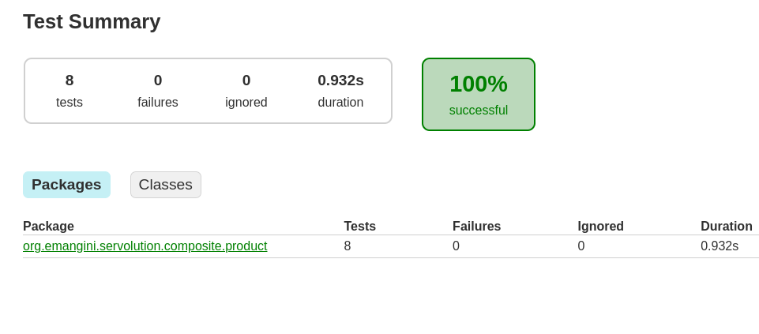
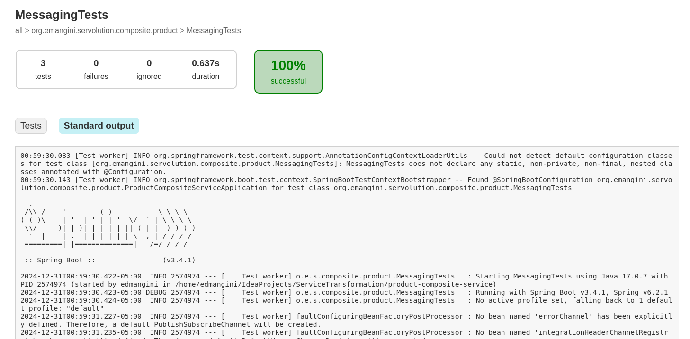
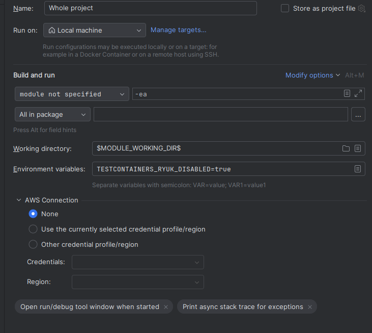
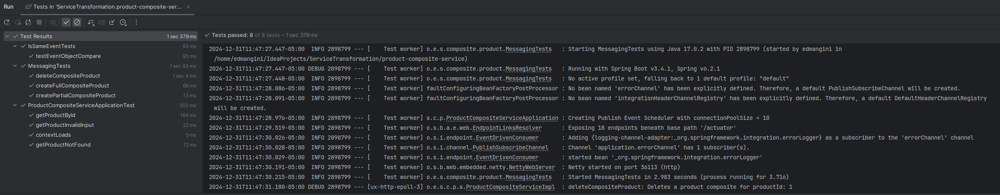

# Testing w/ Gradle

## Contents

- [Testing Gradle from CLI](#testing-gradle-from-cli)
  - [1. Running Entire Test Suite](#1-running-entire-test-suite)
  - [2. Sending Output to Console](#2-sending-output-to-console)
  - [3. Running Clean Test](#3-running-clean-test)
  - [4. Viewing Test Reports](#4-viewing-test-reports)
  - [5. Running Tests For a Specific Submodule](#5-running-tests-for-a-specific-submodule)
  - [6. Running a Specific Test Class](#6-running-a-specific-test-class)
  - [7. Running a Specific Test Method](#7-running-a-specific-test-method)


- [Testing Gradle from Intellij](#testing-gradle-from-intellij)
  - [1. Testing Entire Project](#1-testing-entire-project)
  - [2. Running Tests For Single Submodule (Project Window)](#2-running-tests-for-single-submodule--service-project-window)
  - [3. Running Tests For Single Class (Project Window)](#3-running-tests-for-single-class-file-project-window)
  - [4. Running Tests From Test Class File](#4-running-tests-from-a-test-class)


---
## Testing Gradle from CLI

#### 1. Running Entire Test Suite

This only shows success/failure. No output is sent to the console

```shell
./gradlew test
```
---

#### 2. Sending Output to Console

This sends a lot of information to the console.

```NOTE: Using the --debug flag can leak secure information.```

```shell
./gradlew test --info
./gradlew test --debug
```
---

#### 3. Running Clean Test

Guarantees previous test results are cleared. 
```shell
./gradlew clean test
```
---

#### 4. Viewing Test reports

Navigate to `./build/reports/tests/test/index.html`

```NOTE: The build directory will be nested in a submodule, not in the parent build directory.```

Clicking on the HTML file will show the raw HTML, but in Intellij a pop-up allows you to launch it into a browser.


Some test classes will allow you to select Standard Output to see the actual results

---


#### 5. Running tests for a specific submodule
Still a lot of info...

```shell
./gradlew :product-service:test --info
```
---

#### 6. Running a specific test class

```shell
./gradlew :product-composite:test --tests "org.emangini.servolution.composite.product.MessagingTests"
```
---

#### 7. Running a specific test method

```shell
./gradlew :product-composite-service:test --tests "org.emangini.servolution.composite.product.MessagingTests.createFullCompositeProduct"
```
---

---

## Testing Gradle from Intellij

## NOTE: TESTCONTAINERS

To get tests running, you must add an EV to every test profile: 

```TESTCONTAINERS_RYUK_DISABLED=true```

There is a apparently a bug in Intellij, and this variable won't be read by SYSTEM (regardless of how it is set). I've 
logged it w/ JetBrains.

### 1. Testing Entire Project

1. Create a Run/Debug Config as follows


2. Select this Configuration and click the Green Arrow to "Run Whole Project"

(Alternatively if you select-click the 4 microservices submodules and then right-click the selection you can select "Run All Tests" )


```text
/home/edmangini/.sdkman/candidates/java/22.0.0.2.r17-grl/bin/java -Dvisualvm.id=863289571119823 -ea -Didea.test.cyclic.buffer.size=1048576 -javaagent:/home/edmangini/.local/share/JetBrains/Toolbox/apps/intellij-idea-ultimate/lib/idea_rt.jar=41549:/home/edmangini/.local/share/JetBrains/Toolbox/apps/intellij-idea-ultimate/bin -javaagent:/home/edmangini/.local/share/JetBrains/Toolbox/apps/intellij-idea-ultimate/plugins/java/lib/rt/debugger-agent.jar=file:/tmp/capture.props -Dkotlinx.coroutines.debug.enable.creation.stack.trace=false -Ddebugger.agent.enable.coroutines=true -Dkotlinx.coroutines.debug.enable.flows.stack.trace=true -Dkotlinx.coroutines.debug.enable.mutable.state.flows.stack.trace=true -Dfile.encoding=UTF-8 -classpath /home/edmangini/.m2/repository/org/junit/platform/junit-platform-launcher/1.11.4/junit-platform-launcher-1.11.4.jar:/home/edmangini/.m2/repository/org/junit/platform/junit-platform-engine/1.11.4/junit-platform-engine-1.11.4.jar:/home/edmangini/.m2/repository/org/opentest4j/opentest4j/1.3.0/opentest4j-1.3.0.jar:/home/edmangini/.m2/repository/org/junit/platform/junit-platform-commons/1.11.4/junit-platform-commons-1.11.4.jar:/home/edmangini/.m2/repository/org/apiguardian/apiguardian-api/1.1.2/apiguardian-api-1.1.2.jar:/home/edmangini/.local/share/JetBrains/Toolbox/apps/intellij-idea-ultimate/lib/idea_rt.jar:/home/edmangini/.local/share/JetBrains/Toolbox/apps/intellij-idea-ultimate/plugins/junit/lib/junit5-rt.jar:/home/edmangini/.local/share/JetBrains/Toolbox/apps/intellij-idea-ultimate/plugins/junit/lib/junit-rt.jar:/home/edmangini/IdeaProjects/ServiceTransformation/util/build/classes/java/main:/home/edmangini/IdeaProjects/ServiceTransformation/recommendation-service/build/classes/java/test:/home/edmangini/IdeaProjects/ServiceTransformation/recommendation-service/build/resources/test:/home/edmangini/IdeaProjects/ServiceTransformation/recommendation-service/build/classes/java/main:/home/edmangini/IdeaProjects/ServiceTransformation/recommendation-service/build/resources/main:/home/edmangini/IdeaProjects/ServiceTransformation/review-service/build/classes/java/test:/home/edmangini/IdeaProjects/ServiceTransformation/review-service/build/resources/test:/home/edmangini/IdeaProjects/ServiceTransformation/review-service/build/classes/java/main:/home/edmangini/IdeaProjects/ServiceTransformation/review-service/build/resources/main:/home/edmangini/IdeaProjects/ServiceTransformation/api/build/classes/java/main:/home/edmangini/.gradle/caches/modules-2/files-2.1/org.jetbrains.kotlin/kotlin-stdlib/2.1.0/85f8b81009cda5890e54ba67d64b5e599c645020/kotlin-stdlib-2.1.0.jar:/home/edmangini/.gradle/caches/modules-2/files-2.1/org.projectlombok/lombok/1.18.36/5a30490a6e14977d97d9c73c924c1f1b5311ea95/lombok-1.18.36.jar:/home/edmangini/.gradle/caches/modules-2/files-2.1/org.mapstruct/mapstruct-processor/1.6.3/52e345c907fbf173b376586c7f8b131d53fa5867/mapstruct-processor-1.6.3.jar:/home/edmangini/.gradle/caches/modules-2/files-2.1/org.springframework.boot/spring-boot-starter-actuator/3.4.1/bd347cc46f34c8b9a6f33b4d103bcfb3b11fc6f8/spring-boot-starter-actuator-3.4.1.jar:/home/edmangini/.gradle/caches/modules-2/files-2.1/org.springframework.cloud/spring-cloud-starter-stream-rabbit/4.2.0/ca62c7f00b508ca093601284b45399034b17b2c/spring-cloud-starter-stream-rabbit-4.2.0.jar:/home/edmangini/.gradle/caches/modules-2/files-2.1/org.springframework.boot/spring-boot-starter-webflux/3.4.1/9d5a081abed454d604c2bbf2ba603f74882e1443/spring-boot-starter-webflux-3.4.1.jar:/home/edmangini/.gradle/caches/modules-2/files-2.1/org.mapstruct/mapstruct/1.6.3/416a2155212286d6a1c4cb3bb553c7dfd6a1a092/mapstruct-1.6.3.jar:/home/edmangini/.gradle/caches/modules-2/files-2.1/org.springframework.cloud/spring-cloud-starter-stream-kafka/4.2.0/79b2f422d1efe2d36fa684388045545437728651/spring-cloud-starter-stream-kafka-4.2.0.jar:/home/edmangini/.gradle/caches/modules-2/files-2.1/org.springdoc/springdoc-openapi-starter-common/2.7.0/bba119cebeab38aa8ba9a506d76bd611407348c1/springdoc-openapi-starter-common-2.7.0.jar:/home/edmangini/.gradle/caches/modules-2/files-2.1/org.jetbrains/annotations/13.0/919f0dfe192fb4e063e7dacadee7f8bb9a2672a9/annotations-13.0.jar:/home/edmangini/.gradle/caches/modules-2/files-2.1/org.springframework.boot/spring-boot-starter/3.4.1/2c97b6fdc451ea69cd04dcfa54980439b7c7cb34/spring-boot-starter-3.4.1.jar:/home/edmangini/.gradle/caches/modules-2/files-2.1/io.micrometer/micrometer-jakarta9/1.14.2/50950404a99cde864c0e4ff3b1647e5be75d7570/micrometer-jakarta9-1.14.2.jar:/home/edmangini/.gradle/caches/modules-2/files-2.1/org.springframework.boot/spring-boot-actuator-autoconfigure/3.4.1/75ab4d3c257fc5b00fbfa8099ec35b6c9702b629/spring-boot-actuator-autoconfigure-3.4.1.jar:/home/edmangini/.gradle/caches/modules-2/files-2.1/io.micrometer/micrometer-observation/1.14.2/a9cad29cc04c0f7e30e3e58b454d4cd47ccc54bd/micrometer-observation-1.14.2.jar:/home/edmangini/.gradle/caches/modules-2/files-2.1/org.springframework.cloud/spring-cloud-stream-binder-rabbit/4.2.0/66ed5caa39cb6e781710b02b4a47a5485d252a53/spring-cloud-stream-binder-rabbit-4.2.0.jar:/home/edmangini/.gradle/caches/modules-2/files-2.1/org.springframework.boot/spring-boot-starter-json/3.4.1/c1d084f65d8d9f2de9daccab47c4f452fb0464de/spring-boot-starter-json-3.4.1.jar:/home/edmangini/.gradle/caches/modules-2/files-2.1/org.springframework/spring-webflux/6.2.1/f8563a18b02c0aa1f7cd1ee298e76abd3514822b/spring-webflux-6.2.1.jar:/home/edmangini/.gradle/caches/modules-2/files-2.1/org.springframework/spring-web/6.2.1/877acb94c5b3a0c92e652b6bebdfdc7c60922ac8/spring-web-6.2.1.jar:/home/edmangini/.gradle/caches/modules-2/files-2.1/org.springframework.boot/spring-boot-starter-reactor-netty/3.4.1/2a46cf5e11f1cb5c54d9091b8bb67b5caf0030ab/spring-boot-starter-reactor-netty-3.4.1.jar:/home/edmangini/.gradle/caches/modules-2/files-2.1/org.springframework.cloud/spring-cloud-stream-binder-kafka/4.2.0/61ced735a7ff7f24f6f1b94c5dbbb465e804f133/spring-cloud-stream-binder-kafka-4.2.0.jar:/home/edmangini/.gradle/caches/modules-2/files-2.1/io.swagger.core.v3/swagger-core-jakarta/2.2.25/83eceb1d4af30f9131b0e0c607b83b2c921c2525/swagger-core-jakarta-2.2.25.jar:/home/edmangini/.gradle/caches/modules-2/files-2.1/org.springframework.boot/spring-boot-autoconfigure/3.4.1/f17b54cc5816ec8f06d0aca9df11c330ead97f2a/spring-boot-autoconfigure-3.4.1.jar:/home/edmangini/.gradle/caches/modules-2/files-2.1/org.springframework.boot/spring-boot-starter-logging/3.4.1/5cd01e208b15113c7f88b3ea40e843ea9989f38a/spring-boot-starter-logging-3.4.1.jar:/home/edmangini/.gradle/caches/modules-2/files-2.1/org.springframework.boot/spring-boot/3.4.1/5fb9890a5eb7c4e86c8f5c0f6960b79240daf3d5/spring-boot-3.4.1.jar:/home/edmangini/.gradle/caches/modules-2/files-2.1/org.springframework/spring-core/6.2.1/f42e6b51d9c0c2fcf95df9e5848470d173adc9af/spring-core-6.2.1.jar:/home/edmangini/.gradle/caches/modules-2/files-2.1/jakarta.annotation/jakarta.annotation-api/2.1.1/48b9bda22b091b1f48b13af03fe36db3be6e1ae3/jakarta.annotation-api-2.1.1.jar:/home/edmangini/.gradle/caches/modules-2/files-2.1/org.yaml/snakeyaml/2.3/936b36210e27320f920536f695cf1af210c44586/snakeyaml-2.3.jar:/home/edmangini/.gradle/caches/modules-2/files-2.1/io.micrometer/micrometer-core/1.14.2/7ec567b052bc560ba76a95eff222fb7999b79817/micrometer-core-1.14.2.jar:/home/edmangini/.gradle/caches/modules-2/files-2.1/io.micrometer/micrometer-commons/1.14.2/69c454dbec59c7842cf59a534b7ec03618d75b91/micrometer-commons-1.14.2.jar:/home/edmangini/.gradle/caches/modules-2/files-2.1/org.springframework.boot/spring-boot-actuator/3.4.1/77873fd387c46b7bb350cc6127a3b0162c41f9bf/spring-boot-actuator-3.4.1.jar:/home/edmangini/.gradle/caches/modules-2/files-2.1/org.springframework.cloud/spring-cloud-stream-binder-rabbit-core/4.2.0/50a6814a8d84e65c4d1db25085e3651f9d08061f/spring-cloud-stream-binder-rabbit-core-4.2.0.jar:/home/edmangini/.gradle/caches/modules-2/files-2.1/org.springframework.cloud/spring-cloud-stream/4.2.0/33befbb92014dfef45c2fa60beae06a16995c1c9/spring-cloud-stream-4.2.0.jar:/home/edmangini/.gradle/caches/modules-2/files-2.1/org.springframework.boot/spring-boot-starter-amqp/3.4.1/490eae1ecdb47be588339508823be8c5dee949ec/spring-boot-starter-amqp-3.4.1.jar:/home/edmangini/.gradle/caches/modules-2/files-2.1/org.springframework.integration/spring-integration-amqp/6.4.1/34f89b53c56ffc8d2003ac20c5b349e31d80fb8e/spring-integration-amqp-6.4.1.jar:/home/edmangini/.gradle/caches/modules-2/files-2.1/org.springframework.integration/spring-integration-jmx/6.4.1/d3328c713d668dc36b2d8eb10432a7c18ab06f30/spring-integration-jmx-6.4.1.jar:/home/edmangini/.gradle/caches/modules-2/files-2.1/org.springframework.integration/spring-integration-core/6.4.1/954c935c8fecfaeadad6edb6c87fa3edcd507a22/spring-integration-core-6.4.1.jar:/home/edmangini/.gradle/caches/modules-2/files-2.1/org.apache.httpcomponents/httpclient/4.5.14/1194890e6f56ec29177673f2f12d0b8e627dec98/httpclient-4.5.14.jar:/home/edmangini/.gradle/caches/modules-2/files-2.1/com.fasterxml.jackson.datatype/jackson-datatype-jsr310/2.18.2/7b6ff96adf421f4c6edbd694e797dd8fe434510a/jackson-datatype-jsr310-2.18.2.jar:/home/edmangini/.gradle/caches/modules-2/files-2.1/com.fasterxml.jackson.module/jackson-module-parameter-names/2.18.2/72960cb3277347a748911d100c3302d60e8a616a/jackson-module-parameter-names-2.18.2.jar:/home/edmangini/.gradle/caches/modules-2/files-2.1/com.fasterxml.jackson.datatype/jackson-datatype-jdk8/2.18.2/9ed6d538ebcc66864e114a7040953dce6ab6ea53/jackson-datatype-jdk8-2.18.2.jar:/home/edmangini/.gradle/caches/modules-2/files-2.1/com.fasterxml.jackson.core/jackson-databind/2.18.2/deef8697b92141fb6caf7aa86966cff4eec9b04f/jackson-databind-2.18.2.jar:/home/edmangini/.gradle/caches/modules-2/files-2.1/io.projectreactor/reactor-core/3.7.1/3391286019effb6c179ebbdd2159130dde543c3a/reactor-core-3.7.1.jar:/home/edmangini/.gradle/caches/modules-2/files-2.1/org.springframework/spring-beans/6.2.1/ab57ec03ba6900075bf28e3cd70ccce173205b8d/spring-beans-6.2.1.jar:/home/edmangini/.gradle/caches/modules-2/files-2.1/io.projectreactor.netty/reactor-netty-http/1.2.1/5d5fb96ccd9daf98e0c0182da8724f006119cf44/reactor-netty-http-1.2.1.jar:/home/edmangini/.gradle/caches/modules-2/files-2.1/org.springframework.cloud/spring-cloud-stream-binder-kafka-core/4.2.0/123260349b4b1cb279aef56d35a5469e698734d6/spring-cloud-stream-binder-kafka-core-4.2.0.jar:/home/edmangini/.gradle/caches/modules-2/files-2.1/org.springframework.kafka/spring-kafka/3.3.1/e389d3f28fa4f08b2ac714dfeaa91724fa4d7c9f/spring-kafka-3.3.1.jar:/home/edmangini/.gradle/caches/modules-2/files-2.1/jakarta.xml.bind/jakarta.xml.bind-api/4.0.2/6cd5a999b834b63238005b7144136379dc36cad2/jakarta.xml.bind-api-4.0.2.jar:/home/edmangini/.gradle/caches/modules-2/files-2.1/com.fasterxml.jackson.dataformat/jackson-dataformat-yaml/2.18.2/d000e13505d1cf564371516fa3d5b8769a779dc9/jackson-dataformat-yaml-2.18.2.jar:/home/edmangini/.gradle/caches/modules-2/files-2.1/io.swagger.core.v3/swagger-models-jakarta/2.2.25/abfe0fce84b0d8d8371f52405816a30cdba64493/swagger-models-jakarta-2.2.25.jar:/home/edmangini/.gradle/caches/modules-2/files-2.1/com.fasterxml.jackson.core/jackson-annotations/2.18.2/985d77751ebc7fce5db115a986bc9aa82f973f4a/jackson-annotations-2.18.2.jar:/home/edmangini/.gradle/caches/modules-2/files-2.1/org.apache.commons/commons-lang3/3.17.0/b17d2136f0460dcc0d2016ceefca8723bdf4ee70/commons-lang3-3.17.0.jar:/home/edmangini/.gradle/caches/modules-2/files-2.1/jakarta.validation/jakarta.validation-api/3.1.0/846b536eff8a32c1b91fdeb3c9c5b6c39916767d/jakarta.validation-api-3.1.0.jar:/home/edmangini/.gradle/caches/modules-2/files-2.1/org.slf4j/slf4j-api/2.0.16/172931663a09a1fa515567af5fbef00897d3c04/slf4j-api-2.0.16.jar:/home/edmangini/.gradle/caches/modules-2/files-2.1/io.swagger.core.v3/swagger-annotations-jakarta/2.2.25/6d8682e3c878769b2658397dacbd2474602487dc/swagger-annotations-jakarta-2.2.25.jar:/home/edmangini/.gradle/caches/modules-2/files-2.1/org.apache.logging.log4j/log4j-to-slf4j/2.24.3/da1143e2a2531ee1c2d90baa98eb50a28a39d5a7/log4j-to-slf4j-2.24.3.jar:/home/edmangini/.gradle/caches/modules-2/files-2.1/ch.qos.logback/logback-classic/1.5.12/3790d1a62e868f7915776dfb392bd9a29ce8d954/logback-classic-1.5.12.jar:/home/edmangini/.gradle/caches/modules-2/files-2.1/org.slf4j/jul-to-slf4j/2.0.16/6d57da3e961daac65bcca0dd3def6cd11e48a24a/jul-to-slf4j-2.0.16.jar:/home/edmangini/.gradle/caches/modules-2/files-2.1/org.springframework/spring-context/6.2.1/f56c7431b03860bfdb016e68f484c5c35531ef2e/spring-context-6.2.1.jar:/home/edmangini/.gradle/caches/modules-2/files-2.1/org.springframework/spring-jcl/6.2.1/a5d662d64470aff0ae51d210147bb6ede31a8ea3/spring-jcl-6.2.1.jar:/home/edmangini/.gradle/caches/modules-2/files-2.1/io.projectreactor.netty/reactor-netty/1.2.1/36e0a8c060a8c3e218cc3d910536a9db4f263122/reactor-netty-1.2.1.jar:/home/edmangini/.gradle/caches/modules-2/files-2.1/org.springframework.cloud/spring-cloud-function-context/4.2.0/a66616bdd545b5375f0c312f253301021388e461/spring-cloud-function-context-4.2.0.jar:/home/edmangini/.gradle/caches/modules-2/files-2.1/org.springframework.boot/spring-boot-starter-validation/3.4.1/7b9baa79c886e362dc14764fc3b0983b607be1f5/spring-boot-starter-validation-3.4.1.jar:/home/edmangini/.gradle/caches/modules-2/files-2.1/org.springframework/spring-messaging/6.2.1/35335abbdd4b1a781e6ad47d6aaa2c294d62809f/spring-messaging-6.2.1.jar:/home/edmangini/.gradle/caches/modules-2/files-2.1/org.springframework.retry/spring-retry/2.0.10/2990d2957ef0988dd243d06e04d357eace43a522/spring-retry-2.0.10.jar:/home/edmangini/.gradle/caches/modules-2/files-2.1/org.springframework.amqp/spring-rabbit/3.2.1/7e9e37e627bfd26c0578d3fe0adc463385147425/spring-rabbit-3.2.1.jar:/home/edmangini/.gradle/caches/modules-2/files-2.1/org.springframework/spring-aop/6.2.1/a9384de38fc00751084446ba014a0c4962240244/spring-aop-6.2.1.jar:/home/edmangini/.gradle/caches/modules-2/files-2.1/org.springframework/spring-tx/6.2.1/5ffde4fee85ff021ad613b9e86a9be893fb52572/spring-tx-6.2.1.jar:/home/edmangini/.gradle/caches/modules-2/files-2.1/commons-codec/commons-codec/1.17.1/973638b7149d333563584137ebf13a691bb60579/commons-codec-1.17.1.jar:/home/edmangini/.gradle/caches/modules-2/files-2.1/org.apache.httpcomponents/httpcore/4.4.16/51cf043c87253c9f58b539c9f7e44c8894223850/httpcore-4.4.16.jar:/home/edmangini/.gradle/caches/modules-2/files-2.1/commons-logging/commons-logging/1.2/4bfc12adfe4842bf07b657f0369c4cb522955686/commons-logging-1.2.jar:/home/edmangini/.gradle/caches/modules-2/files-2.1/com.fasterxml.jackson.core/jackson-core/2.18.2/fb64ccac5c27dca8819418eb4e443a9f496d9ee7/jackson-core-2.18.2.jar:/home/edmangini/.gradle/caches/modules-2/files-2.1/org.reactivestreams/reactive-streams/1.0.4/3864a1320d97d7b045f729a326e1e077661f31b7/reactive-streams-1.0.4.jar:/home/edmangini/.gradle/caches/modules-2/files-2.1/io.netty/netty-codec-http2/4.1.116.Final/5aefc3cf9ca7df764d0b15b9cb9b6e706a4a55b3/netty-codec-http2-4.1.116.Final.jar:/home/edmangini/.gradle/caches/modules-2/files-2.1/io.projectreactor.netty/reactor-netty-core/1.2.1/9c85dceb89ee078615ff02dd1a9afedbf3c1b14d/reactor-netty-core-1.2.1.jar:/home/edmangini/.gradle/caches/modules-2/files-2.1/io.netty/netty-codec-http/4.1.116.Final/75a0455171848a4188a9f77e9a1e76a036381260/netty-codec-http-4.1.116.Final.jar:/home/edmangini/.gradle/caches/modules-2/files-2.1/io.netty/netty-resolver-dns-native-macos/4.1.116.Final/d2449cd6b6b1e3f2c329f685cadf66c10d75ed28/netty-resolver-dns-native-macos-4.1.116.Final-osx-x86_64.jar:/home/edmangini/.gradle/caches/modules-2/files-2.1/io.netty/netty-resolver-dns/4.1.116.Final/9f9a00e071e8e63b1aa3db14aacb93c8ecba1ac8/netty-resolver-dns-4.1.116.Final.jar:/home/edmangini/.gradle/caches/modules-2/files-2.1/io.netty/netty-transport-native-epoll/4.1.116.Final/31ae9fc682c72ec448887b00698e4c8b275ff42d/netty-transport-native-epoll-4.1.116.Final-linux-x86_64.jar:/home/edmangini/.gradle/caches/modules-2/files-2.1/org.springframework.integration/spring-integration-kafka/6.4.1/7a588a6bca6500bcc113d1a7d1dd4563aaba3459/spring-integration-kafka-6.4.1.jar:/home/edmangini/.gradle/caches/modules-2/files-2.1/org.apache.kafka/kafka-clients/3.8.1/fd79e3aa252c6d818334e9c0bac8166b426e498c/kafka-clients-3.8.1.jar:/home/edmangini/.gradle/caches/modules-2/files-2.1/jakarta.activation/jakarta.activation-api/2.1.3/fa165bd70cda600368eee31555222776a46b881f/jakarta.activation-api-2.1.3.jar:/home/edmangini/.gradle/caches/modules-2/files-2.1/org.apache.logging.log4j/log4j-api/2.24.3/b02c125db8b6d295adf72ae6e71af5d83bce2370/log4j-api-2.24.3.jar:/home/edmangini/.gradle/caches/modules-2/files-2.1/ch.qos.logback/logback-core/1.5.12/65b1fa25fe8d8e4bdc140e79eb67ac6741f775e2/logback-core-1.5.12.jar:/home/edmangini/.gradle/caches/modules-2/files-2.1/org.springframework/spring-expression/6.2.1/91fcf6b9501705c31c8337e2713fe823bb512b24/spring-expression-6.2.1.jar:/home/edmangini/.gradle/caches/modules-2/files-2.1/org.springframework.cloud/spring-cloud-function-core/4.2.0/783aa48e5b799ba67d061e670bb4bb7796386093/spring-cloud-function-core-4.2.0.jar:/home/edmangini/.gradle/caches/modules-2/files-2.1/org.hibernate.validator/hibernate-validator/8.0.2.Final/220e64815dd87535525331de20570017f899eb13/hibernate-validator-8.0.2.Final.jar:/home/edmangini/.gradle/caches/modules-2/files-2.1/org.apache.tomcat.embed/tomcat-embed-el/10.1.34/d2b2daca3bc999c62e58ae36b45ba0582530fb25/tomcat-embed-el-10.1.34.jar:/home/edmangini/.gradle/caches/modules-2/files-2.1/org.springframework.amqp/spring-amqp/3.2.1/401d228d7adeb11ae037dc3bd8317feac88a8490/spring-amqp-3.2.1.jar:/home/edmangini/.gradle/caches/modules-2/files-2.1/com.rabbitmq/amqp-client/5.22.0/d5bf5f55022e14c7bc889fd8750b21cb60db064a/amqp-client-5.22.0.jar:/home/edmangini/.gradle/caches/modules-2/files-2.1/io.netty/netty-handler/4.1.116.Final/eaef854ef33f3fd3d0ecf927690d8112c710bc05/netty-handler-4.1.116.Final.jar:/home/edmangini/.gradle/caches/modules-2/files-2.1/io.netty/netty-codec/4.1.116.Final/cbe928f601e51a0b5750342b6dad5d35fa12f745/netty-codec-4.1.116.Final.jar:/home/edmangini/.gradle/caches/modules-2/files-2.1/io.netty/netty-transport/4.1.116.Final/3fa60bbc84222a691bb0686a82308b8e180812b7/netty-transport-4.1.116.Final.jar:/home/edmangini/.gradle/caches/modules-2/files-2.1/io.netty/netty-buffer/4.1.116.Final/77a86414b9c1e52622e467f1ef7ccb473996742a/netty-buffer-4.1.116.Final.jar:/home/edmangini/.gradle/caches/modules-2/files-2.1/io.netty/netty-common/4.1.116.Final/6871f95af2bc3a98fda34a580baf6cac8cbc2944/netty-common-4.1.116.Final.jar:/home/edmangini/.gradle/caches/modules-2/files-2.1/io.netty/netty-handler-proxy/4.1.116.Final/3e0c3f519305905e41b69dc73064684e31d68357/netty-handler-proxy-4.1.116.Final.jar:/home/edmangini/.gradle/caches/modules-2/files-2.1/io.netty/netty-resolver-dns-classes-macos/4.1.116.Final/216d4b543fb0e046ea819b2a39a5dd794fe9776f/netty-resolver-dns-classes-macos-4.1.116.Final.jar:/home/edmangini/.gradle/caches/modules-2/files-2.1/io.netty/netty-codec-dns/4.1.116.Final/6fa882dde3db7aecc7b7d4882f70f17d9e33b2ad/netty-codec-dns-4.1.116.Final.jar:/home/edmangini/.gradle/caches/modules-2/files-2.1/io.netty/netty-resolver/4.1.116.Final/82fc6bbf59eae483712c8716b8d1f5112b1721a0/netty-resolver-4.1.116.Final.jar:/home/edmangini/.gradle/caches/modules-2/files-2.1/io.netty/netty-transport-classes-epoll/4.1.116.Final/ce620832453892a92be73f672cd79a36f8c60235/netty-transport-classes-epoll-4.1.116.Final.jar:/home/edmangini/.gradle/caches/modules-2/files-2.1/io.netty/netty-transport-native-unix-common/4.1.116.Final/1f77d6d8e582ded200e0be1462afbc7563144e12/netty-transport-native-unix-common-4.1.116.Final.jar:/home/edmangini/.gradle/caches/modules-2/files-2.1/com.fasterxml/classmate/1.7.0/e98374da1f2143ac8e6e0a95036994bb19137a3/classmate-1.7.0.jar:/home/edmangini/.gradle/caches/modules-2/files-2.1/org.jboss.logging/jboss-logging/3.6.1.Final/886afbb445b4016a37c8960a7aef6ebd769ce7e5/jboss-logging-3.6.1.Final.jar:/home/edmangini/.gradle/caches/modules-2/files-2.1/io.netty/netty-codec-socks/4.1.116.Final/6d67f4ad92677a29e7a5aae340cb33ea80408c72/netty-codec-socks-4.1.116.Final.jar:/home/edmangini/.gradle/caches/modules-2/files-2.1/org.hdrhistogram/HdrHistogram/2.2.2/7959933ebcc0f05b2eaa5af0a0c8689fa257b15c/HdrHistogram-2.2.2.jar:/home/edmangini/.gradle/caches/modules-2/files-2.1/org.latencyutils/LatencyUtils/2.0.3/769c0b82cb2421c8256300e907298a9410a2a3d3/LatencyUtils-2.0.3.jar:/home/edmangini/.gradle/caches/modules-2/files-2.1/io.projectreactor.netty.incubator/reactor-netty-incubator-quic/0.2.1/c34c609bd103007825029c1ceaa790421ad48920/reactor-netty-incubator-quic-0.2.1.jar:/home/edmangini/.gradle/caches/modules-2/files-2.1/com.github.luben/zstd-jni/1.5.6-4/ba9e303e0b5e94cdd0017390d7d8c06f47fd61f7/zstd-jni-1.5.6-4.jar:/home/edmangini/.gradle/caches/modules-2/files-2.1/org.lz4/lz4-java/1.8.0/4b986a99445e49ea5fbf5d149c4b63f6ed6c6780/lz4-java-1.8.0.jar:/home/edmangini/.gradle/caches/modules-2/files-2.1/org.xerial.snappy/snappy-java/1.1.10.5/ac605269f3598506196e469f1fb0d7ed5c55059e/snappy-java-1.1.10.5.jar:/home/edmangini/.gradle/caches/modules-2/files-2.1/io.netty.incubator/netty-incubator-codec-native-quic/0.0.68.Final/e73b44b4cd3c2a0347a530be443f23c55aea1bd/netty-incubator-codec-native-quic-0.0.68.Final-linux-x86_64.jar:/home/edmangini/.gradle/caches/modules-2/files-2.1/io.netty.incubator/netty-incubator-codec-classes-quic/0.0.68.Final/ec3772f7b04ab9fc566cf56696b8cf50e52bf9a8/netty-incubator-codec-classes-quic-0.0.68.Final.jar:/home/edmangini/.gradle/caches/modules-2/files-2.1/org.springframework.cloud/spring-cloud-stream-test-binder/4.2.0/f882e445ba6d4a65dc283c54d41596cefab1d895/spring-cloud-stream-test-binder-4.2.0.jar:/home/edmangini/.gradle/caches/modules-2/files-2.1/org.springframework.boot/spring-boot-starter-test/3.4.1/ac1caa2ab4c8eaedd82abab3ed8d27a1b4ee2da8/spring-boot-starter-test-3.4.1.jar:/home/edmangini/.gradle/caches/modules-2/files-2.1/org.junit.jupiter/junit-jupiter/5.11.4/a699f024a4a4706b36bddbeb42d499aff9e09379/junit-jupiter-5.11.4.jar:/home/edmangini/.gradle/caches/modules-2/files-2.1/io.projectreactor/reactor-test/3.7.1/fa0944805a93242e42a391e4f8af382c8cd4f24e/reactor-test-3.7.1.jar:/home/edmangini/.gradle/caches/modules-2/files-2.1/org.assertj/assertj-core/3.26.3/d26263eb7524252d98e602fc6942996a3195e29/assertj-core-3.26.3.jar:/home/edmangini/.gradle/caches/modules-2/files-2.1/org.springframework.boot/spring-boot-test-autoconfigure/3.4.1/87ac4bbb73af12298ddf1cd6830121527e6de7c7/spring-boot-test-autoconfigure-3.4.1.jar:/home/edmangini/.gradle/caches/modules-2/files-2.1/org.springframework.boot/spring-boot-test/3.4.1/56fb2970279daa00359e37fabdc3bf46a1ab1a8b/spring-boot-test-3.4.1.jar:/home/edmangini/.gradle/caches/modules-2/files-2.1/org.mockito/mockito-junit-jupiter/5.14.2/3cfc377d4bb9fe729f3dd9098d9a9b27da58324a/mockito-junit-jupiter-5.14.2.jar:/home/edmangini/.gradle/caches/modules-2/files-2.1/org.mockito/mockito-core/5.14.2/f7bf936008d7664e2002c3faf0c02071c8d10e7c/mockito-core-5.14.2.jar:/home/edmangini/.gradle/caches/modules-2/files-2.1/org.springframework/spring-test/6.2.1/60b7fe91a4ecb88b9ee0d6f228ad0b6a8ac78cb2/spring-test-6.2.1.jar:/home/edmangini/.gradle/caches/modules-2/files-2.1/org.awaitility/awaitility/4.2.2/7336242073ebf83fe034e42b46a403c5501b63c9/awaitility-4.2.2.jar:/home/edmangini/.gradle/caches/modules-2/files-2.1/org.hamcrest/hamcrest/2.2/1820c0968dba3a11a1b30669bb1f01978a91dedc/hamcrest-2.2.jar:/home/edmangini/.gradle/caches/modules-2/files-2.1/com.jayway.jsonpath/json-path/2.9.0/37fe2217f577b0b68b18e62c4d17a8858ecf9b69/json-path-2.9.0.jar:/home/edmangini/.gradle/caches/modules-2/files-2.1/net.minidev/json-smart/2.5.1/4c11d2808d009132dfbbf947ebf37de6bf266c8e/json-smart-2.5.1.jar:/home/edmangini/.gradle/caches/modules-2/files-2.1/org.skyscreamer/jsonassert/1.5.3/aaa43e0823d2a0e106e8754d6a9c4ab24e05e9bc/jsonassert-1.5.3.jar:/home/edmangini/.gradle/caches/modules-2/files-2.1/org.xmlunit/xmlunit-core/2.10.0/1355088731b4ec2107ff7f319f0d7445d916bab/xmlunit-core-2.10.0.jar:/home/edmangini/.gradle/caches/modules-2/files-2.1/org.junit.jupiter/junit-jupiter-params/5.11.4/e4c86fbe2a39c60c6b87260ef7f7e7c1a1906481/junit-jupiter-params-5.11.4.jar:/home/edmangini/.gradle/caches/modules-2/files-2.1/org.junit.jupiter/junit-jupiter-api/5.11.4/308315b28e667db4091b2ba1f7aa220d1ddadb97/junit-jupiter-api-5.11.4.jar:/home/edmangini/.gradle/caches/modules-2/files-2.1/net.bytebuddy/byte-buddy/1.15.11/f61886478e0f9ee4c21d09574736f0ff45e0a46c/byte-buddy-1.15.11.jar:/home/edmangini/.gradle/caches/modules-2/files-2.1/net.bytebuddy/byte-buddy-agent/1.15.11/a38b16385e867f59a641330f0362ebe742788ed8/byte-buddy-agent-1.15.11.jar:/home/edmangini/.gradle/caches/modules-2/files-2.1/net.minidev/accessors-smart/2.5.1/19b820261eb2e7de7d5bde11d1c06e4501dd7e5f/accessors-smart-2.5.1.jar:/home/edmangini/.gradle/caches/modules-2/files-2.1/com.vaadin.external.google/android-json/0.0.20131108.vaadin1/fa26d351fe62a6a17f5cda1287c1c6110dec413f/android-json-0.0.20131108.vaadin1.jar:/home/edmangini/.gradle/caches/modules-2/files-2.1/org.apiguardian/apiguardian-api/1.1.2/a231e0d844d2721b0fa1b238006d15c6ded6842a/apiguardian-api-1.1.2.jar:/home/edmangini/.gradle/caches/modules-2/files-2.1/org.junit.platform/junit-platform-commons/1.11.4/8898eea3ed0da2641548d602c3e308804f166303/junit-platform-commons-1.11.4.jar:/home/edmangini/.gradle/caches/modules-2/files-2.1/org.opentest4j/opentest4j/1.3.0/152ea56b3a72f655d4fd677fc0ef2596c3dd5e6e/opentest4j-1.3.0.jar:/home/edmangini/.gradle/caches/modules-2/files-2.1/org.ow2.asm/asm/9.6/aa205cf0a06dbd8e04ece91c0b37c3f5d567546a/asm-9.6.jar:/home/edmangini/.gradle/caches/modules-2/files-2.1/org.junit.jupiter/junit-jupiter-engine/5.11.4/dc10ec209623986a68ea07f67cdc7d2a65a60355/junit-jupiter-engine-5.11.4.jar:/home/edmangini/.gradle/caches/modules-2/files-2.1/org.objenesis/objenesis/3.3/1049c09f1de4331e8193e579448d0916d75b7631/objenesis-3.3.jar:/home/edmangini/.gradle/caches/modules-2/files-2.1/org.junit.platform/junit-platform-engine/1.11.4/21f61b123ad6ac8f7e73971bff3a096c8d8e1cd0/junit-platform-engine-1.11.4.jar:/home/edmangini/IdeaProjects/ServiceTransformation/product-composite-service/build/classes/java/test:/home/edmangini/IdeaProjects/ServiceTransformation/product-composite-service/build/classes/java/main:/home/edmangini/IdeaProjects/ServiceTransformation/product-composite-service/build/resources/main:/home/edmangini/.gradle/caches/modules-2/files-2.1/jakarta.validation/jakarta.validation-api/3.0.2/92b6631659ba35ca09e44874d3eb936edfeee532/jakarta.validation-api-3.0.2.jar:/home/edmangini/.gradle/caches/modules-2/files-2.1/org.springdoc/springdoc-openapi-starter-webflux-ui/2.7.0/38738da327bd4c235c331f25f69137cceaaa4430/springdoc-openapi-starter-webflux-ui-2.7.0.jar:/home/edmangini/.gradle/caches/modules-2/files-2.1/org.springdoc/springdoc-openapi-starter-webflux-api/2.7.0/a7a4b1c48569a8e060285049703b89fbdbc16d96/springdoc-openapi-starter-webflux-api-2.7.0.jar:/home/edmangini/.gradle/caches/modules-2/files-2.1/org.webjars/swagger-ui/5.18.2/368118833fc82beedbc17783972c836aa22e0872/swagger-ui-5.18.2.jar:/home/edmangini/.gradle/caches/modules-2/files-2.1/org.webjars/webjars-locator-lite/1.0.1/b4389136604123d4fe4199cc29b94a33206996bc/webjars-locator-lite-1.0.1.jar:/home/edmangini/.gradle/caches/modules-2/files-2.1/org.jspecify/jspecify/1.0.0/7425a601c1c7ec76645a78d22b8c6a627edee507/jspecify-1.0.0.jar:/home/edmangini/.gradle/caches/modules-2/files-2.1/org.springframework.retry/spring-retry/2.0.11/bd4fae67445baf330b69b6b786748a308ab31f6/spring-retry-2.0.11.jar:/home/edmangini/.gradle/caches/modules-2/files-2.1/org.springframework.boot/spring-boot-devtools/3.4.1/3bdbab471c56ce1fece521e9db67102d018006c4/spring-boot-devtools-3.4.1.jar:/home/edmangini/.gradle/caches/modules-2/files-2.1/org.springframework.boot/spring-boot-starter-data-mongodb-reactive/3.4.1/98586bdcffbe5a105b84758c9eb6895690d4b4bf/spring-boot-starter-data-mongodb-reactive-3.4.1.jar:/home/edmangini/.gradle/caches/modules-2/files-2.1/org.springframework.data/spring-data-mongodb/4.4.1/2cd1faa1142449e1b0341f78428814a5012f2830/spring-data-mongodb-4.4.1.jar:/home/edmangini/.gradle/caches/modules-2/files-2.1/org.mongodb/mongodb-driver-reactivestreams/5.2.1/eab6074c877b0e3a36984bb8efb89f0ce4c7c314/mongodb-driver-reactivestreams-5.2.1.jar:/home/edmangini/.gradle/caches/modules-2/files-2.1/org.springframework.data/spring-data-commons/3.4.1/3ae5f19bc2b1b30de85b0610ae25818c2e7c295a/spring-data-commons-3.4.1.jar:/home/edmangini/.gradle/caches/modules-2/files-2.1/org.mongodb/mongodb-driver-core/5.2.1/34aa1e29cdab75c2fd912a6b853319d6936515c6/mongodb-driver-core-5.2.1.jar:/home/edmangini/.gradle/caches/modules-2/files-2.1/org.mongodb/bson/5.2.1/a45b5955870d5c9325531a2fef5fbef1329b7e8a/bson-5.2.1.jar:/home/edmangini/.gradle/caches/modules-2/files-2.1/org.mongodb/bson-record-codec/5.2.1/47a9b8ef55b63b6a66e1fd69bcf62a6f547468c8/bson-record-codec-5.2.1.jar:/home/edmangini/.gradle/caches/modules-2/files-2.1/org.springframework.boot/spring-boot-starter-data-jpa/3.4.1/f06be4354c339f3f880a5c66a6913cd2366eb225/spring-boot-starter-data-jpa-3.4.1.jar:/home/edmangini/.gradle/caches/modules-2/files-2.1/org.springframework.boot/spring-boot-starter-jdbc/3.4.1/307db83ee5f33fe810565cf980f73747b8f8f43b/spring-boot-starter-jdbc-3.4.1.jar:/home/edmangini/.gradle/caches/modules-2/files-2.1/org.springframework.data/spring-data-jpa/3.4.1/1c704fa9169ea3745775568e733fddd0132070b2/spring-data-jpa-3.4.1.jar:/home/edmangini/.gradle/caches/modules-2/files-2.1/org.hibernate.orm/hibernate-core/6.6.4.Final/95c6d2d58c40dbbfbbd58084941e5cbca4ddef2f/hibernate-core-6.6.4.Final.jar:/home/edmangini/.gradle/caches/modules-2/files-2.1/org.springframework/spring-aspects/6.2.1/50350218608abf215ae40ef00c87cc666737e199/spring-aspects-6.2.1.jar:/home/edmangini/.gradle/caches/modules-2/files-2.1/com.mysql/mysql-connector-j/9.1.0/5fb1d513278e1a9767dfa80ea9d8d7ee909f1a/mysql-connector-j-9.1.0.jar:/home/edmangini/.gradle/caches/modules-2/files-2.1/org.springframework/spring-jdbc/6.2.1/def8d3d9bebafc36c19f8407645eddde32454c8a/spring-jdbc-6.2.1.jar:/home/edmangini/.gradle/caches/modules-2/files-2.1/com.zaxxer/HikariCP/5.1.0/8c96e36c14461fc436bb02b264b96ef3ca5dca8c/HikariCP-5.1.0.jar:/home/edmangini/.gradle/caches/modules-2/files-2.1/org.springframework/spring-orm/6.2.1/7fd75b4984d92c3c5e46ee94365cfc79d2daa821/spring-orm-6.2.1.jar:/home/edmangini/.gradle/caches/modules-2/files-2.1/org.antlr/antlr4-runtime/4.13.0/5a02e48521624faaf5ff4d99afc88b01686af655/antlr4-runtime-4.13.0.jar:/home/edmangini/.gradle/caches/modules-2/files-2.1/jakarta.persistence/jakarta.persistence-api/3.1.0/66901fa1c373c6aff65c13791cc11da72060a8d6/jakarta.persistence-api-3.1.0.jar:/home/edmangini/.gradle/caches/modules-2/files-2.1/jakarta.transaction/jakarta.transaction-api/2.0.1/51a520e3fae406abb84e2e1148e6746ce3f80a1a/jakarta.transaction-api-2.0.1.jar:/home/edmangini/.gradle/caches/modules-2/files-2.1/org.aspectj/aspectjweaver/1.9.22.1/bca243d0af0db4758fbae45c5f4995cb5dabb612/aspectjweaver-1.9.22.1.jar:/home/edmangini/.gradle/caches/modules-2/files-2.1/com.google.protobuf/protobuf-java/4.26.1/594fabdcbceb7edfb883fe621d3e97d9cc05fa73/protobuf-java-4.26.1.jar:/home/edmangini/.gradle/caches/modules-2/files-2.1/org.glassfish.jaxb/jaxb-runtime/4.0.5/ca84c2a7169b5293e232b9d00d1e4e36d4c3914a/jaxb-runtime-4.0.5.jar:/home/edmangini/.gradle/caches/modules-2/files-2.1/jakarta.inject/jakarta.inject-api/2.0.1/4c28afe1991a941d7702fe1362c365f0a8641d1e/jakarta.inject-api-2.0.1.jar:/home/edmangini/.gradle/caches/modules-2/files-2.1/org.hibernate.common/hibernate-commons-annotations/7.0.3.Final/e183c4be8bb41d12e9f19b374e00c34a0a85f439/hibernate-commons-annotations-7.0.3.Final.jar:/home/edmangini/.gradle/caches/modules-2/files-2.1/io.smallrye/jandex/3.2.0/f17ad860f62a08487b9edabde608f8ac55c62fa7/jandex-3.2.0.jar:/home/edmangini/.gradle/caches/modules-2/files-2.1/org.glassfish.jaxb/jaxb-core/4.0.5/7b4b11ea5542eea4ad55e1080b23be436795b3/jaxb-core-4.0.5.jar:/home/edmangini/.gradle/caches/modules-2/files-2.1/org.glassfish.jaxb/txw2/4.0.5/f36a4ef12120a9bb06d766d6a0e54b144fd7ed98/txw2-4.0.5.jar:/home/edmangini/.gradle/caches/modules-2/files-2.1/com.sun.istack/istack-commons-runtime/4.1.2/18ec117c85f3ba0ac65409136afa8e42bc74e739/istack-commons-runtime-4.1.2.jar:/home/edmangini/.gradle/caches/modules-2/files-2.1/org.eclipse.angus/angus-activation/2.0.2/41f1e0ddd157c856926ed149ab837d110955a9fc/angus-activation-2.0.2.jar:/home/edmangini/.gradle/caches/modules-2/files-2.1/org.testcontainers/junit-jupiter/1.20.4/977e62d63e294828bfed88d1e99c2220ece8498a/junit-jupiter-1.20.4.jar:/home/edmangini/.gradle/caches/modules-2/files-2.1/org.testcontainers/mysql/1.20.4/dceb05d856af048ad003a2ce564a365dfa796178/mysql-1.20.4.jar:/home/edmangini/.gradle/caches/modules-2/files-2.1/org.testcontainers/testcontainers/1.20.4/ee2fe3afc9fa6cb2e6a43233998f3633f761692f/testcontainers-1.20.4.jar:/home/edmangini/.gradle/caches/modules-2/files-2.1/org.jetbrains/annotations/17.0.0/8ceead41f4e71821919dbdb7a9847608f1a938cb/annotations-17.0.0.jar:/home/edmangini/.gradle/caches/modules-2/files-2.1/org.testcontainers/jdbc/1.20.4/a02c0d9c5bf18fac3a3e27f2daec1c0137b30b3d/jdbc-1.20.4.jar:/home/edmangini/.gradle/caches/modules-2/files-2.1/org.rnorth.duct-tape/duct-tape/1.0.8/92edc22a9ab2f3e17c9bf700aaee377d50e8b530/duct-tape-1.0.8.jar:/home/edmangini/.gradle/caches/modules-2/files-2.1/junit/junit/4.13.2/8ac9e16d933b6fb43bc7f576336b8f4d7eb5ba12/junit-4.13.2.jar:/home/edmangini/.gradle/caches/modules-2/files-2.1/com.github.docker-java/docker-java-api/3.4.0/9ef23dcc93693f15e69b64632be096c38e31bc44/docker-java-api-3.4.0.jar:/home/edmangini/.gradle/caches/modules-2/files-2.1/com.github.docker-java/docker-java-transport-zerodep/3.4.0/c4ce6d8695cfdb0027872f99cc20f8f679f8a969/docker-java-transport-zerodep-3.4.0.jar:/home/edmangini/.gradle/caches/modules-2/files-2.1/org.apache.commons/commons-compress/1.24.0/b4b1b5a3d9573b2970fddab236102c0a4d27d35e/commons-compress-1.24.0.jar:/home/edmangini/.gradle/caches/modules-2/files-2.1/org.testcontainers/database-commons/1.20.4/75b6aae47412a70fc8fc7154144cbb57852b2665/database-commons-1.20.4.jar:/home/edmangini/.gradle/caches/modules-2/files-2.1/org.hamcrest/hamcrest-core/2.2/3f2bd07716a31c395e2837254f37f21f0f0ab24b/hamcrest-core-2.2.jar:/home/edmangini/.gradle/caches/modules-2/files-2.1/com.github.docker-java/docker-java-transport/3.4.0/c058705684d782effc4b2edfdef1a87544ba4af8/docker-java-transport-3.4.0.jar:/home/edmangini/.gradle/caches/modules-2/files-2.1/net.java.dev.jna/jna/5.13.0/1200e7ebeedbe0d10062093f32925a912020e747/jna-5.13.0.jar:/home/edmangini/.gradle/caches/modules-2/files-2.1/org.testcontainers/mongodb/1.20.4/5929c630a8f66b3b06fd0a6d22c666e278b2cf99/mongodb-1.20.4.jar:/home/edmangini/IdeaProjects/ServiceTransformation/product-service/build/classes/java/main:/home/edmangini/IdeaProjects/ServiceTransformation/product-service/build/resources/main:/home/edmangini/IdeaProjects/ServiceTransformation/product-service/build/classes/java/test:/home/edmangini/IdeaProjects/ServiceTransformation/product-service/build/resources/test:/home/edmangini/.gradle/caches/modules-2/files-2.1/org.springframework.boot/spring-boot-starter-amqp/3.4.0/e043738ef6c496466c7afa1f8393c86bdc546dd8/spring-boot-starter-amqp-3.4.0.jar:/home/edmangini/.gradle/caches/modules-2/files-2.1/org.springframework.integration/spring-integration-amqp/6.4.0/8b5088293b49c4f169e8d772c98c1f0dbc73df3a/spring-integration-amqp-6.4.0.jar:/home/edmangini/.gradle/caches/modules-2/files-2.1/org.springframework.integration/spring-integration-jmx/6.4.0/b6dfcb13cc0a1262f071a166a9589d484fcc4c2a/spring-integration-jmx-6.4.0.jar:/home/edmangini/.gradle/caches/modules-2/files-2.1/org.springframework.integration/spring-integration-core/6.4.0/741b72ae0d35108d2d2c93365393eced163499ff/spring-integration-core-6.4.0.jar:/home/edmangini/.gradle/caches/modules-2/files-2.1/org.springframework.kafka/spring-kafka/3.3.0/fcafcea56825daf58dee1cc6d5449d22d7f839fb/spring-kafka-3.3.0.jar:/home/edmangini/.gradle/caches/modules-2/files-2.1/io.projectreactor.netty/reactor-netty/1.2.0/69ac703aef4b0b1f98440456ba7ed4974cb92b4d/reactor-netty-1.2.0.jar:/home/edmangini/.gradle/caches/modules-2/files-2.1/org.springframework.amqp/spring-rabbit/3.2.0/62455b9040a899ecdc6629e5a7e11c6a3321cb17/spring-rabbit-3.2.0.jar:/home/edmangini/.gradle/caches/modules-2/files-2.1/org.springframework/spring-messaging/6.2.0/b76f7778525e40af36e93ade58f202c737d45d34/spring-messaging-6.2.0.jar:/home/edmangini/.gradle/caches/modules-2/files-2.1/org.springframework.boot/spring-boot-starter-validation/3.4.0/580aad0cdaf9d9f862e9703a612db95846055843/spring-boot-starter-validation-3.4.0.jar:/home/edmangini/.gradle/caches/modules-2/files-2.1/org.springframework/spring-tx/6.2.0/940031e305c992e11d52cb3e75fb71f71bf5a19d/spring-tx-6.2.0.jar:/home/edmangini/.gradle/caches/modules-2/files-2.1/commons-codec/commons-codec/1.11/3acb4705652e16236558f0f4f2192cc33c3bd189/commons-codec-1.11.jar:/home/edmangini/.gradle/caches/modules-2/files-2.1/io.netty/netty-codec-http2/4.1.115.Final/bc474c27c96e3a309da73160fbcfe0bd3aa85bc/netty-codec-http2-4.1.115.Final.jar:/home/edmangini/.gradle/caches/modules-2/files-2.1/io.netty/netty-codec-http/4.1.115.Final/80f0dece29a2c0269217e8dd1b6db6ff9710781f/netty-codec-http-4.1.115.Final.jar:/home/edmangini/.gradle/caches/modules-2/files-2.1/io.netty/netty-resolver-dns-native-macos/4.1.115.Final/f26e44e39a65570d01ca52f7eab17a9983a1b91d/netty-resolver-dns-native-macos-4.1.115.Final-osx-x86_64.jar:/home/edmangini/.gradle/caches/modules-2/files-2.1/io.netty/netty-resolver-dns/4.1.115.Final/33b0636c6fe36c7f41d9da204aa1ad94ff244ac7/netty-resolver-dns-4.1.115.Final.jar:/home/edmangini/.gradle/caches/modules-2/files-2.1/io.netty/netty-transport-native-epoll/4.1.115.Final/a6cc58c4a259bad159cbb06120cea9b3474e86a0/netty-transport-native-epoll-4.1.115.Final-linux-x86_64.jar:/home/edmangini/.gradle/caches/modules-2/files-2.1/org.springframework.integration/spring-integration-kafka/6.4.0/c1e93fc48f9c1a9e606ce48af61784d3cc255d50/spring-integration-kafka-6.4.0.jar:/home/edmangini/.gradle/caches/modules-2/files-2.1/org.springframework.amqp/spring-amqp/3.2.0/d6ce712490fd3ff8c25a8f2a2fd81033ba1882ad/spring-amqp-3.2.0.jar:/home/edmangini/.gradle/caches/modules-2/files-2.1/org.apache.tomcat.embed/tomcat-embed-el/10.1.33/6cdf9afcb8577309fae1181e0a5f2f8cff559d97/tomcat-embed-el-10.1.33.jar:/home/edmangini/.gradle/caches/modules-2/files-2.1/org.hibernate.validator/hibernate-validator/8.0.1.Final/e49e116b3d3928060599b176b3538bb848718e95/hibernate-validator-8.0.1.Final.jar:/home/edmangini/.gradle/caches/modules-2/files-2.1/io.netty/netty-handler-proxy/4.1.115.Final/5f61f44704a09b373167f1c0b1854bdcd880a8cb/netty-handler-proxy-4.1.115.Final.jar:/home/edmangini/.gradle/caches/modules-2/files-2.1/io.netty/netty-handler/4.1.115.Final/d54dbf68b9d88a98240107758c6b63da5e46e23a/netty-handler-4.1.115.Final.jar:/home/edmangini/.gradle/caches/modules-2/files-2.1/io.netty/netty-codec/4.1.115.Final/d326bf3a4c785b272da3db6941779a1bd5448378/netty-codec-4.1.115.Final.jar:/home/edmangini/.gradle/caches/modules-2/files-2.1/io.netty/netty-transport/4.1.115.Final/39cef77c1a25908ac1abf4960c2e789f0bf70ff9/netty-transport-4.1.115.Final.jar:/home/edmangini/.gradle/caches/modules-2/files-2.1/io.netty/netty-buffer/4.1.115.Final/d5daf1030e5c36d198caf7562da2441a97ec0df6/netty-buffer-4.1.115.Final.jar:/home/edmangini/.gradle/caches/modules-2/files-2.1/io.netty/netty-common/4.1.115.Final/9da10a9f72e3f87e181d91b525174007a6fc4f11/netty-common-4.1.115.Final.jar:/home/edmangini/.gradle/caches/modules-2/files-2.1/io.netty/netty-resolver-dns-classes-macos/4.1.115.Final/70dcbd4a64caa48a3149d0b166c5f5367a2ca2f8/netty-resolver-dns-classes-macos-4.1.115.Final.jar:/home/edmangini/.gradle/caches/modules-2/files-2.1/io.netty/netty-codec-dns/4.1.115.Final/d39b9866939cbbb8ae3a1af5c1df5ddf93656d47/netty-codec-dns-4.1.115.Final.jar:/home/edmangini/.gradle/caches/modules-2/files-2.1/io.netty/netty-resolver/4.1.115.Final/e33b4d476c03975957f5d8d0319d592bf2bc5e96/netty-resolver-4.1.115.Final.jar:/home/edmangini/.gradle/caches/modules-2/files-2.1/io.netty/netty-transport-classes-epoll/4.1.115.Final/11fea00408ecbd8b8d1f0698d708e37db4a01841/netty-transport-classes-epoll-4.1.115.Final.jar:/home/edmangini/.gradle/caches/modules-2/files-2.1/io.netty/netty-transport-native-unix-common/4.1.115.Final/dc96c67d06cd6b5eb677f2728f27bf2e3d9a7284/netty-transport-native-unix-common-4.1.115.Final.jar:/home/edmangini/.gradle/caches/modules-2/files-2.1/org.jboss.logging/jboss-logging/3.4.3.Final/c4bd7e12a745c0e7f6cf98c45cdcdf482fd827ea/jboss-logging-3.4.3.Final.jar:/home/edmangini/.gradle/caches/modules-2/files-2.1/com.fasterxml/classmate/1.5.1/3fe0bed568c62df5e89f4f174c101eab25345b6c/classmate-1.5.1.jar:/home/edmangini/.gradle/caches/modules-2/files-2.1/io.netty/netty-codec-socks/4.1.115.Final/955faadc8f5b1ca41881398043b62ce1a245800c/netty-codec-socks-4.1.115.Final.jar:/home/edmangini/.gradle/caches/modules-2/files-2.1/io.projectreactor.netty.incubator/reactor-netty-incubator-quic/0.2.0/4687c5f92162a723c5b685d87b8a0a7cc5134162/reactor-netty-incubator-quic-0.2.0.jar:/home/edmangini/.gradle/caches/modules-2/files-2.1/net.bytebuddy/byte-buddy/1.15.4/e8bd42992701720649765383ff570f415190b83f/byte-buddy-1.15.4.jar:/home/edmangini/.gradle/caches/modules-2/files-2.1/net.bytebuddy/byte-buddy-agent/1.15.4/58e850dde88f3cf20f41f659440bef33f6c4fe02/byte-buddy-agent-1.15.4.jar com.intellij.rt.junit.JUnitStarter -ideVersion5 -junit5 @w@/tmp/idea_working_dirs_junit.tmp @/tmp/idea_junit.tmp -socket34995 @@@none,/tmp/command.line2
11:40:18.886 [main] INFO org.springframework.test.context.support.AnnotationConfigContextLoaderUtils -- Could not detect default configuration classes for test class [org.emangini.servolution.composite.product.MessagingTests]: MessagingTests does not declare any static, non-private, non-final, nested classes annotated with @Configuration.
11:40:18.953 [main] INFO org.springframework.boot.test.context.SpringBootTestContextBootstrapper -- Found @SpringBootConfiguration org.emangini.servolution.composite.product.ProductCompositeServiceApplication for test class org.emangini.servolution.composite.product.MessagingTests

  .   ____          _            __ _ _
 /\\ / ___'_ __ _ _(_)_ __  __ _ \ \ \ \
( ( )\___ | '_ | '_| | '_ \/ _` | \ \ \ \
 \\/  ___)| |_)| | | | | || (_| |  ) ) ) )
  '  |____| .__|_| |_|_| |_\__, | / / / /
 =========|_|==============|___/=/_/_/_/

 :: Spring Boot ::                (v3.4.1)

2024-12-31T11:40:19.236-05:00  INFO 2893749 --- [           main] o.e.s.composite.product.MessagingTests   : Starting MessagingTests using Java 17.0.2 with PID 2893749 (started by edmangini in /home/edmangini/IdeaProjects/ServiceTransformation/product-composite-service)
2024-12-31T11:40:19.237-05:00 DEBUG 2893749 --- [           main] o.e.s.composite.product.MessagingTests   : Running with Spring Boot v3.4.1, Spring v6.2.1
2024-12-31T11:40:19.237-05:00  INFO 2893749 --- [           main] o.e.s.composite.product.MessagingTests   : No active profile set, falling back to 1 default profile: "default"
2024-12-31T11:40:19.939-05:00  INFO 2893749 --- [           main] faultConfiguringBeanFactoryPostProcessor : No bean named 'errorChannel' has been explicitly defined. Therefore, a default PublishSubscribeChannel will be created.
2024-12-31T11:40:19.943-05:00  INFO 2893749 --- [           main] faultConfiguringBeanFactoryPostProcessor : No bean named 'integrationHeaderChannelRegistry' has been explicitly defined. Therefore, a default DefaultHeaderChannelRegistry will be created.
2024-12-31T11:40:20.503-05:00  INFO 2893749 --- [           main] s.c.p.ProductCompositeServiceApplication : Creating Publish Event Scheduler with connectionPoolSize = 10
2024-12-31T11:40:20.844-05:00  INFO 2893749 --- [           main] o.s.b.a.e.web.EndpointLinksResolver      : Exposing 18 endpoints beneath base path '/actuator'
2024-12-31T11:40:21.182-05:00  INFO 2893749 --- [           main] o.s.i.endpoint.EventDrivenConsumer       : Adding {logging-channel-adapter:_org.springframework.integration.errorLogger} as a subscriber to the 'errorChannel' channel
2024-12-31T11:40:21.183-05:00  INFO 2893749 --- [           main] o.s.i.channel.PublishSubscribeChannel    : Channel 'application.errorChannel' has 1 subscriber(s).
2024-12-31T11:40:21.183-05:00  INFO 2893749 --- [           main] o.s.i.endpoint.EventDrivenConsumer       : started bean '_org.springframework.integration.errorLogger'
2024-12-31T11:40:21.250-05:00  INFO 2893749 --- [           main] o.s.b.web.embedded.netty.NettyWebServer  : Netty started on port 34641 (http)
2024-12-31T11:40:21.273-05:00  INFO 2893749 --- [           main] o.e.s.composite.product.MessagingTests   : Started MessagingTests in 2.253 seconds (process running for 2.965)
OpenJDK 64-Bit Server VM warning: Sharing is only supported for boot loader classes because bootstrap classpath has been appended
2024-12-31T11:40:22.155-05:00 DEBUG 2893749 --- [ux-http-epoll-3] o.e.s.c.p.s.ProductCompositeServiceImpl  : deleteCompositeProduct: Deletes a product composite for productId: 1
2024-12-31T11:40:22.157-05:00 DEBUG 2893749 --- [ux-http-epoll-3] o.e.s.c.p.s.ProductCompositeServiceImpl  : | onSubscribe([Fuseable] MonoPeekTerminal.MonoTerminalPeekSubscriber)
2024-12-31T11:40:22.157-05:00 DEBUG 2893749 --- [ux-http-epoll-3] o.e.s.c.p.s.ProductCompositeServiceImpl  : | request(unbounded)
2024-12-31T11:40:22.159-05:00 DEBUG 2893749 --- [sh-event-pool-1] o.e.s.c.p.s.ProductCompositeIntegration  : Sending a DELETE message to products-out-0
2024-12-31T11:40:22.159-05:00 DEBUG 2893749 --- [sh-event-pool-2] o.e.s.c.p.s.ProductCompositeIntegration  : Sending a DELETE message to recommendations-out-0
2024-12-31T11:40:22.159-05:00 DEBUG 2893749 --- [sh-event-pool-3] o.e.s.c.p.s.ProductCompositeIntegration  : Sending a DELETE message to reviews-out-0
2024-12-31T11:40:22.163-05:00  INFO 2893749 --- [sh-event-pool-3] o.s.i.channel.PublishSubscribeChannel    : Channel 'reviews.destination' has 1 subscriber(s).
2024-12-31T11:40:22.164-05:00  INFO 2893749 --- [sh-event-pool-3] o.s.c.s.m.DirectWithAttributesChannel    : Channel 'application.reviews-out-0' has 1 subscriber(s).
2024-12-31T11:40:22.165-05:00  INFO 2893749 --- [sh-event-pool-1] o.s.i.channel.PublishSubscribeChannel    : Channel 'products.destination' has 1 subscriber(s).
2024-12-31T11:40:22.165-05:00  INFO 2893749 --- [sh-event-pool-1] o.s.c.s.m.DirectWithAttributesChannel    : Channel 'application.products-out-0' has 1 subscriber(s).
2024-12-31T11:40:22.165-05:00  INFO 2893749 --- [sh-event-pool-2] o.s.i.channel.PublishSubscribeChannel    : Channel 'recommendations.destination' has 1 subscriber(s).
2024-12-31T11:40:22.166-05:00  INFO 2893749 --- [sh-event-pool-2] o.s.c.s.m.DirectWithAttributesChannel    : Channel 'application.recommendations-out-0' has 1 subscriber(s).
2024-12-31T11:40:22.174-05:00 DEBUG 2893749 --- [sh-event-pool-1] o.e.s.c.p.s.ProductCompositeServiceImpl  : | currentContext(Context1{micrometer.observation={name=http.server.requests(null), error=null, context=name='http.server.requests', contextualName='null', error='null', lowCardinalityKeyValues=[exception='none', method='DELETE', outcome='SUCCESS', status='200', uri='UNKNOWN'], highCardinalityKeyValues=[http.url='/product-composite/1'], map=[class io.micrometer.core.instrument.Timer$Sample='io.micrometer.core.instrument.Timer$Sample@4679bab3', class io.micrometer.core.instrument.LongTaskTimer$Sample='SampleImpl{duration(seconds)=0.03582128, duration(nanos)=3.582128E7, startTimeNanos=863295362654161}'], parentObservation=null}})
2024-12-31T11:40:22.175-05:00 DEBUG 2893749 --- [sh-event-pool-1] o.e.s.c.p.s.ProductCompositeServiceImpl  : | onComplete()
2024-12-31T11:40:22.239-05:00 DEBUG 2893749 --- [ux-http-epoll-3] o.e.s.c.p.s.ProductCompositeServiceImpl  : createCompositeProduct: creates a new composite entity for productId: 1
2024-12-31T11:40:22.239-05:00 DEBUG 2893749 --- [ux-http-epoll-3] o.e.s.c.p.s.ProductCompositeServiceImpl  : createCompositeProduct: composite entities created for productId: 1
2024-12-31T11:40:22.240-05:00 DEBUG 2893749 --- [sh-event-pool-1] o.e.s.c.p.s.ProductCompositeIntegration  : Sending a CREATE message to products-out-0
2024-12-31T11:40:22.240-05:00 DEBUG 2893749 --- [sh-event-pool-3] o.e.s.c.p.s.ProductCompositeIntegration  : Sending a CREATE message to reviews-out-0
2024-12-31T11:40:22.240-05:00 DEBUG 2893749 --- [sh-event-pool-2] o.e.s.c.p.s.ProductCompositeIntegration  : Sending a CREATE message to recommendations-out-0
2024-12-31T11:40:22.258-05:00 DEBUG 2893749 --- [ux-http-epoll-3] o.e.s.c.p.s.ProductCompositeServiceImpl  : createCompositeProduct: creates a new composite entity for productId: 1
2024-12-31T11:40:22.259-05:00 DEBUG 2893749 --- [ux-http-epoll-3] o.e.s.c.p.s.ProductCompositeServiceImpl  : createCompositeProduct: composite entities created for productId: 1
2024-12-31T11:40:22.259-05:00 DEBUG 2893749 --- [sh-event-pool-1] o.e.s.c.p.s.ProductCompositeIntegration  : Sending a CREATE message to products-out-0
2024-12-31T11:40:22.271-05:00  INFO 2893749 --- [           main] t.c.s.AnnotationConfigContextLoaderUtils : Could not detect default configuration classes for test class [org.emangini.servolution.composite.product.ProductCompositeServiceApplicationTest]: ProductCompositeServiceApplicationTest does not declare any static, non-private, non-final, nested classes annotated with @Configuration.
2024-12-31T11:40:22.274-05:00  INFO 2893749 --- [           main] .b.t.c.SpringBootTestContextBootstrapper : Found @SpringBootConfiguration org.emangini.servolution.composite.product.ProductCompositeServiceApplication for test class org.emangini.servolution.composite.product.ProductCompositeServiceApplicationTest

  .   ____          _            __ _ _
 /\\ / ___'_ __ _ _(_)_ __  __ _ \ \ \ \
( ( )\___ | '_ | '_| | '_ \/ _` | \ \ \ \
 \\/  ___)| |_)| | | | | || (_| |  ) ) ) )
  '  |____| .__|_| |_|_| |_\__, | / / / /
 =========|_|==============|___/=/_/_/_/

 :: Spring Boot ::                (v3.4.1)

2024-12-31T11:40:22.299-05:00  INFO 2893749 --- [           main] p.ProductCompositeServiceApplicationTest : Starting ProductCompositeServiceApplicationTest using Java 17.0.2 with PID 2893749 (started by edmangini in /home/edmangini/IdeaProjects/ServiceTransformation/product-composite-service)
2024-12-31T11:40:22.299-05:00 DEBUG 2893749 --- [           main] p.ProductCompositeServiceApplicationTest : Running with Spring Boot v3.4.1, Spring v6.2.1
2024-12-31T11:40:22.299-05:00  INFO 2893749 --- [           main] p.ProductCompositeServiceApplicationTest : No active profile set, falling back to 1 default profile: "default"
2024-12-31T11:40:22.473-05:00  INFO 2893749 --- [           main] faultConfiguringBeanFactoryPostProcessor : No bean named 'errorChannel' has been explicitly defined. Therefore, a default PublishSubscribeChannel will be created.
2024-12-31T11:40:22.473-05:00  INFO 2893749 --- [           main] faultConfiguringBeanFactoryPostProcessor : No bean named 'integrationHeaderChannelRegistry' has been explicitly defined. Therefore, a default DefaultHeaderChannelRegistry will be created.
2024-12-31T11:40:22.698-05:00  INFO 2893749 --- [           main] s.c.p.ProductCompositeServiceApplication : Creating Publish Event Scheduler with connectionPoolSize = 10
2024-12-31T11:40:22.976-05:00  INFO 2893749 --- [           main] o.s.b.a.e.web.EndpointLinksResolver      : Exposing 18 endpoints beneath base path '/actuator'
2024-12-31T11:40:23.109-05:00  INFO 2893749 --- [           main] o.s.i.endpoint.EventDrivenConsumer       : Adding {logging-channel-adapter:_org.springframework.integration.errorLogger} as a subscriber to the 'errorChannel' channel
2024-12-31T11:40:23.109-05:00  INFO 2893749 --- [           main] o.s.i.channel.PublishSubscribeChannel    : Channel 'application.errorChannel' has 1 subscriber(s).
2024-12-31T11:40:23.110-05:00  INFO 2893749 --- [           main] o.s.i.endpoint.EventDrivenConsumer       : started bean '_org.springframework.integration.errorLogger'
2024-12-31T11:40:23.112-05:00  INFO 2893749 --- [           main] o.s.b.web.embedded.netty.NettyWebServer  : Netty started on port 36525 (http)
2024-12-31T11:40:23.136-05:00  INFO 2893749 --- [           main] p.ProductCompositeServiceApplicationTest : Started ProductCompositeServiceApplicationTest in 0.86 seconds (process running for 4.828)
2024-12-31T11:40:23.184-05:00  INFO 2893749 --- [ux-http-epoll-2] o.e.s.c.p.s.ProductCompositeServiceImpl  : calling getCompositeProduct for product with id: 1
2024-12-31T11:40:23.191-05:00 DEBUG 2893749 --- [ux-http-epoll-2] o.e.s.c.p.s.ProductCompositeServiceImpl  : | onSubscribe([Fuseable] MonoPeekTerminal.MonoTerminalPeekSubscriber)
2024-12-31T11:40:23.191-05:00 DEBUG 2893749 --- [ux-http-epoll-2] o.e.s.c.p.s.ProductCompositeServiceImpl  : | request(unbounded)
2024-12-31T11:40:23.194-05:00 DEBUG 2893749 --- [ux-http-epoll-2] o.e.s.c.p.s.ProductCompositeServiceImpl  : | onNext(ProductAggregate(productId=1, name=name, weight=1, recommendations=[RecommendationSummary(recommendationId=1, author=author, rate=1, content=content)], reviews=[ReviewSummary(reviewId=1, author=author, subject=subject, content=content)], serviceAddress=ServiceAddresses(compositeAddress=pop-os/127.0.1.1:0, productAddress=mock-address, recommendationAddress=mock address, reviewAddress=mock address)))
2024-12-31T11:40:23.210-05:00 DEBUG 2893749 --- [ux-http-epoll-2] o.e.s.c.p.s.ProductCompositeServiceImpl  : | onComplete()
2024-12-31T11:40:23.267-05:00  INFO 2893749 --- [ux-http-epoll-2] o.e.s.c.p.s.ProductCompositeServiceImpl  : calling getCompositeProduct for product with id: 3
2024-12-31T11:40:23.271-05:00 DEBUG 2893749 --- [ux-http-epoll-2] e.s.u.h.GlobalControllerExceptionHandler : Returning HTTP status: 422 UNPROCESSABLE_ENTITY for path: /product-composite/3, message: INVALID: 3
2024-12-31T11:40:23.290-05:00  INFO 2893749 --- [ux-http-epoll-2] o.e.s.c.p.s.ProductCompositeServiceImpl  : calling getCompositeProduct for product with id: 2
2024-12-31T11:40:23.290-05:00 DEBUG 2893749 --- [ux-http-epoll-2] e.s.u.h.GlobalControllerExceptionHandler : Returning HTTP status: 404 NOT_FOUND for path: /product-composite/2, message: NOT FOUND: 2
2024-12-31T11:40:23.300-05:00  INFO 2893749 --- [ionShutdownHook] o.s.b.w.embedded.netty.GracefulShutdown  : Commencing graceful shutdown. Waiting for active requests to complete
2024-12-31T11:40:23.302-05:00  INFO 2893749 --- [ netty-shutdown] o.s.b.w.embedded.netty.GracefulShutdown  : Graceful shutdown complete
2024-12-31T11:40:25.336-05:00  INFO 2893749 --- [ionShutdownHook] o.s.i.endpoint.EventDrivenConsumer       : Removing {logging-channel-adapter:_org.springframework.integration.errorLogger} as a subscriber to the 'errorChannel' channel
2024-12-31T11:40:25.337-05:00  INFO 2893749 --- [ionShutdownHook] o.s.i.channel.PublishSubscribeChannel    : Channel 'application.errorChannel' has 0 subscriber(s).
2024-12-31T11:40:25.338-05:00  INFO 2893749 --- [ionShutdownHook] o.s.i.endpoint.EventDrivenConsumer       : stopped bean '_org.springframework.integration.errorLogger'
2024-12-31T11:40:25.358-05:00  INFO 2893749 --- [ionShutdownHook] o.s.b.w.embedded.netty.GracefulShutdown  : Commencing graceful shutdown. Waiting for active requests to complete
2024-12-31T11:40:25.359-05:00  INFO 2893749 --- [ netty-shutdown] o.s.b.w.embedded.netty.GracefulShutdown  : Graceful shutdown complete
2024-12-31T11:40:27.365-05:00  INFO 2893749 --- [ionShutdownHook] o.s.i.endpoint.EventDrivenConsumer       : Removing {logging-channel-adapter:_org.springframework.integration.errorLogger} as a subscriber to the 'errorChannel' channel
2024-12-31T11:40:27.365-05:00  INFO 2893749 --- [ionShutdownHook] o.s.i.channel.PublishSubscribeChannel    : Channel 'application.errorChannel' has 0 subscriber(s).
2024-12-31T11:40:27.365-05:00  INFO 2893749 --- [ionShutdownHook] o.s.i.endpoint.EventDrivenConsumer       : stopped bean '_org.springframework.integration.errorLogger'
2024-12-31T11:40:28.237-05:00  INFO  --- [           main] t.c.s.AnnotationConfigContextLoaderUtils : Could not detect default configuration classes for test class [org.emangini.servolution.core.product.PersistenceTests]: PersistenceTests does not declare any static, non-private, non-final, nested classes annotated with @Configuration.
2024-12-31T11:40:28.304-05:00  INFO  --- [           main] .b.t.c.SpringBootTestContextBootstrapper : Found @SpringBootConfiguration org.emangini.servolution.core.product.ProductServiceApplication for test class org.emangini.servolution.core.product.PersistenceTests
2024-12-31T11:40:28.332-05:00  INFO  --- [           main] org.testcontainers.images.PullPolicy     : Image pull policy will be performed by: DefaultPullPolicy()
2024-12-31T11:40:28.334-05:00  INFO  --- [           main] o.t.utility.ImageNameSubstitutor         : Image name substitution will be performed by: DefaultImageNameSubstitutor (composite of 'ConfigurationFileImageNameSubstitutor' and 'PrefixingImageNameSubstitutor')
2024-12-31T11:40:28.348-05:00  INFO  --- [           main] org.testcontainers.DockerClientFactory   : Testcontainers version: 1.20.4
2024-12-31T11:40:28.484-05:00  INFO  --- [           main] o.t.d.DockerClientProviderStrategy       : Loaded org.testcontainers.dockerclient.UnixSocketClientProviderStrategy from ~/.testcontainers.properties, will try it first
2024-12-31T11:40:28.626-05:00  INFO  --- [           main] o.t.d.DockerClientProviderStrategy       : Found Docker environment with Environment variables, system properties and defaults. Resolved dockerHost=unix:///home/edmangini/.docker/desktop/docker.sock
2024-12-31T11:40:28.627-05:00  INFO  --- [           main] org.testcontainers.DockerClientFactory   : Docker host IP address is localhost
2024-12-31T11:40:28.639-05:00  INFO  --- [           main] org.testcontainers.DockerClientFactory   : Connected to docker: 
  Server Version: 26.1.1
  API Version: 1.45
  Operating System: Docker Desktop
  Total Memory: 32094 MB
  Labels: 
    com.docker.desktop.address=unix:///home/edmangini/.docker/desktop/docker-cli.sock
2024-12-31T11:40:28.641-05:00  WARN  --- [           main] o.testcontainers.utility.ResourceReaper  : 
********************************************************************************
Ryuk has been disabled. This can cause unexpected behavior in your environment.
********************************************************************************
2024-12-31T11:40:28.642-05:00  INFO  --- [           main] org.testcontainers.DockerClientFactory   : Checking the system...
2024-12-31T11:40:28.643-05:00  INFO  --- [           main] org.testcontainers.DockerClientFactory   : ✔︎ Docker server version should be at least 1.6.0
2024-12-31T11:40:28.660-05:00  INFO  --- [           main] tc.mongo:7.0.16                          : Creating container for image: mongo:7.0.16
2024-12-31T11:40:28.827-05:00  INFO  --- [           main] tc.mongo:7.0.16                          : Container mongo:7.0.16 is starting: f3b77cc64282358f67ae9642069cb0e08a43ff9b46737f914bfc1b60f6618493
2024-12-31T11:40:29.763-05:00  INFO  --- [           main] tc.mongo:7.0.16                          : Container mongo:7.0.16 started in PT1.102045477S

  .   ____          _            __ _ _
 /\\ / ___'_ __ _ _(_)_ __  __ _ \ \ \ \
( ( )\___ | '_ | '_| | '_ \/ _` | \ \ \ \
 \\/  ___)| |_)| | | | | || (_| |  ) ) ) )
  '  |____| .__|_| |_|_| |_\__, | / / / /
 =========|_|==============|___/=/_/_/_/

 :: Spring Boot ::                (v3.4.1)

2024-12-31T11:40:30.968-05:00  INFO 2893941 --- [           main] o.e.s.core.product.PersistenceTests      : Starting PersistenceTests using Java 17.0.2 with PID 2893941 (started by edmangini in /home/edmangini/IdeaProjects/ServiceTransformation/product-service)
2024-12-31T11:40:30.969-05:00 DEBUG 2893941 --- [           main] o.e.s.core.product.PersistenceTests      : Running with Spring Boot v3.4.1, Spring v6.2.1
2024-12-31T11:40:30.969-05:00  INFO 2893941 --- [           main] o.e.s.core.product.PersistenceTests      : No active profile set, falling back to 1 default profile: "default"
2024-12-31T11:40:31.175-05:00  INFO 2893941 --- [           main] .s.d.r.c.RepositoryConfigurationDelegate : Bootstrapping Spring Data Reactive MongoDB repositories in DEFAULT mode.
2024-12-31T11:40:31.252-05:00  INFO 2893941 --- [           main] .s.d.r.c.RepositoryConfigurationDelegate : Finished Spring Data repository scanning in 71 ms. Found 1 Reactive MongoDB repository interface.
2024-12-31T11:40:31.504-05:00  INFO 2893941 --- [           main] org.mongodb.driver.client                : MongoClient with metadata {"driver": {"name": "mongo-java-driver|reactive-streams|spring-boot", "version": "5.2.1"}, "os": {"type": "Linux", "name": "Linux", "architecture": "amd64", "version": "6.9.3-76060903-generic"}, "platform": "Java/GraalVM Community/17.0.2+8-jvmci-22.0-b05"} created with settings MongoClientSettings{readPreference=primary, writeConcern=WriteConcern{w=null, wTimeout=null ms, journal=null}, retryWrites=true, retryReads=true, readConcern=ReadConcern{level=null}, credential=null, transportSettings=NettyTransportSettings{eventLoopGroup=io.netty.channel.nio.NioEventLoopGroup@2d2fc130, socketChannelClass=null, allocator=null, sslContext=null}, commandListeners=[], codecRegistry=ProvidersCodecRegistry{codecProviders=[ValueCodecProvider{}, BsonValueCodecProvider{}, DBRefCodecProvider{}, DBObjectCodecProvider{}, DocumentCodecProvider{}, CollectionCodecProvider{}, IterableCodecProvider{}, MapCodecProvider{}, GeoJsonCodecProvider{}, GridFSFileCodecProvider{}, Jsr310CodecProvider{}, JsonObjectCodecProvider{}, BsonCodecProvider{}, EnumCodecProvider{}, com.mongodb.client.model.mql.ExpressionCodecProvider@7bbdb220, com.mongodb.Jep395RecordCodecProvider@6d001fbe, com.mongodb.KotlinCodecProvider@d120d7c]}, loggerSettings=LoggerSettings{maxDocumentLength=1000}, clusterSettings={hosts=[localhost:44521], srvServiceName=mongodb, mode=SINGLE, requiredClusterType=UNKNOWN, requiredReplicaSetName='null', serverSelector='null', clusterListeners='[]', serverSelectionTimeout='30000 ms', localThreshold='15 ms'}, socketSettings=SocketSettings{connectTimeoutMS=10000, readTimeoutMS=0, receiveBufferSize=0, proxySettings=ProxySettings{host=null, port=null, username=null, password=null}}, heartbeatSocketSettings=SocketSettings{connectTimeoutMS=10000, readTimeoutMS=10000, receiveBufferSize=0, proxySettings=ProxySettings{host=null, port=null, username=null, password=null}}, connectionPoolSettings=ConnectionPoolSettings{maxSize=100, minSize=0, maxWaitTimeMS=120000, maxConnectionLifeTimeMS=0, maxConnectionIdleTimeMS=0, maintenanceInitialDelayMS=0, maintenanceFrequencyMS=60000, connectionPoolListeners=[], maxConnecting=2}, serverSettings=ServerSettings{heartbeatFrequencyMS=10000, minHeartbeatFrequencyMS=500, serverMonitoringMode=AUTO, serverListeners='[]', serverMonitorListeners='[]'}, sslSettings=SslSettings{enabled=false, invalidHostNameAllowed=false, context=null}, applicationName='null', compressorList=[], uuidRepresentation=JAVA_LEGACY, serverApi=null, autoEncryptionSettings=null, dnsClient=null, inetAddressResolver=null, contextProvider=null, timeoutMS=null}
2024-12-31T11:40:31.551-05:00  INFO 2893941 --- [localhost:44521] org.mongodb.driver.cluster               : Monitor thread successfully connected to server with description ServerDescription{address=localhost:44521, type=REPLICA_SET_PRIMARY, cryptd=false, state=CONNECTED, ok=true, minWireVersion=0, maxWireVersion=21, maxDocumentSize=16777216, logicalSessionTimeoutMinutes=30, roundTripTimeNanos=30880851, minRoundTripTimeNanos=0, setName='docker-rs', canonicalAddress=f3b77cc64282:27017, hosts=[f3b77cc64282:27017], passives=[], arbiters=[], primary='f3b77cc64282:27017', tagSet=TagSet{[]}, electionId=7fffffff0000000000000001, setVersion=1, topologyVersion=TopologyVersion{processId=67741e7dbdb16c5b463a766b, counter=6}, lastWriteDate=Tue Dec 31 11:40:30 EST 2024, lastUpdateTimeNanos=863304770926086}
2024-12-31T11:40:31.733-05:00  INFO 2893941 --- [           main] o.e.s.core.product.PersistenceTests      : Started PersistenceTests in 0.976 seconds (process running for 3.98)
OpenJDK 64-Bit Server VM warning: Sharing is only supported for boot loader classes because bootstrap classpath has been appended
2024-12-31T11:40:32.486-05:00 DEBUG 2893941 --- [           main] o.s.d.m.core.ReactiveMongoTemplate       : Remove using query: {} in collection: products.
2024-12-31T11:40:32.547-05:00 DEBUG 2893941 --- [           main] o.s.d.m.core.ReactiveMongoTemplate       : Inserting Document containing fields: [version, productId, name, weight, _class] in collection: products
2024-12-31T11:40:32.613-05:00 DEBUG 2893941 --- [           main] o.s.d.m.core.ReactiveMongoTemplate       : find using query: { "productId" : 1} fields: Document{{}} for class: class org.emangini.servolution.core.product.persistence.ProductEntity in collection: products
2024-12-31T11:40:32.652-05:00 DEBUG 2893941 --- [           main] o.s.d.m.core.ReactiveMongoTemplate       : Remove using query: {} in collection: products.
2024-12-31T11:40:32.663-05:00 DEBUG 2893941 --- [           main] o.s.d.m.core.ReactiveMongoTemplate       : Inserting Document containing fields: [version, productId, name, weight, _class] in collection: products
2024-12-31T11:40:32.670-05:00 DEBUG 2893941 --- [           main] o.s.d.m.core.ReactiveMongoTemplate       : Inserting Document containing fields: [version, productId, name, weight, _class] in collection: products
2024-12-31T11:40:32.677-05:00 DEBUG 2893941 --- [           main] o.s.d.m.core.ReactiveMongoTemplate       : findOne using query: { "id" : "67741e80c7643f799220d104"} fields: Document{{}} for class: class org.emangini.servolution.core.product.persistence.ProductEntity in collection: products
2024-12-31T11:40:32.686-05:00 DEBUG 2893941 --- [           main] o.s.d.m.core.ReactiveMongoTemplate       : Executing count: {} in collection: products
2024-12-31T11:40:32.686-05:00 DEBUG 2893941 --- [           main] o.s.d.m.core.ReactiveMongoTemplate       : Executing count: {} in collection: products
2024-12-31T11:40:32.698-05:00 DEBUG 2893941 --- [           main] o.s.d.m.core.ReactiveMongoTemplate       : Remove using query: {} in collection: products.
2024-12-31T11:40:32.706-05:00 DEBUG 2893941 --- [           main] o.s.d.m.core.ReactiveMongoTemplate       : Inserting Document containing fields: [version, productId, name, weight, _class] in collection: products
2024-12-31T11:40:32.715-05:00 DEBUG 2893941 --- [           main] o.s.d.m.core.ReactiveMongoTemplate       : Remove using query: { "_id" : { "$oid" : "67741e80c7643f799220d105"}, "version" : 0} in collection: products.
2024-12-31T11:40:32.723-05:00 DEBUG 2893941 --- [           main] o.s.d.m.core.ReactiveMongoTemplate       : exists: { "_id" : { "$oid" : "67741e80c7643f799220d105"}} in collection: products
2024-12-31T11:40:32.728-05:00 DEBUG 2893941 --- [           main] o.s.d.m.core.ReactiveMongoTemplate       : Remove using query: {} in collection: products.
2024-12-31T11:40:32.731-05:00 DEBUG 2893941 --- [           main] o.s.d.m.core.ReactiveMongoTemplate       : Inserting Document containing fields: [version, productId, name, weight, _class] in collection: products
2024-12-31T11:40:32.742-05:00 DEBUG 2893941 --- [           main] o.s.d.m.core.ReactiveMongoTemplate       : Calling update using query: { "_id" : { "$oid" : "67741e80c7643f799220d106"}, "version" : 0} and update: { "version" : 1, "productId" : 1, "name" : "name2", "weight" : 1, "_class" : "org.emangini.servolution.core.product.persistence.ProductEntity"} in collection: products
2024-12-31T11:40:32.755-05:00 DEBUG 2893941 --- [           main] o.s.d.m.core.ReactiveMongoTemplate       : findOne using query: { "id" : "67741e80c7643f799220d106"} fields: Document{{}} for class: class org.emangini.servolution.core.product.persistence.ProductEntity in collection: products
2024-12-31T11:40:32.762-05:00 DEBUG 2893941 --- [           main] o.s.d.m.core.ReactiveMongoTemplate       : Remove using query: {} in collection: products.
2024-12-31T11:40:32.770-05:00 DEBUG 2893941 --- [           main] o.s.d.m.core.ReactiveMongoTemplate       : Inserting Document containing fields: [version, productId, name, weight, _class] in collection: products
2024-12-31T11:40:32.776-05:00 DEBUG 2893941 --- [           main] o.s.d.m.core.ReactiveMongoTemplate       : findOne using query: { "id" : "67741e80c7643f799220d107"} fields: Document{{}} for class: class org.emangini.servolution.core.product.persistence.ProductEntity in collection: products
2024-12-31T11:40:32.782-05:00 DEBUG 2893941 --- [           main] o.s.d.m.core.ReactiveMongoTemplate       : findOne using query: { "id" : "67741e80c7643f799220d107"} fields: Document{{}} for class: class org.emangini.servolution.core.product.persistence.ProductEntity in collection: products
2024-12-31T11:40:32.786-05:00 DEBUG 2893941 --- [           main] o.s.d.m.core.ReactiveMongoTemplate       : Calling update using query: { "_id" : { "$oid" : "67741e80c7643f799220d107"}, "version" : 0} and update: { "version" : 1, "productId" : 1, "name" : "nameUpdatedFromEntity1", "weight" : 1, "_class" : "org.emangini.servolution.core.product.persistence.ProductEntity"} in collection: products
2024-12-31T11:40:32.794-05:00 DEBUG 2893941 --- [           main] o.s.d.m.core.ReactiveMongoTemplate       : Calling update using query: { "_id" : { "$oid" : "67741e80c7643f799220d107"}, "version" : 0} and update: { "version" : 1, "productId" : 1, "name" : "nameUpdatedFromEntity2", "weight" : 1, "_class" : "org.emangini.servolution.core.product.persistence.ProductEntity"} in collection: products
2024-12-31T11:40:32.798-05:00 DEBUG 2893941 --- [           main] o.s.d.m.core.ReactiveMongoTemplate       : findOne using query: { "id" : "67741e80c7643f799220d107"} fields: Document{{}} for class: class org.emangini.servolution.core.product.persistence.ProductEntity in collection: products

void org.emangini.servolution.core.product.PersistenceTests.validateDuplicateKeyException() is @Disabled
2024-12-31T11:40:32.815-05:00  INFO 2893941 --- [           main] t.c.s.AnnotationConfigContextLoaderUtils : Could not detect default configuration classes for test class [org.emangini.servolution.core.product.ProductServiceApplicationTests]: ProductServiceApplicationTests does not declare any static, non-private, non-final, nested classes annotated with @Configuration.
2024-12-31T11:40:32.816-05:00  INFO 2893941 --- [           main] .b.t.c.SpringBootTestContextBootstrapper : Found @SpringBootConfiguration org.emangini.servolution.core.product.ProductServiceApplication for test class org.emangini.servolution.core.product.ProductServiceApplicationTests

  .   ____          _            __ _ _
 /\\ / ___'_ __ _ _(_)_ __  __ _ \ \ \ \
( ( )\___ | '_ | '_| | '_ \/ _` | \ \ \ \
 \\/  ___)| |_)| | | | | || (_| |  ) ) ) )
  '  |____| .__|_| |_|_| |_\__, | / / / /
 =========|_|==============|___/=/_/_/_/

 :: Spring Boot ::                (v3.4.1)

2024-12-31T11:40:32.855-05:00  INFO 2893941 --- [           main] o.e.s.c.p.ProductServiceApplicationTests : Starting ProductServiceApplicationTests using Java 17.0.2 with PID 2893941 (started by edmangini in /home/edmangini/IdeaProjects/ServiceTransformation/product-service)
2024-12-31T11:40:32.855-05:00 DEBUG 2893941 --- [           main] o.e.s.c.p.ProductServiceApplicationTests : Running with Spring Boot v3.4.1, Spring v6.2.1
2024-12-31T11:40:32.855-05:00  INFO 2893941 --- [           main] o.e.s.c.p.ProductServiceApplicationTests : No active profile set, falling back to 1 default profile: "default"
2024-12-31T11:40:33.298-05:00  INFO 2893941 --- [           main] .s.d.r.c.RepositoryConfigurationDelegate : Bootstrapping Spring Data Reactive MongoDB repositories in DEFAULT mode.
2024-12-31T11:40:33.302-05:00  INFO 2893941 --- [           main] .s.d.r.c.RepositoryConfigurationDelegate : Finished Spring Data repository scanning in 3 ms. Found 1 Reactive MongoDB repository interface.
2024-12-31T11:40:33.336-05:00  INFO 2893941 --- [           main] faultConfiguringBeanFactoryPostProcessor : No bean named 'errorChannel' has been explicitly defined. Therefore, a default PublishSubscribeChannel will be created.
2024-12-31T11:40:33.340-05:00  INFO 2893941 --- [           main] faultConfiguringBeanFactoryPostProcessor : No bean named 'integrationHeaderChannelRegistry' has been explicitly defined. Therefore, a default DefaultHeaderChannelRegistry will be created.
2024-12-31T11:40:33.554-05:00  INFO 2893941 --- [           main] org.mongodb.driver.client                : MongoClient with metadata {"driver": {"name": "mongo-java-driver|reactive-streams|spring-boot", "version": "5.2.1"}, "os": {"type": "Linux", "name": "Linux", "architecture": "amd64", "version": "6.9.3-76060903-generic"}, "platform": "Java/GraalVM Community/17.0.2+8-jvmci-22.0-b05"} created with settings MongoClientSettings{readPreference=primary, writeConcern=WriteConcern{w=null, wTimeout=null ms, journal=null}, retryWrites=true, retryReads=true, readConcern=ReadConcern{level=null}, credential=null, transportSettings=NettyTransportSettings{eventLoopGroup=io.netty.channel.nio.NioEventLoopGroup@13ac1657, socketChannelClass=null, allocator=null, sslContext=null}, commandListeners=[io.micrometer.core.instrument.binder.mongodb.MongoMetricsCommandListener@52d68eb9], codecRegistry=ProvidersCodecRegistry{codecProviders=[ValueCodecProvider{}, BsonValueCodecProvider{}, DBRefCodecProvider{}, DBObjectCodecProvider{}, DocumentCodecProvider{}, CollectionCodecProvider{}, IterableCodecProvider{}, MapCodecProvider{}, GeoJsonCodecProvider{}, GridFSFileCodecProvider{}, Jsr310CodecProvider{}, JsonObjectCodecProvider{}, BsonCodecProvider{}, EnumCodecProvider{}, com.mongodb.client.model.mql.ExpressionCodecProvider@7bbdb220, com.mongodb.Jep395RecordCodecProvider@6d001fbe, com.mongodb.KotlinCodecProvider@d120d7c]}, loggerSettings=LoggerSettings{maxDocumentLength=1000}, clusterSettings={hosts=[localhost:44521], srvServiceName=mongodb, mode=SINGLE, requiredClusterType=UNKNOWN, requiredReplicaSetName='null', serverSelector='null', clusterListeners='[]', serverSelectionTimeout='30000 ms', localThreshold='15 ms'}, socketSettings=SocketSettings{connectTimeoutMS=10000, readTimeoutMS=0, receiveBufferSize=0, proxySettings=ProxySettings{host=null, port=null, username=null, password=null}}, heartbeatSocketSettings=SocketSettings{connectTimeoutMS=10000, readTimeoutMS=10000, receiveBufferSize=0, proxySettings=ProxySettings{host=null, port=null, username=null, password=null}}, connectionPoolSettings=ConnectionPoolSettings{maxSize=100, minSize=0, maxWaitTimeMS=120000, maxConnectionLifeTimeMS=0, maxConnectionIdleTimeMS=0, maintenanceInitialDelayMS=0, maintenanceFrequencyMS=60000, connectionPoolListeners=[io.micrometer.core.instrument.binder.mongodb.MongoMetricsConnectionPoolListener@1a557a52], maxConnecting=2}, serverSettings=ServerSettings{heartbeatFrequencyMS=10000, minHeartbeatFrequencyMS=500, serverMonitoringMode=AUTO, serverListeners='[]', serverMonitorListeners='[]'}, sslSettings=SslSettings{enabled=false, invalidHostNameAllowed=false, context=null}, applicationName='null', compressorList=[], uuidRepresentation=JAVA_LEGACY, serverApi=null, autoEncryptionSettings=null, dnsClient=null, inetAddressResolver=null, contextProvider=null, timeoutMS=null}
2024-12-31T11:40:33.559-05:00  INFO 2893941 --- [localhost:44521] org.mongodb.driver.cluster               : Monitor thread successfully connected to server with description ServerDescription{address=localhost:44521, type=REPLICA_SET_PRIMARY, cryptd=false, state=CONNECTED, ok=true, minWireVersion=0, maxWireVersion=21, maxDocumentSize=16777216, logicalSessionTimeoutMinutes=30, roundTripTimeNanos=4971766, minRoundTripTimeNanos=0, setName='docker-rs', canonicalAddress=f3b77cc64282:27017, hosts=[f3b77cc64282:27017], passives=[], arbiters=[], primary='f3b77cc64282:27017', tagSet=TagSet{[]}, electionId=7fffffff0000000000000001, setVersion=1, topologyVersion=TopologyVersion{processId=67741e7dbdb16c5b463a766b, counter=6}, lastWriteDate=Tue Dec 31 11:40:32 EST 2024, lastUpdateTimeNanos=863306782927116}
2024-12-31T11:40:34.088-05:00  INFO 2893941 --- [           main] o.s.b.a.e.web.EndpointLinksResolver      : Exposing 18 endpoints beneath base path '/actuator'
2024-12-31T11:40:34.298-05:00  INFO 2893941 --- [           main] o.s.c.s.m.DirectWithAttributesChannel    : Channel 'application.messageProcessor-in-0' has 1 subscriber(s).
2024-12-31T11:40:34.456-05:00  INFO 2893941 --- [           main] o.s.i.endpoint.EventDrivenConsumer       : Adding {logging-channel-adapter:_org.springframework.integration.errorLogger} as a subscriber to the 'errorChannel' channel
2024-12-31T11:40:34.456-05:00  INFO 2893941 --- [           main] o.s.i.channel.PublishSubscribeChannel    : Channel 'application.errorChannel' has 1 subscriber(s).
2024-12-31T11:40:34.456-05:00  INFO 2893941 --- [           main] o.s.i.endpoint.EventDrivenConsumer       : started bean '_org.springframework.integration.errorLogger'
2024-12-31T11:40:34.483-05:00  INFO 2893941 --- [           main] o.s.b.web.embedded.netty.NettyWebServer  : Netty started on port 45777 (http)
2024-12-31T11:40:34.484-05:00  INFO 2893941 --- [           main] o.s.c.s.binder.DefaultBinderFactory      : Creating binder: rabbit
2024-12-31T11:40:34.484-05:00  INFO 2893941 --- [           main] o.s.c.s.binder.DefaultBinderFactory      : Constructing binder child context for rabbit
2024-12-31T11:40:34.627-05:00  INFO 2893941 --- [           main] o.s.c.s.binder.DefaultBinderFactory      : Caching the binder: rabbit
2024-12-31T11:40:34.631-05:00  INFO 2893941 --- [           main] c.s.b.r.p.RabbitExchangeQueueProvisioner : declaring queue for inbound: products.productsGroup, bound to: products
2024-12-31T11:40:34.634-05:00  INFO 2893941 --- [           main] o.s.a.r.c.CachingConnectionFactory       : Attempting to connect to: [127.0.0.1:5672]
2024-12-31T11:40:34.637-05:00  INFO 2893941 --- [           main] o.s.a.r.c.CachingConnectionFactory       : Attempting to connect to: [127.0.0.1:5672]
2024-12-31T11:40:34.638-05:00  INFO 2893941 --- [           main] o.s.a.r.c.CachingConnectionFactory       : Attempting to connect to: [127.0.0.1:5672]
2024-12-31T11:40:34.638-05:00  INFO 2893941 --- [           main] o.s.a.r.c.CachingConnectionFactory       : Attempting to connect to: [127.0.0.1:5672]
2024-12-31T11:40:34.639-05:00  INFO 2893941 --- [           main] o.s.a.r.c.CachingConnectionFactory       : Attempting to connect to: [127.0.0.1:5672]
2024-12-31T11:40:34.639-05:00  INFO 2893941 --- [           main] o.s.a.r.c.CachingConnectionFactory       : Attempting to connect to: [127.0.0.1:5672]
2024-12-31T11:40:34.639-05:00  INFO 2893941 --- [           main] o.s.a.r.c.CachingConnectionFactory       : Attempting to connect to: [127.0.0.1:5672]
2024-12-31T11:40:34.649-05:00  INFO 2893941 --- [           main] o.s.c.stream.binder.BinderErrorChannel   : Channel 'rabbit-2102549317.messageProcessor-in-0.errors' has 1 subscriber(s).
2024-12-31T11:40:34.649-05:00  INFO 2893941 --- [           main] o.s.c.stream.binder.BinderErrorChannel   : Channel 'rabbit-2102549317.messageProcessor-in-0.errors' has 2 subscriber(s).
2024-12-31T11:40:34.650-05:00  INFO 2893941 --- [           main] o.s.a.r.c.CachingConnectionFactory       : Attempting to connect to: [127.0.0.1:5672]
2024-12-31T11:40:34.651-05:00  INFO 2893941 --- [           main] o.s.a.r.l.SimpleMessageListenerContainer : Broker not available; cannot force queue declarations during start: java.net.ConnectException: Connection refused
2024-12-31T11:40:34.655-05:00  INFO 2893941 --- [productsGroup-1] o.s.a.r.c.CachingConnectionFactory       : Attempting to connect to: [127.0.0.1:5672]
2024-12-31T11:40:34.655-05:00  INFO 2893941 --- [           main] o.s.i.a.i.AmqpInboundChannelAdapter      : started bean 'inbound.products.productsGroup'
2024-12-31T11:40:34.687-05:00  INFO 2893941 --- [           main] o.e.s.c.p.ProductServiceApplicationTests : Started ProductServiceApplicationTests in 1.866 seconds (process running for 6.934)
2024-12-31T11:40:34.724-05:00 DEBUG 2893941 --- [           main] o.s.d.m.core.ReactiveMongoTemplate       : Remove using query: {} in collection: products.
2024-12-31T11:40:34.753-05:00 DEBUG 2893941 --- [           main] o.s.d.m.core.ReactiveMongoTemplate       : find using query: { "productId" : 1} fields: Document{{}} for class: class org.emangini.servolution.core.product.persistence.ProductEntity in collection: products
2024-12-31T11:40:34.760-05:00 DEBUG 2893941 --- [           main] o.s.d.m.core.ReactiveMongoTemplate       : Executing count: {} in collection: products
2024-12-31T11:40:34.760-05:00 DEBUG 2893941 --- [           main] o.s.d.m.core.ReactiveMongoTemplate       : Executing count: {} in collection: products
2024-12-31T11:40:34.764-05:00  INFO 2893941 --- [           main] o.e.s.c.p.s.MessageProcessorConfig       : Process message created at 2024-12-31T11:40:34.764471247-05:00[America/New_York]...
2024-12-31T11:40:34.764-05:00  INFO 2893941 --- [           main] o.e.s.c.p.s.MessageProcessorConfig       : Creating product with id: 1
2024-12-31T11:40:34.767-05:00 DEBUG 2893941 --- [           main] o.e.s.c.p.services.ProductServiceImpl    : onSubscribe(MonoUsingWhen.MonoUsingWhenSubscriber)
2024-12-31T11:40:34.767-05:00 DEBUG 2893941 --- [           main] o.e.s.c.p.services.ProductServiceImpl    : request(unbounded)
2024-12-31T11:40:34.768-05:00 DEBUG 2893941 --- [           main] o.s.d.m.core.ReactiveMongoTemplate       : Inserting Document containing fields: [version, productId, name, weight, _class] in collection: products
2024-12-31T11:40:34.777-05:00 DEBUG 2893941 --- [ntLoopGroup-4-3] o.e.s.c.p.services.ProductServiceImpl    : onNext(ProductEntity: 1)
2024-12-31T11:40:34.777-05:00  INFO 2893941 --- [           main] o.e.s.c.p.s.MessageProcessorConfig       : Message processing complete
2024-12-31T11:40:34.777-05:00 DEBUG 2893941 --- [ntLoopGroup-4-3] o.e.s.c.p.services.ProductServiceImpl    : onComplete()
2024-12-31T11:40:34.778-05:00 DEBUG 2893941 --- [           main] o.s.d.m.core.ReactiveMongoTemplate       : find using query: { "productId" : 1} fields: Document{{}} for class: class org.emangini.servolution.core.product.persistence.ProductEntity in collection: products
2024-12-31T11:40:34.783-05:00 DEBUG 2893941 --- [           main] o.s.d.m.core.ReactiveMongoTemplate       : Executing count: {} in collection: products
2024-12-31T11:40:34.783-05:00 DEBUG 2893941 --- [           main] o.s.d.m.core.ReactiveMongoTemplate       : Executing count: {} in collection: products
2024-12-31T11:40:34.894-05:00  INFO 2893941 --- [ux-http-epoll-2] o.e.s.c.p.services.ProductServiceImpl    : calling getProduct for productId=1
2024-12-31T11:40:34.913-05:00 DEBUG 2893941 --- [ux-http-epoll-2] o.e.s.c.p.services.ProductServiceImpl    : onSubscribe(FluxSwitchIfEmpty.SwitchIfEmptySubscriber)
2024-12-31T11:40:34.913-05:00 DEBUG 2893941 --- [ux-http-epoll-2] o.e.s.c.p.services.ProductServiceImpl    : request(unbounded)
2024-12-31T11:40:34.914-05:00 DEBUG 2893941 --- [ux-http-epoll-2] o.s.d.m.core.ReactiveMongoTemplate       : find using query: { "productId" : 1} fields: Document{{}} for class: class org.emangini.servolution.core.product.persistence.ProductEntity in collection: products
2024-12-31T11:40:34.914-05:00 DEBUG 2893941 --- [ux-http-epoll-2] o.e.s.c.p.services.ProductServiceImpl    : currentContext(Context2{micrometer.observation={name=http.server.requests(null), error=null, context=name='http.server.requests', contextualName='null', error='null', lowCardinalityKeyValues=[exception='none', method='GET', outcome='SUCCESS', status='200', uri='UNKNOWN'], highCardinalityKeyValues=[http.url='/product/1'], map=[class io.micrometer.core.instrument.LongTaskTimer$Sample='SampleImpl{duration(seconds)=0.033768544, duration(nanos)=3.3768544E7, startTimeNanos=863308104625399}', class io.micrometer.core.instrument.Timer$Sample='io.micrometer.core.instrument.Timer$Sample@5047bfba'], parentObservation=null}, reactor.onDiscard.local=reactor.core.publisher.Operators$$Lambda$3104/0x00000008018b9188@754ad2a0})
2024-12-31T11:40:34.914-05:00 DEBUG 2893941 --- [ux-http-epoll-2] o.e.s.c.p.services.ProductServiceImpl    : currentContext(Context2{micrometer.observation={name=http.server.requests(null), error=null, context=name='http.server.requests', contextualName='null', error='null', lowCardinalityKeyValues=[exception='none', method='GET', outcome='SUCCESS', status='200', uri='UNKNOWN'], highCardinalityKeyValues=[http.url='/product/1'], map=[class io.micrometer.core.instrument.LongTaskTimer$Sample='SampleImpl{duration(seconds)=0.03395462, duration(nanos)=3.395462E7, startTimeNanos=863308104625399}', class io.micrometer.core.instrument.Timer$Sample='io.micrometer.core.instrument.Timer$Sample@5047bfba'], parentObservation=null}, reactor.onDiscard.local=reactor.core.publisher.Operators$$Lambda$3104/0x00000008018b9188@754ad2a0})
2024-12-31T11:40:34.915-05:00 DEBUG 2893941 --- [ux-http-epoll-2] o.e.s.c.p.services.ProductServiceImpl    : currentContext(Context2{micrometer.observation={name=http.server.requests(null), error=null, context=name='http.server.requests', contextualName='null', error='null', lowCardinalityKeyValues=[exception='none', method='GET', outcome='SUCCESS', status='200', uri='UNKNOWN'], highCardinalityKeyValues=[http.url='/product/1'], map=[class io.micrometer.core.instrument.LongTaskTimer$Sample='SampleImpl{duration(seconds)=0.034158257, duration(nanos)=3.4158257E7, startTimeNanos=863308104625399}', class io.micrometer.core.instrument.Timer$Sample='io.micrometer.core.instrument.Timer$Sample@5047bfba'], parentObservation=null}, reactor.onDiscard.local=reactor.core.publisher.Operators$$Lambda$3104/0x00000008018b9188@754ad2a0})
2024-12-31T11:40:34.915-05:00 DEBUG 2893941 --- [ux-http-epoll-2] o.e.s.c.p.services.ProductServiceImpl    : currentContext(Context2{micrometer.observation={name=http.server.requests(null), error=null, context=name='http.server.requests', contextualName='null', error='null', lowCardinalityKeyValues=[exception='none', method='GET', outcome='SUCCESS', status='200', uri='UNKNOWN'], highCardinalityKeyValues=[http.url='/product/1'], map=[class io.micrometer.core.instrument.LongTaskTimer$Sample='SampleImpl{duration(seconds)=0.034429861, duration(nanos)=3.4429861E7, startTimeNanos=863308104625399}', class io.micrometer.core.instrument.Timer$Sample='io.micrometer.core.instrument.Timer$Sample@5047bfba'], parentObservation=null}, reactor.onDiscard.local=reactor.core.publisher.Operators$$Lambda$3104/0x00000008018b9188@754ad2a0})
2024-12-31T11:40:34.918-05:00 DEBUG 2893941 --- [ntLoopGroup-4-3] o.e.s.c.p.services.ProductServiceImpl    : currentContext(Context2{micrometer.observation={name=http.server.requests(null), error=null, context=name='http.server.requests', contextualName='null', error='null', lowCardinalityKeyValues=[exception='none', method='GET', outcome='SUCCESS', status='200', uri='UNKNOWN'], highCardinalityKeyValues=[http.url='/product/1'], map=[class io.micrometer.core.instrument.LongTaskTimer$Sample='SampleImpl{duration(seconds)=0.037769592, duration(nanos)=3.7769592E7, startTimeNanos=863308104625399}', class io.micrometer.core.instrument.Timer$Sample='io.micrometer.core.instrument.Timer$Sample@5047bfba'], parentObservation=null}, reactor.onDiscard.local=reactor.core.publisher.Operators$$Lambda$3104/0x00000008018b9188@754ad2a0})
2024-12-31T11:40:34.919-05:00 DEBUG 2893941 --- [ntLoopGroup-4-3] o.e.s.c.p.services.ProductServiceImpl    : currentContext(Context2{micrometer.observation={name=http.server.requests(null), error=null, context=name='http.server.requests', contextualName='null', error='null', lowCardinalityKeyValues=[exception='none', method='GET', outcome='SUCCESS', status='200', uri='UNKNOWN'], highCardinalityKeyValues=[http.url='/product/1'], map=[class io.micrometer.core.instrument.LongTaskTimer$Sample='SampleImpl{duration(seconds)=0.038616542, duration(nanos)=3.8616542E7, startTimeNanos=863308104625399}', class io.micrometer.core.instrument.Timer$Sample='io.micrometer.core.instrument.Timer$Sample@5047bfba'], parentObservation=null}, reactor.onDiscard.local=reactor.core.publisher.Operators$$Lambda$3104/0x00000008018b9188@754ad2a0})
2024-12-31T11:40:34.919-05:00 DEBUG 2893941 --- [ntLoopGroup-4-3] o.e.s.c.p.services.ProductServiceImpl    : onNext(ProductEntity: 1)
2024-12-31T11:40:34.927-05:00 DEBUG 2893941 --- [ntLoopGroup-4-3] o.e.s.c.p.services.ProductServiceImpl    : onComplete()
2024-12-31T11:40:34.980-05:00 DEBUG 2893941 --- [           main] o.s.d.m.core.ReactiveMongoTemplate       : Remove using query: {} in collection: products.
2024-12-31T11:40:34.995-05:00 DEBUG 2893941 --- [ux-http-epoll-2] e.s.u.h.GlobalControllerExceptionHandler : Returning HTTP status: 422 UNPROCESSABLE_ENTITY for path: /product/-1, message: Invalid productId: -1
2024-12-31T11:40:35.012-05:00 DEBUG 2893941 --- [           main] o.s.d.m.core.ReactiveMongoTemplate       : Remove using query: {} in collection: products.
2024-12-31T11:40:35.017-05:00  INFO 2893941 --- [           main] o.e.s.c.p.s.MessageProcessorConfig       : Process message created at 2024-12-31T11:40:35.017535151-05:00[America/New_York]...
2024-12-31T11:40:35.017-05:00  INFO 2893941 --- [           main] o.e.s.c.p.s.MessageProcessorConfig       : Creating product with id: 1
2024-12-31T11:40:35.017-05:00 DEBUG 2893941 --- [           main] o.e.s.c.p.services.ProductServiceImpl    : onSubscribe(MonoUsingWhen.MonoUsingWhenSubscriber)
2024-12-31T11:40:35.018-05:00 DEBUG 2893941 --- [           main] o.e.s.c.p.services.ProductServiceImpl    : request(unbounded)
2024-12-31T11:40:35.018-05:00 DEBUG 2893941 --- [           main] o.s.d.m.core.ReactiveMongoTemplate       : Inserting Document containing fields: [version, productId, name, weight, _class] in collection: products
2024-12-31T11:40:35.027-05:00 DEBUG 2893941 --- [ntLoopGroup-4-3] o.e.s.c.p.services.ProductServiceImpl    : onNext(ProductEntity: 1)
2024-12-31T11:40:35.028-05:00 DEBUG 2893941 --- [ntLoopGroup-4-3] o.e.s.c.p.services.ProductServiceImpl    : onComplete()
2024-12-31T11:40:35.028-05:00  INFO 2893941 --- [           main] o.e.s.c.p.s.MessageProcessorConfig       : Message processing complete
2024-12-31T11:40:35.028-05:00 DEBUG 2893941 --- [           main] o.s.d.m.core.ReactiveMongoTemplate       : find using query: { "productId" : 1} fields: Document{{}} for class: class org.emangini.servolution.core.product.persistence.ProductEntity in collection: products
2024-12-31T11:40:35.032-05:00  INFO 2893941 --- [           main] o.e.s.c.p.s.MessageProcessorConfig       : Process message created at 2024-12-31T11:40:35.032336075-05:00[America/New_York]...
2024-12-31T11:40:35.032-05:00  INFO 2893941 --- [           main] o.e.s.c.p.s.MessageProcessorConfig       : Deleting product with id: 1
2024-12-31T11:40:35.032-05:00 DEBUG 2893941 --- [           main] o.e.s.c.p.services.ProductServiceImpl    : deleteProduct: attempts to delete an entity with productId: 1
2024-12-31T11:40:35.033-05:00 DEBUG 2893941 --- [           main] o.s.d.m.core.ReactiveMongoTemplate       : find using query: { "productId" : 1} fields: Document{{}} for class: class org.emangini.servolution.core.product.persistence.ProductEntity in collection: products
2024-12-31T11:40:35.033-05:00 DEBUG 2893941 --- [           main] o.e.s.c.p.services.ProductServiceImpl    : onSubscribe(MonoNext.NextSubscriber)
2024-12-31T11:40:35.033-05:00 DEBUG 2893941 --- [           main] o.e.s.c.p.services.ProductServiceImpl    : request(unbounded)
2024-12-31T11:40:35.036-05:00 DEBUG 2893941 --- [ntLoopGroup-4-3] o.e.s.c.p.services.ProductServiceImpl    : onNext(ProductEntity: 1)
2024-12-31T11:40:35.038-05:00 DEBUG 2893941 --- [ntLoopGroup-4-3] o.s.d.m.core.ReactiveMongoTemplate       : Remove using query: { "_id" : { "$oid" : "67741e83c7643f799220d10a"}, "version" : 0} in collection: products.
2024-12-31T11:40:35.038-05:00 DEBUG 2893941 --- [ntLoopGroup-4-3] o.e.s.c.p.services.ProductServiceImpl    : onComplete()
2024-12-31T11:40:35.044-05:00  INFO 2893941 --- [           main] o.e.s.c.p.s.MessageProcessorConfig       : Message processing complete
2024-12-31T11:40:35.045-05:00 DEBUG 2893941 --- [           main] o.s.d.m.core.ReactiveMongoTemplate       : find using query: { "productId" : 1} fields: Document{{}} for class: class org.emangini.servolution.core.product.persistence.ProductEntity in collection: products
2024-12-31T11:40:35.047-05:00  INFO 2893941 --- [           main] o.e.s.c.p.s.MessageProcessorConfig       : Process message created at 2024-12-31T11:40:35.047971056-05:00[America/New_York]...
2024-12-31T11:40:35.048-05:00  INFO 2893941 --- [           main] o.e.s.c.p.s.MessageProcessorConfig       : Deleting product with id: 1
2024-12-31T11:40:35.048-05:00 DEBUG 2893941 --- [           main] o.e.s.c.p.services.ProductServiceImpl    : deleteProduct: attempts to delete an entity with productId: 1
2024-12-31T11:40:35.048-05:00 DEBUG 2893941 --- [           main] o.s.d.m.core.ReactiveMongoTemplate       : find using query: { "productId" : 1} fields: Document{{}} for class: class org.emangini.servolution.core.product.persistence.ProductEntity in collection: products
2024-12-31T11:40:35.048-05:00 DEBUG 2893941 --- [           main] o.e.s.c.p.services.ProductServiceImpl    : onSubscribe(MonoNext.NextSubscriber)
2024-12-31T11:40:35.048-05:00 DEBUG 2893941 --- [           main] o.e.s.c.p.services.ProductServiceImpl    : request(unbounded)
2024-12-31T11:40:35.051-05:00 DEBUG 2893941 --- [ntLoopGroup-4-3] o.e.s.c.p.services.ProductServiceImpl    : onComplete()
2024-12-31T11:40:35.051-05:00  INFO 2893941 --- [           main] o.e.s.c.p.s.MessageProcessorConfig       : Message processing complete
2024-12-31T11:40:35.056-05:00 DEBUG 2893941 --- [           main] o.s.d.m.core.ReactiveMongoTemplate       : Remove using query: {} in collection: products.
2024-12-31T11:40:35.081-05:00 DEBUG 2893941 --- [           main] o.s.d.m.core.ReactiveMongoTemplate       : Remove using query: {} in collection: products.
2024-12-31T11:40:35.089-05:00 DEBUG 2893941 --- [           main] o.s.d.m.core.ReactiveMongoTemplate       : Remove using query: {} in collection: products.
2024-12-31T11:40:35.095-05:00  INFO 2893941 --- [ux-http-epoll-2] o.e.s.c.p.services.ProductServiceImpl    : calling getProduct for productId=13
2024-12-31T11:40:35.096-05:00 DEBUG 2893941 --- [ux-http-epoll-2] o.e.s.c.p.services.ProductServiceImpl    : onSubscribe(FluxSwitchIfEmpty.SwitchIfEmptySubscriber)
2024-12-31T11:40:35.096-05:00 DEBUG 2893941 --- [ux-http-epoll-2] o.e.s.c.p.services.ProductServiceImpl    : request(unbounded)
2024-12-31T11:40:35.097-05:00 DEBUG 2893941 --- [ux-http-epoll-2] o.s.d.m.core.ReactiveMongoTemplate       : find using query: { "productId" : 13} fields: Document{{}} for class: class org.emangini.servolution.core.product.persistence.ProductEntity in collection: products
2024-12-31T11:40:35.097-05:00 DEBUG 2893941 --- [ux-http-epoll-2] o.e.s.c.p.services.ProductServiceImpl    : currentContext(Context2{micrometer.observation={name=http.server.requests(null), error=null, context=name='http.server.requests', contextualName='null', error='null', lowCardinalityKeyValues=[exception='none', method='GET', outcome='SUCCESS', status='200', uri='UNKNOWN'], highCardinalityKeyValues=[http.url='/product/13'], map=[class io.micrometer.core.instrument.LongTaskTimer$Sample='SampleImpl{duration(seconds)=0.0026673, duration(nanos)=2667300.0, startTimeNanos=863308318302825}', class io.micrometer.core.instrument.Timer$Sample='io.micrometer.core.instrument.Timer$Sample@2b24e39'], parentObservation=null}, reactor.onDiscard.local=reactor.core.publisher.Operators$$Lambda$3104/0x00000008018b9188@1f94c600})
2024-12-31T11:40:35.097-05:00 DEBUG 2893941 --- [ux-http-epoll-2] o.e.s.c.p.services.ProductServiceImpl    : currentContext(Context2{micrometer.observation={name=http.server.requests(null), error=null, context=name='http.server.requests', contextualName='null', error='null', lowCardinalityKeyValues=[exception='none', method='GET', outcome='SUCCESS', status='200', uri='UNKNOWN'], highCardinalityKeyValues=[http.url='/product/13'], map=[class io.micrometer.core.instrument.LongTaskTimer$Sample='SampleImpl{duration(seconds)=0.002752234, duration(nanos)=2752234.0, startTimeNanos=863308318302825}', class io.micrometer.core.instrument.Timer$Sample='io.micrometer.core.instrument.Timer$Sample@2b24e39'], parentObservation=null}, reactor.onDiscard.local=reactor.core.publisher.Operators$$Lambda$3104/0x00000008018b9188@1f94c600})
2024-12-31T11:40:35.097-05:00 DEBUG 2893941 --- [ux-http-epoll-2] o.e.s.c.p.services.ProductServiceImpl    : currentContext(Context2{micrometer.observation={name=http.server.requests(null), error=null, context=name='http.server.requests', contextualName='null', error='null', lowCardinalityKeyValues=[exception='none', method='GET', outcome='SUCCESS', status='200', uri='UNKNOWN'], highCardinalityKeyValues=[http.url='/product/13'], map=[class io.micrometer.core.instrument.LongTaskTimer$Sample='SampleImpl{duration(seconds)=0.002928792, duration(nanos)=2928792.0, startTimeNanos=863308318302825}', class io.micrometer.core.instrument.Timer$Sample='io.micrometer.core.instrument.Timer$Sample@2b24e39'], parentObservation=null}, reactor.onDiscard.local=reactor.core.publisher.Operators$$Lambda$3104/0x00000008018b9188@1f94c600})
2024-12-31T11:40:35.097-05:00 DEBUG 2893941 --- [ux-http-epoll-2] o.e.s.c.p.services.ProductServiceImpl    : currentContext(Context2{micrometer.observation={name=http.server.requests(null), error=null, context=name='http.server.requests', contextualName='null', error='null', lowCardinalityKeyValues=[exception='none', method='GET', outcome='SUCCESS', status='200', uri='UNKNOWN'], highCardinalityKeyValues=[http.url='/product/13'], map=[class io.micrometer.core.instrument.LongTaskTimer$Sample='SampleImpl{duration(seconds)=0.003066056, duration(nanos)=3066056.0, startTimeNanos=863308318302825}', class io.micrometer.core.instrument.Timer$Sample='io.micrometer.core.instrument.Timer$Sample@2b24e39'], parentObservation=null}, reactor.onDiscard.local=reactor.core.publisher.Operators$$Lambda$3104/0x00000008018b9188@1f94c600})
2024-12-31T11:40:35.100-05:00 DEBUG 2893941 --- [ntLoopGroup-4-3] o.e.s.c.p.services.ProductServiceImpl    : currentContext(Context2{micrometer.observation={name=http.server.requests(null), error=null, context=name='http.server.requests', contextualName='null', error='null', lowCardinalityKeyValues=[exception='none', method='GET', outcome='SUCCESS', status='200', uri='UNKNOWN'], highCardinalityKeyValues=[http.url='/product/13'], map=[class io.micrometer.core.instrument.LongTaskTimer$Sample='SampleImpl{duration(seconds)=0.006280907, duration(nanos)=6280907.0, startTimeNanos=863308318302825}', class io.micrometer.core.instrument.Timer$Sample='io.micrometer.core.instrument.Timer$Sample@2b24e39'], parentObservation=null}, reactor.onDiscard.local=reactor.core.publisher.Operators$$Lambda$3104/0x00000008018b9188@1f94c600})
2024-12-31T11:40:35.101-05:00 DEBUG 2893941 --- [ntLoopGroup-4-3] o.e.s.c.p.services.ProductServiceImpl    : currentContext(Context2{micrometer.observation={name=http.server.requests(null), error=null, context=name='http.server.requests', contextualName='null', error='null', lowCardinalityKeyValues=[exception='none', method='GET', outcome='SUCCESS', status='200', uri='UNKNOWN'], highCardinalityKeyValues=[http.url='/product/13'], map=[class io.micrometer.core.instrument.LongTaskTimer$Sample='SampleImpl{duration(seconds)=0.006550669, duration(nanos)=6550669.0, startTimeNanos=863308318302825}', class io.micrometer.core.instrument.Timer$Sample='io.micrometer.core.instrument.Timer$Sample@2b24e39'], parentObservation=null}, reactor.onDiscard.local=reactor.core.publisher.Operators$$Lambda$3104/0x00000008018b9188@1f94c600})
2024-12-31T11:40:35.101-05:00 DEBUG 2893941 --- [ntLoopGroup-4-3] o.e.s.c.p.services.ProductServiceImpl    : onError(org.emangini.servolution.api.exceptions.NotFoundException: No product found for productId: 13)
2024-12-31T11:40:35.101-05:00 DEBUG 2893941 --- [ntLoopGroup-4-3] o.e.s.c.p.services.ProductServiceImpl    : 

org.emangini.servolution.api.exceptions.NotFoundException: No product found for productId: 13
	at org.emangini.servolution.core.product.services.ProductServiceImpl.getProduct(ProductServiceImpl.java:66)
	at java.base/jdk.internal.reflect.NativeMethodAccessorImpl.invoke0(Native Method)
	at java.base/jdk.internal.reflect.NativeMethodAccessorImpl.invoke(NativeMethodAccessorImpl.java:77)
	at java.base/jdk.internal.reflect.DelegatingMethodAccessorImpl.invoke(DelegatingMethodAccessorImpl.java:43)
	at java.base/java.lang.reflect.Method.invoke(Method.java:568)
	at org.springframework.web.reactive.result.method.InvocableHandlerMethod.lambda$invoke$0(InvocableHandlerMethod.java:200)
	at reactor.core.publisher.MonoFlatMap$FlatMapMain.onNext(MonoFlatMap.java:132)
	at reactor.core.publisher.MonoZip$ZipCoordinator.signal(MonoZip.java:297)
	at reactor.core.publisher.MonoZip$ZipInner.onNext(MonoZip.java:478)
	at reactor.core.publisher.MonoPeekTerminal$MonoTerminalPeekSubscriber.onNext(MonoPeekTerminal.java:180)
	at reactor.core.publisher.FluxDefaultIfEmpty$DefaultIfEmptySubscriber.onNext(FluxDefaultIfEmpty.java:122)
	at reactor.core.publisher.FluxSwitchIfEmpty$SwitchIfEmptySubscriber.onNext(FluxSwitchIfEmpty.java:74)
	at reactor.core.publisher.Operators$ScalarSubscription.request(Operators.java:2571)
	at reactor.core.publisher.Operators$MultiSubscriptionSubscriber.set(Operators.java:2367)
	at reactor.core.publisher.Operators$MultiSubscriptionSubscriber.onSubscribe(Operators.java:2241)
	at reactor.core.publisher.FluxFlatMap.trySubscribeScalarMap(FluxFlatMap.java:193)
	at reactor.core.publisher.MonoFlatMap.subscribeOrReturn(MonoFlatMap.java:53)
	at reactor.core.publisher.InternalMonoOperator.subscribe(InternalMonoOperator.java:63)
	at reactor.core.publisher.MonoZip$ZipCoordinator.request(MonoZip.java:220)
	at reactor.core.publisher.MonoFlatMap$FlatMapMain.request(MonoFlatMap.java:194)
	at reactor.core.publisher.MonoIgnoreThen$ThenIgnoreMain.onSubscribe(MonoIgnoreThen.java:135)
	at reactor.core.publisher.MonoFlatMap$FlatMapMain.onSubscribe(MonoFlatMap.java:117)
	at reactor.core.publisher.MonoZip.subscribe(MonoZip.java:129)
	at reactor.core.publisher.InternalMonoOperator.subscribe(InternalMonoOperator.java:76)
	at reactor.core.publisher.MonoDefer.subscribe(MonoDefer.java:53)
	at reactor.core.publisher.MonoIgnoreThen$ThenIgnoreMain.subscribeNext(MonoIgnoreThen.java:241)
	at reactor.core.publisher.MonoIgnoreThen$ThenIgnoreMain.onComplete(MonoIgnoreThen.java:204)
	at reactor.core.publisher.MonoFlatMap$FlatMapMain.onComplete(MonoFlatMap.java:189)
	at reactor.core.publisher.Operators.complete(Operators.java:137)
	at reactor.core.publisher.MonoZip.subscribe(MonoZip.java:121)
	at reactor.core.publisher.Mono.subscribe(Mono.java:4576)
	at reactor.core.publisher.MonoIgnoreThen$ThenIgnoreMain.subscribeNext(MonoIgnoreThen.java:265)
	at reactor.core.publisher.MonoIgnoreThen.subscribe(MonoIgnoreThen.java:51)
	at reactor.core.publisher.InternalMonoOperator.subscribe(InternalMonoOperator.java:76)
	at reactor.core.publisher.MonoFlatMap$FlatMapMain.onNext(MonoFlatMap.java:165)
	at reactor.core.publisher.FluxOnErrorResume$ResumeSubscriber.onNext(FluxOnErrorResume.java:79)
	at reactor.core.publisher.FluxSwitchIfEmpty$SwitchIfEmptySubscriber.onNext(FluxSwitchIfEmpty.java:74)
	at reactor.core.publisher.MonoNext$NextSubscriber.onNext(MonoNext.java:82)
	at reactor.core.publisher.FluxConcatMapNoPrefetch$FluxConcatMapNoPrefetchSubscriber.innerNext(FluxConcatMapNoPrefetch.java:259)
	at reactor.core.publisher.FluxConcatMap$ConcatMapInner.onNext(FluxConcatMap.java:865)
	at reactor.core.publisher.FluxMapFuseable$MapFuseableSubscriber.onNext(FluxMapFuseable.java:129)
	at reactor.core.publisher.MonoPeekTerminal$MonoTerminalPeekSubscriber.onNext(MonoPeekTerminal.java:180)
	at reactor.core.publisher.Operators$ScalarSubscription.request(Operators.java:2571)
	at reactor.core.publisher.MonoPeekTerminal$MonoTerminalPeekSubscriber.request(MonoPeekTerminal.java:139)
	at reactor.core.publisher.FluxMapFuseable$MapFuseableSubscriber.request(FluxMapFuseable.java:171)
	at reactor.core.publisher.Operators$MultiSubscriptionSubscriber.request(Operators.java:2331)
	at reactor.core.publisher.FluxConcatMapNoPrefetch$FluxConcatMapNoPrefetchSubscriber.request(FluxConcatMapNoPrefetch.java:339)
	at reactor.core.publisher.MonoNext$NextSubscriber.request(MonoNext.java:108)
	at reactor.core.publisher.Operators$MultiSubscriptionSubscriber.set(Operators.java:2367)
	at reactor.core.publisher.Operators$MultiSubscriptionSubscriber.onSubscribe(Operators.java:2241)
	at reactor.core.publisher.MonoNext$NextSubscriber.onSubscribe(MonoNext.java:70)
	at reactor.core.publisher.FluxConcatMapNoPrefetch$FluxConcatMapNoPrefetchSubscriber.onSubscribe(FluxConcatMapNoPrefetch.java:164)
	at reactor.core.publisher.FluxIterable.subscribe(FluxIterable.java:201)
	at reactor.core.publisher.FluxIterable.subscribe(FluxIterable.java:83)
	at reactor.core.publisher.InternalMonoOperator.subscribe(InternalMonoOperator.java:76)
	at reactor.core.publisher.MonoDefer.subscribe(MonoDefer.java:53)
	at reactor.core.publisher.Mono.subscribe(Mono.java:4576)
	at reactor.core.publisher.MonoIgnoreThen$ThenIgnoreMain.subscribeNext(MonoIgnoreThen.java:265)
	at reactor.core.publisher.MonoIgnoreThen.subscribe(MonoIgnoreThen.java:51)
	at reactor.core.publisher.InternalMonoOperator.subscribe(InternalMonoOperator.java:76)
	at reactor.core.publisher.MonoDeferContextual.subscribe(MonoDeferContextual.java:55)
	at reactor.netty.http.server.HttpServer$HttpServerHandle.onStateChange(HttpServer.java:1211)
	at reactor.netty.ReactorNetty$CompositeConnectionObserver.onStateChange(ReactorNetty.java:716)
	at reactor.netty.transport.ServerTransport$ChildObserver.onStateChange(ServerTransport.java:486)
	at reactor.netty.http.server.HttpServerOperations.handleDefaultHttpRequest(HttpServerOperations.java:843)
	at reactor.netty.http.server.HttpServerOperations.onInboundNext(HttpServerOperations.java:776)
	at reactor.netty.channel.ChannelOperationsHandler.channelRead(ChannelOperationsHandler.java:115)
	at io.netty.channel.AbstractChannelHandlerContext.invokeChannelRead(AbstractChannelHandlerContext.java:444)
	at io.netty.channel.AbstractChannelHandlerContext.invokeChannelRead(AbstractChannelHandlerContext.java:420)
	at io.netty.channel.AbstractChannelHandlerContext.fireChannelRead(AbstractChannelHandlerContext.java:412)
	at reactor.netty.http.server.HttpTrafficHandler.channelRead(HttpTrafficHandler.java:267)
	at io.netty.channel.AbstractChannelHandlerContext.invokeChannelRead(AbstractChannelHandlerContext.java:442)
	at io.netty.channel.AbstractChannelHandlerContext.invokeChannelRead(AbstractChannelHandlerContext.java:420)
	at io.netty.channel.AbstractChannelHandlerContext.fireChannelRead(AbstractChannelHandlerContext.java:412)
	at io.netty.channel.CombinedChannelDuplexHandler$DelegatingChannelHandlerContext.fireChannelRead(CombinedChannelDuplexHandler.java:436)
	at io.netty.handler.codec.ByteToMessageDecoder.fireChannelRead(ByteToMessageDecoder.java:346)
	at io.netty.handler.codec.ByteToMessageDecoder.channelRead(ByteToMessageDecoder.java:318)
	at io.netty.channel.CombinedChannelDuplexHandler.channelRead(CombinedChannelDuplexHandler.java:251)
	at io.netty.channel.AbstractChannelHandlerContext.invokeChannelRead(AbstractChannelHandlerContext.java:442)
	at io.netty.channel.AbstractChannelHandlerContext.invokeChannelRead(AbstractChannelHandlerContext.java:420)
	at io.netty.channel.AbstractChannelHandlerContext.fireChannelRead(AbstractChannelHandlerContext.java:412)
	at io.netty.channel.DefaultChannelPipeline$HeadContext.channelRead(DefaultChannelPipeline.java:1357)
	at io.netty.channel.AbstractChannelHandlerContext.invokeChannelRead(AbstractChannelHandlerContext.java:440)
	at io.netty.channel.AbstractChannelHandlerContext.invokeChannelRead(AbstractChannelHandlerContext.java:420)
	at io.netty.channel.DefaultChannelPipeline.fireChannelRead(DefaultChannelPipeline.java:868)
	at io.netty.channel.epoll.AbstractEpollStreamChannel$EpollStreamUnsafe.epollInReady(AbstractEpollStreamChannel.java:799)
	at io.netty.channel.epoll.EpollEventLoop.processReady(EpollEventLoop.java:501)
	at io.netty.channel.epoll.EpollEventLoop.run(EpollEventLoop.java:399)
	at io.netty.util.concurrent.SingleThreadEventExecutor$4.run(SingleThreadEventExecutor.java:997)
	at io.netty.util.internal.ThreadExecutorMap$2.run(ThreadExecutorMap.java:74)
	at io.netty.util.concurrent.FastThreadLocalRunnable.run(FastThreadLocalRunnable.java:30)
	at java.base/java.lang.Thread.run(Thread.java:833)

2024-12-31T11:40:35.103-05:00 DEBUG 2893941 --- [ntLoopGroup-4-3] e.s.u.h.GlobalControllerExceptionHandler : Returning HTTP status: 404 NOT_FOUND for path: /product/13, message: No product found for productId: 13

void org.emangini.servolution.core.product.ProductServiceApplicationTests.validateDuplicationFailure() is @Disabled
2024-12-31T11:40:35.146-05:00  INFO 2893941 --- [localhost:44521] org.mongodb.driver.cluster               : Exception in monitor thread while connecting to server localhost:44521

com.mongodb.MongoSocketReadException: Exception receiving message
	at com.mongodb.internal.connection.InternalStreamConnection.translateReadException(InternalStreamConnection.java:814)
	at com.mongodb.internal.connection.InternalStreamConnection.receiveResponseBuffers(InternalStreamConnection.java:862)
	at com.mongodb.internal.connection.InternalStreamConnection.receiveCommandMessageResponse(InternalStreamConnection.java:517)
	at com.mongodb.internal.connection.InternalStreamConnection.receive(InternalStreamConnection.java:469)
	at com.mongodb.internal.connection.DefaultServerMonitor$ServerMonitor.lookupServerDescription(DefaultServerMonitor.java:249)
	at com.mongodb.internal.connection.DefaultServerMonitor$ServerMonitor.run(DefaultServerMonitor.java:176)
Caused by: java.io.IOException: The connection to the server was closed
	at com.mongodb.internal.connection.netty.NettyStream$OpenChannelFutureListener.lambda$operationComplete$0(NettyStream.java:527)
	at io.netty.util.concurrent.DefaultPromise.notifyListener0(DefaultPromise.java:590)
	at io.netty.util.concurrent.DefaultPromise.notifyListenersNow(DefaultPromise.java:557)
	at io.netty.util.concurrent.DefaultPromise.notifyListeners(DefaultPromise.java:492)
	at io.netty.util.concurrent.DefaultPromise.setValue0(DefaultPromise.java:636)
	at io.netty.util.concurrent.DefaultPromise.setSuccess0(DefaultPromise.java:625)
	at io.netty.util.concurrent.DefaultPromise.trySuccess(DefaultPromise.java:105)
	at io.netty.channel.DefaultChannelPromise.trySuccess(DefaultChannelPromise.java:84)
	at io.netty.channel.AbstractChannel$CloseFuture.setClosed(AbstractChannel.java:1161)
	at io.netty.channel.AbstractChannel$AbstractUnsafe.doClose0(AbstractChannel.java:753)
	at io.netty.channel.AbstractChannel$AbstractUnsafe.close(AbstractChannel.java:729)
	at io.netty.channel.AbstractChannel$AbstractUnsafe.close(AbstractChannel.java:619)
	at io.netty.channel.nio.AbstractNioByteChannel$NioByteUnsafe.closeOnRead(AbstractNioByteChannel.java:105)
	at io.netty.channel.nio.AbstractNioByteChannel$NioByteUnsafe.read(AbstractNioByteChannel.java:174)
	at io.netty.channel.nio.NioEventLoop.processSelectedKey(NioEventLoop.java:788)
	at io.netty.channel.nio.NioEventLoop.processSelectedKeysOptimized(NioEventLoop.java:724)
	at io.netty.channel.nio.NioEventLoop.processSelectedKeys(NioEventLoop.java:650)
	at io.netty.channel.nio.NioEventLoop.run(NioEventLoop.java:562)
	at io.netty.util.concurrent.SingleThreadEventExecutor$4.run(SingleThreadEventExecutor.java:997)
	at io.netty.util.internal.ThreadExecutorMap$2.run(ThreadExecutorMap.java:74)
	at io.netty.util.concurrent.FastThreadLocalRunnable.run(FastThreadLocalRunnable.java:30)
	at java.base/java.lang.Thread.run(Thread.java:833)

2024-12-31T11:40:37.134-05:00  INFO 2893941 --- [ionShutdownHook] o.s.a.r.l.SimpleMessageListenerContainer : Waiting for workers to finish.
2024-12-31T11:40:37.134-05:00  INFO 2893941 --- [ionShutdownHook] o.s.a.r.l.SimpleMessageListenerContainer : Successfully waited for workers to finish.
2024-12-31T11:40:37.134-05:00  INFO 2893941 --- [ionShutdownHook] o.s.i.a.i.AmqpInboundChannelAdapter      : stopped bean 'inbound.products.productsGroup'
2024-12-31T11:40:37.140-05:00  INFO 2893941 --- [ionShutdownHook] o.s.c.stream.binder.BinderErrorChannel   : Channel 'application.rabbit-2102549317.messageProcessor-in-0.errors' has 1 subscriber(s).
2024-12-31T11:40:37.141-05:00  INFO 2893941 --- [ionShutdownHook] o.s.c.stream.binder.BinderErrorChannel   : Channel 'application.rabbit-2102549317.messageProcessor-in-0.errors' has 0 subscriber(s).
2024-12-31T11:40:37.143-05:00  INFO 2893941 --- [ionShutdownHook] o.s.b.w.embedded.netty.GracefulShutdown  : Commencing graceful shutdown. Waiting for active requests to complete
2024-12-31T11:40:37.144-05:00  INFO 2893941 --- [ netty-shutdown] o.s.b.w.embedded.netty.GracefulShutdown  : Graceful shutdown complete
2024-12-31T11:40:39.167-05:00  INFO 2893941 --- [ionShutdownHook] o.s.i.endpoint.EventDrivenConsumer       : Removing {logging-channel-adapter:_org.springframework.integration.errorLogger} as a subscriber to the 'errorChannel' channel
2024-12-31T11:40:39.168-05:00  INFO 2893941 --- [ionShutdownHook] o.s.i.channel.PublishSubscribeChannel    : Channel 'application.errorChannel' has 0 subscriber(s).
2024-12-31T11:40:39.168-05:00  INFO 2893941 --- [ionShutdownHook] o.s.i.endpoint.EventDrivenConsumer       : stopped bean '_org.springframework.integration.errorLogger'
2024-12-31T11:40:42.033-05:00  INFO  --- [           main] t.c.s.AnnotationConfigContextLoaderUtils : Could not detect default configuration classes for test class [org.emangini.servolution.core.recommendation.PersistenceTests]: PersistenceTests does not declare any static, non-private, non-final, nested classes annotated with @Configuration.
2024-12-31T11:40:42.097-05:00  INFO  --- [           main] .b.t.c.SpringBootTestContextBootstrapper : Found @SpringBootConfiguration org.emangini.servolution.core.recommendation.RecommendationServiceApplication for test class org.emangini.servolution.core.recommendation.PersistenceTests
2024-12-31T11:40:42.120-05:00  INFO  --- [           main] org.testcontainers.images.PullPolicy     : Image pull policy will be performed by: DefaultPullPolicy()
2024-12-31T11:40:42.122-05:00  INFO  --- [           main] o.t.utility.ImageNameSubstitutor         : Image name substitution will be performed by: DefaultImageNameSubstitutor (composite of 'ConfigurationFileImageNameSubstitutor' and 'PrefixingImageNameSubstitutor')
2024-12-31T11:40:42.135-05:00  INFO  --- [           main] org.testcontainers.DockerClientFactory   : Testcontainers version: 1.20.4
2024-12-31T11:40:42.252-05:00  INFO  --- [           main] o.t.d.DockerClientProviderStrategy       : Loaded org.testcontainers.dockerclient.UnixSocketClientProviderStrategy from ~/.testcontainers.properties, will try it first
2024-12-31T11:40:42.394-05:00  INFO  --- [           main] o.t.d.DockerClientProviderStrategy       : Found Docker environment with Environment variables, system properties and defaults. Resolved dockerHost=unix:///home/edmangini/.docker/desktop/docker.sock
2024-12-31T11:40:42.394-05:00  INFO  --- [           main] org.testcontainers.DockerClientFactory   : Docker host IP address is localhost
2024-12-31T11:40:42.406-05:00  INFO  --- [           main] org.testcontainers.DockerClientFactory   : Connected to docker: 
  Server Version: 26.1.1
  API Version: 1.45
  Operating System: Docker Desktop
  Total Memory: 32094 MB
  Labels: 
    com.docker.desktop.address=unix:///home/edmangini/.docker/desktop/docker-cli.sock
2024-12-31T11:40:42.408-05:00  WARN  --- [           main] o.testcontainers.utility.ResourceReaper  : 
********************************************************************************
Ryuk has been disabled. This can cause unexpected behavior in your environment.
********************************************************************************
2024-12-31T11:40:42.409-05:00  INFO  --- [           main] org.testcontainers.DockerClientFactory   : Checking the system...
2024-12-31T11:40:42.409-05:00  INFO  --- [           main] org.testcontainers.DockerClientFactory   : ✔︎ Docker server version should be at least 1.6.0
2024-12-31T11:40:42.426-05:00  INFO  --- [           main] tc.mongo:7.0.16                          : Creating container for image: mongo:7.0.16
2024-12-31T11:40:42.599-05:00  INFO  --- [           main] tc.mongo:7.0.16                          : Container mongo:7.0.16 is starting: 8ae1f9bcdfd740cfe5212543e9feca74abaf50bc412d1ec555cc986411df61cb
2024-12-31T11:40:43.518-05:00  INFO  --- [           main] tc.mongo:7.0.16                          : Container mongo:7.0.16 started in PT1.092027147S

  .   ____          _            __ _ _
 /\\ / ___'_ __ _ _(_)_ __  __ _ \ \ \ \
( ( )\___ | '_ | '_| | '_ \/ _` | \ \ \ \
 \\/  ___)| |_)| | | | | || (_| |  ) ) ) )
  '  |____| .__|_| |_|_| |_\__, | / / / /
 =========|_|==============|___/=/_/_/_/

 :: Spring Boot ::                (v3.4.1)

2024-12-31T11:40:44.667-05:00  INFO 2894237 --- [           main] o.e.s.c.recommendation.PersistenceTests  : Starting PersistenceTests using Java 17.0.2 with PID 2894237 (started by edmangini in /home/edmangini/IdeaProjects/ServiceTransformation/recommendation-service)
2024-12-31T11:40:44.667-05:00 DEBUG 2894237 --- [           main] o.e.s.c.recommendation.PersistenceTests  : Running with Spring Boot v3.4.1, Spring v6.2.1
2024-12-31T11:40:44.668-05:00  INFO 2894237 --- [           main] o.e.s.c.recommendation.PersistenceTests  : No active profile set, falling back to 1 default profile: "default"
2024-12-31T11:40:44.868-05:00  INFO 2894237 --- [           main] .s.d.r.c.RepositoryConfigurationDelegate : Bootstrapping Spring Data Reactive MongoDB repositories in DEFAULT mode.
2024-12-31T11:40:44.947-05:00  INFO 2894237 --- [           main] .s.d.r.c.RepositoryConfigurationDelegate : Finished Spring Data repository scanning in 73 ms. Found 1 Reactive MongoDB repository interface.
2024-12-31T11:40:45.169-05:00  INFO 2894237 --- [           main] org.mongodb.driver.client                : MongoClient with metadata {"driver": {"name": "mongo-java-driver|reactive-streams|spring-boot", "version": "5.2.1"}, "os": {"type": "Linux", "name": "Linux", "architecture": "amd64", "version": "6.9.3-76060903-generic"}, "platform": "Java/GraalVM Community/17.0.2+8-jvmci-22.0-b05"} created with settings MongoClientSettings{readPreference=primary, writeConcern=WriteConcern{w=null, wTimeout=null ms, journal=null}, retryWrites=true, retryReads=true, readConcern=ReadConcern{level=null}, credential=null, transportSettings=NettyTransportSettings{eventLoopGroup=io.netty.channel.nio.NioEventLoopGroup@210a26b, socketChannelClass=null, allocator=null, sslContext=null}, commandListeners=[], codecRegistry=ProvidersCodecRegistry{codecProviders=[ValueCodecProvider{}, BsonValueCodecProvider{}, DBRefCodecProvider{}, DBObjectCodecProvider{}, DocumentCodecProvider{}, CollectionCodecProvider{}, IterableCodecProvider{}, MapCodecProvider{}, GeoJsonCodecProvider{}, GridFSFileCodecProvider{}, Jsr310CodecProvider{}, JsonObjectCodecProvider{}, BsonCodecProvider{}, EnumCodecProvider{}, com.mongodb.client.model.mql.ExpressionCodecProvider@2dc21583, com.mongodb.Jep395RecordCodecProvider@6cbdd1c5, com.mongodb.KotlinCodecProvider@60816371]}, loggerSettings=LoggerSettings{maxDocumentLength=1000}, clusterSettings={hosts=[localhost:34913], srvServiceName=mongodb, mode=SINGLE, requiredClusterType=UNKNOWN, requiredReplicaSetName='null', serverSelector='null', clusterListeners='[]', serverSelectionTimeout='30000 ms', localThreshold='15 ms'}, socketSettings=SocketSettings{connectTimeoutMS=10000, readTimeoutMS=0, receiveBufferSize=0, proxySettings=ProxySettings{host=null, port=null, username=null, password=null}}, heartbeatSocketSettings=SocketSettings{connectTimeoutMS=10000, readTimeoutMS=10000, receiveBufferSize=0, proxySettings=ProxySettings{host=null, port=null, username=null, password=null}}, connectionPoolSettings=ConnectionPoolSettings{maxSize=100, minSize=0, maxWaitTimeMS=120000, maxConnectionLifeTimeMS=0, maxConnectionIdleTimeMS=0, maintenanceInitialDelayMS=0, maintenanceFrequencyMS=60000, connectionPoolListeners=[], maxConnecting=2}, serverSettings=ServerSettings{heartbeatFrequencyMS=10000, minHeartbeatFrequencyMS=500, serverMonitoringMode=AUTO, serverListeners='[]', serverMonitorListeners='[]'}, sslSettings=SslSettings{enabled=false, invalidHostNameAllowed=false, context=null}, applicationName='null', compressorList=[], uuidRepresentation=JAVA_LEGACY, serverApi=null, autoEncryptionSettings=null, dnsClient=null, inetAddressResolver=null, contextProvider=null, timeoutMS=null}
2024-12-31T11:40:45.220-05:00  INFO 2894237 --- [localhost:34913] org.mongodb.driver.cluster               : Monitor thread successfully connected to server with description ServerDescription{address=localhost:34913, type=REPLICA_SET_PRIMARY, cryptd=false, state=CONNECTED, ok=true, minWireVersion=0, maxWireVersion=21, maxDocumentSize=16777216, logicalSessionTimeoutMinutes=30, roundTripTimeNanos=28990412, minRoundTripTimeNanos=0, setName='docker-rs', canonicalAddress=8ae1f9bcdfd7:27017, hosts=[8ae1f9bcdfd7:27017], passives=[], arbiters=[], primary='8ae1f9bcdfd7:27017', tagSet=TagSet{[]}, electionId=7fffffff0000000000000001, setVersion=1, topologyVersion=TopologyVersion{processId=67741e8abcaf4ccb3b48b484, counter=6}, lastWriteDate=Tue Dec 31 11:40:44 EST 2024, lastUpdateTimeNanos=863318439764189}
2024-12-31T11:40:45.385-05:00  INFO 2894237 --- [           main] o.e.s.c.recommendation.PersistenceTests  : Started PersistenceTests in 0.927 seconds (process running for 3.832)
OpenJDK 64-Bit Server VM warning: Sharing is only supported for boot loader classes because bootstrap classpath has been appended
2024-12-31T11:40:46.161-05:00 DEBUG 2894237 --- [           main] o.s.d.m.core.ReactiveMongoTemplate       : Remove using query: {} in collection: recommendations.
2024-12-31T11:40:46.220-05:00 DEBUG 2894237 --- [           main] o.s.d.m.core.ReactiveMongoTemplate       : Inserting Document containing fields: [version, productId, recommendationId, author, rating, content, _class] in collection: recommendations
2024-12-31T11:40:46.300-05:00 DEBUG 2894237 --- [           main] o.s.d.m.core.ReactiveMongoTemplate       : find using query: { "productId" : 1} fields: Document{{}} for class: class org.emangini.servolution.core.recommendation.persistence.RecommendationEntity in collection: recommendations
2024-12-31T11:40:46.335-05:00 DEBUG 2894237 --- [           main] o.s.d.m.core.ReactiveMongoTemplate       : Remove using query: {} in collection: recommendations.
2024-12-31T11:40:46.342-05:00 DEBUG 2894237 --- [           main] o.s.d.m.core.ReactiveMongoTemplate       : Inserting Document containing fields: [version, productId, recommendationId, author, rating, content, _class] in collection: recommendations
2024-12-31T11:40:46.349-05:00 DEBUG 2894237 --- [           main] o.s.d.m.core.ReactiveMongoTemplate       : Inserting Document containing fields: [version, productId, recommendationId, author, rating, content, _class] in collection: recommendations
2024-12-31T11:40:46.356-05:00 DEBUG 2894237 --- [           main] o.s.d.m.core.ReactiveMongoTemplate       : findOne using query: { "id" : "67741e8e3ba00841611ae5f9"} fields: Document{{}} for class: class org.emangini.servolution.core.recommendation.persistence.RecommendationEntity in collection: recommendations
2024-12-31T11:40:46.362-05:00 DEBUG 2894237 --- [           main] o.s.d.m.core.ReactiveMongoTemplate       : Executing count: {} in collection: recommendations
2024-12-31T11:40:46.362-05:00 DEBUG 2894237 --- [           main] o.s.d.m.core.ReactiveMongoTemplate       : Executing count: {} in collection: recommendations
2024-12-31T11:40:46.374-05:00 DEBUG 2894237 --- [           main] o.s.d.m.core.ReactiveMongoTemplate       : Remove using query: {} in collection: recommendations.
2024-12-31T11:40:46.380-05:00 DEBUG 2894237 --- [           main] o.s.d.m.core.ReactiveMongoTemplate       : Inserting Document containing fields: [version, productId, recommendationId, author, rating, content, _class] in collection: recommendations
2024-12-31T11:40:46.390-05:00 DEBUG 2894237 --- [           main] o.s.d.m.core.ReactiveMongoTemplate       : Remove using query: { "_id" : { "$oid" : "67741e8e3ba00841611ae5fa"}, "version" : 0} in collection: recommendations.
2024-12-31T11:40:46.398-05:00 DEBUG 2894237 --- [           main] o.s.d.m.core.ReactiveMongoTemplate       : exists: { "_id" : { "$oid" : "67741e8e3ba00841611ae5fa"}} in collection: recommendations
2024-12-31T11:40:46.406-05:00 DEBUG 2894237 --- [           main] o.s.d.m.core.ReactiveMongoTemplate       : Remove using query: {} in collection: recommendations.
2024-12-31T11:40:46.410-05:00 DEBUG 2894237 --- [           main] o.s.d.m.core.ReactiveMongoTemplate       : Inserting Document containing fields: [version, productId, recommendationId, author, rating, content, _class] in collection: recommendations
2024-12-31T11:40:46.425-05:00 DEBUG 2894237 --- [           main] o.s.d.m.core.ReactiveMongoTemplate       : Calling update using query: { "_id" : { "$oid" : "67741e8e3ba00841611ae5fb"}, "version" : 0} and update: { "version" : 1, "productId" : 1, "recommendationId" : 2, "author" : "author2", "rating" : 3, "content" : "content", "_class" : "org.emangini.servolution.core.recommendation.persistence.RecommendationEntity"} in collection: recommendations
2024-12-31T11:40:46.434-05:00 DEBUG 2894237 --- [           main] o.s.d.m.core.ReactiveMongoTemplate       : findOne using query: { "id" : "67741e8e3ba00841611ae5fb"} fields: Document{{}} for class: class org.emangini.servolution.core.recommendation.persistence.RecommendationEntity in collection: recommendations
2024-12-31T11:40:46.443-05:00 DEBUG 2894237 --- [           main] o.s.d.m.core.ReactiveMongoTemplate       : Remove using query: {} in collection: recommendations.
2024-12-31T11:40:46.450-05:00 DEBUG 2894237 --- [           main] o.s.d.m.core.ReactiveMongoTemplate       : Inserting Document containing fields: [version, productId, recommendationId, author, rating, content, _class] in collection: recommendations
2024-12-31T11:40:46.459-05:00 DEBUG 2894237 --- [           main] o.s.d.m.core.ReactiveMongoTemplate       : findOne using query: { "id" : "67741e8e3ba00841611ae5fc"} fields: Document{{}} for class: class org.emangini.servolution.core.recommendation.persistence.RecommendationEntity in collection: recommendations
2024-12-31T11:40:46.463-05:00 DEBUG 2894237 --- [           main] o.s.d.m.core.ReactiveMongoTemplate       : findOne using query: { "id" : "67741e8e3ba00841611ae5fc"} fields: Document{{}} for class: class org.emangini.servolution.core.recommendation.persistence.RecommendationEntity in collection: recommendations
2024-12-31T11:40:46.467-05:00 DEBUG 2894237 --- [           main] o.s.d.m.core.ReactiveMongoTemplate       : Calling update using query: { "_id" : { "$oid" : "67741e8e3ba00841611ae5fc"}, "version" : 0} and update: { "version" : 1, "productId" : 1, "recommendationId" : 2, "author" : "authorUpdatedFromEntityOne", "rating" : 3, "content" : "content", "_class" : "org.emangini.servolution.core.recommendation.persistence.RecommendationEntity"} in collection: recommendations
2024-12-31T11:40:46.485-05:00 DEBUG 2894237 --- [           main] o.s.d.m.core.ReactiveMongoTemplate       : Calling update using query: { "_id" : { "$oid" : "67741e8e3ba00841611ae5fc"}, "version" : 0} and update: { "version" : 1, "productId" : 1, "recommendationId" : 2, "author" : "authorUpdatedFromEntityTwo", "rating" : 3, "content" : "content", "_class" : "org.emangini.servolution.core.recommendation.persistence.RecommendationEntity"} in collection: recommendations

void org.emangini.servolution.core.recommendation.PersistenceTests.validateDuplicateKeyException() is @Disabled
2024-12-31T11:40:46.499-05:00  INFO 2894237 --- [           main] t.c.s.AnnotationConfigContextLoaderUtils : Could not detect default configuration classes for test class [org.emangini.servolution.core.recommendation.RecommendationServiceApplicationTests]: RecommendationServiceApplicationTests does not declare any static, non-private, non-final, nested classes annotated with @Configuration.
2024-12-31T11:40:46.502-05:00  INFO 2894237 --- [           main] .b.t.c.SpringBootTestContextBootstrapper : Found @SpringBootConfiguration org.emangini.servolution.core.recommendation.RecommendationServiceApplication for test class org.emangini.servolution.core.recommendation.RecommendationServiceApplicationTests

  .   ____          _            __ _ _
 /\\ / ___'_ __ _ _(_)_ __  __ _ \ \ \ \
( ( )\___ | '_ | '_| | '_ \/ _` | \ \ \ \
 \\/  ___)| |_)| | | | | || (_| |  ) ) ) )
  '  |____| .__|_| |_|_| |_\__, | / / / /
 =========|_|==============|___/=/_/_/_/

 :: Spring Boot ::                (v3.4.1)

2024-12-31T11:40:46.533-05:00  INFO 2894237 --- [           main] .r.RecommendationServiceApplicationTests : Starting RecommendationServiceApplicationTests using Java 17.0.2 with PID 2894237 (started by edmangini in /home/edmangini/IdeaProjects/ServiceTransformation/recommendation-service)
2024-12-31T11:40:46.533-05:00 DEBUG 2894237 --- [           main] .r.RecommendationServiceApplicationTests : Running with Spring Boot v3.4.1, Spring v6.2.1
2024-12-31T11:40:46.533-05:00  INFO 2894237 --- [           main] .r.RecommendationServiceApplicationTests : No active profile set, falling back to 1 default profile: "default"
2024-12-31T11:40:47.027-05:00  INFO 2894237 --- [           main] .s.d.r.c.RepositoryConfigurationDelegate : Bootstrapping Spring Data Reactive MongoDB repositories in DEFAULT mode.
2024-12-31T11:40:47.034-05:00  INFO 2894237 --- [           main] .s.d.r.c.RepositoryConfigurationDelegate : Finished Spring Data repository scanning in 5 ms. Found 1 Reactive MongoDB repository interface.
2024-12-31T11:40:47.082-05:00  INFO 2894237 --- [           main] faultConfiguringBeanFactoryPostProcessor : No bean named 'errorChannel' has been explicitly defined. Therefore, a default PublishSubscribeChannel will be created.
2024-12-31T11:40:47.089-05:00  INFO 2894237 --- [           main] faultConfiguringBeanFactoryPostProcessor : No bean named 'integrationHeaderChannelRegistry' has been explicitly defined. Therefore, a default DefaultHeaderChannelRegistry will be created.
2024-12-31T11:40:47.315-05:00  INFO 2894237 --- [           main] org.mongodb.driver.client                : MongoClient with metadata {"driver": {"name": "mongo-java-driver|reactive-streams|spring-boot", "version": "5.2.1"}, "os": {"type": "Linux", "name": "Linux", "architecture": "amd64", "version": "6.9.3-76060903-generic"}, "platform": "Java/GraalVM Community/17.0.2+8-jvmci-22.0-b05"} created with settings MongoClientSettings{readPreference=primary, writeConcern=WriteConcern{w=null, wTimeout=null ms, journal=null}, retryWrites=true, retryReads=true, readConcern=ReadConcern{level=null}, credential=null, transportSettings=NettyTransportSettings{eventLoopGroup=io.netty.channel.nio.NioEventLoopGroup@1e8c9083, socketChannelClass=null, allocator=null, sslContext=null}, commandListeners=[io.micrometer.core.instrument.binder.mongodb.MongoMetricsCommandListener@64547a83], codecRegistry=ProvidersCodecRegistry{codecProviders=[ValueCodecProvider{}, BsonValueCodecProvider{}, DBRefCodecProvider{}, DBObjectCodecProvider{}, DocumentCodecProvider{}, CollectionCodecProvider{}, IterableCodecProvider{}, MapCodecProvider{}, GeoJsonCodecProvider{}, GridFSFileCodecProvider{}, Jsr310CodecProvider{}, JsonObjectCodecProvider{}, BsonCodecProvider{}, EnumCodecProvider{}, com.mongodb.client.model.mql.ExpressionCodecProvider@2dc21583, com.mongodb.Jep395RecordCodecProvider@6cbdd1c5, com.mongodb.KotlinCodecProvider@60816371]}, loggerSettings=LoggerSettings{maxDocumentLength=1000}, clusterSettings={hosts=[localhost:34913], srvServiceName=mongodb, mode=SINGLE, requiredClusterType=UNKNOWN, requiredReplicaSetName='null', serverSelector='null', clusterListeners='[]', serverSelectionTimeout='30000 ms', localThreshold='15 ms'}, socketSettings=SocketSettings{connectTimeoutMS=10000, readTimeoutMS=0, receiveBufferSize=0, proxySettings=ProxySettings{host=null, port=null, username=null, password=null}}, heartbeatSocketSettings=SocketSettings{connectTimeoutMS=10000, readTimeoutMS=10000, receiveBufferSize=0, proxySettings=ProxySettings{host=null, port=null, username=null, password=null}}, connectionPoolSettings=ConnectionPoolSettings{maxSize=100, minSize=0, maxWaitTimeMS=120000, maxConnectionLifeTimeMS=0, maxConnectionIdleTimeMS=0, maintenanceInitialDelayMS=0, maintenanceFrequencyMS=60000, connectionPoolListeners=[io.micrometer.core.instrument.binder.mongodb.MongoMetricsConnectionPoolListener@2b3e2039], maxConnecting=2}, serverSettings=ServerSettings{heartbeatFrequencyMS=10000, minHeartbeatFrequencyMS=500, serverMonitoringMode=AUTO, serverListeners='[]', serverMonitorListeners='[]'}, sslSettings=SslSettings{enabled=false, invalidHostNameAllowed=false, context=null}, applicationName='null', compressorList=[], uuidRepresentation=JAVA_LEGACY, serverApi=null, autoEncryptionSettings=null, dnsClient=null, inetAddressResolver=null, contextProvider=null, timeoutMS=null}
2024-12-31T11:40:47.321-05:00  INFO 2894237 --- [localhost:34913] org.mongodb.driver.cluster               : Monitor thread successfully connected to server with description ServerDescription{address=localhost:34913, type=REPLICA_SET_PRIMARY, cryptd=false, state=CONNECTED, ok=true, minWireVersion=0, maxWireVersion=21, maxDocumentSize=16777216, logicalSessionTimeoutMinutes=30, roundTripTimeNanos=5195017, minRoundTripTimeNanos=0, setName='docker-rs', canonicalAddress=8ae1f9bcdfd7:27017, hosts=[8ae1f9bcdfd7:27017], passives=[], arbiters=[], primary='8ae1f9bcdfd7:27017', tagSet=TagSet{[]}, electionId=7fffffff0000000000000001, setVersion=1, topologyVersion=TopologyVersion{processId=67741e8abcaf4ccb3b48b484, counter=6}, lastWriteDate=Tue Dec 31 11:40:46 EST 2024, lastUpdateTimeNanos=863320544600058}
2024-12-31T11:40:47.880-05:00  INFO 2894237 --- [           main] o.s.b.a.e.web.EndpointLinksResolver      : Exposing 18 endpoints beneath base path '/actuator'
2024-12-31T11:40:48.064-05:00  INFO 2894237 --- [           main] o.s.c.s.m.DirectWithAttributesChannel    : Channel 'application.messageProcessor-in-0' has 1 subscriber(s).
2024-12-31T11:40:48.231-05:00  INFO 2894237 --- [           main] o.s.i.endpoint.EventDrivenConsumer       : Adding {logging-channel-adapter:_org.springframework.integration.errorLogger} as a subscriber to the 'errorChannel' channel
2024-12-31T11:40:48.231-05:00  INFO 2894237 --- [           main] o.s.i.channel.PublishSubscribeChannel    : Channel 'application.errorChannel' has 1 subscriber(s).
2024-12-31T11:40:48.232-05:00  INFO 2894237 --- [           main] o.s.i.endpoint.EventDrivenConsumer       : started bean '_org.springframework.integration.errorLogger'
2024-12-31T11:40:48.259-05:00  INFO 2894237 --- [           main] o.s.b.web.embedded.netty.NettyWebServer  : Netty started on port 38247 (http)
2024-12-31T11:40:48.260-05:00  INFO 2894237 --- [           main] o.s.c.s.binder.DefaultBinderFactory      : Creating binder: rabbit
2024-12-31T11:40:48.260-05:00  INFO 2894237 --- [           main] o.s.c.s.binder.DefaultBinderFactory      : Constructing binder child context for rabbit
2024-12-31T11:40:48.394-05:00  INFO 2894237 --- [           main] o.s.c.s.binder.DefaultBinderFactory      : Caching the binder: rabbit
2024-12-31T11:40:48.398-05:00  INFO 2894237 --- [           main] c.s.b.r.p.RabbitExchangeQueueProvisioner : declaring queue for inbound: recommendations.recommendationsGroup, bound to: recommendations
2024-12-31T11:40:48.401-05:00  INFO 2894237 --- [           main] o.s.a.r.c.CachingConnectionFactory       : Attempting to connect to: [127.0.0.1:5672]
2024-12-31T11:40:48.403-05:00  INFO 2894237 --- [           main] o.s.a.r.c.CachingConnectionFactory       : Attempting to connect to: [127.0.0.1:5672]
2024-12-31T11:40:48.404-05:00  INFO 2894237 --- [           main] o.s.a.r.c.CachingConnectionFactory       : Attempting to connect to: [127.0.0.1:5672]
2024-12-31T11:40:48.404-05:00  INFO 2894237 --- [           main] o.s.a.r.c.CachingConnectionFactory       : Attempting to connect to: [127.0.0.1:5672]
2024-12-31T11:40:48.405-05:00  INFO 2894237 --- [           main] o.s.a.r.c.CachingConnectionFactory       : Attempting to connect to: [127.0.0.1:5672]
2024-12-31T11:40:48.405-05:00  INFO 2894237 --- [           main] o.s.a.r.c.CachingConnectionFactory       : Attempting to connect to: [127.0.0.1:5672]
2024-12-31T11:40:48.405-05:00  INFO 2894237 --- [           main] o.s.a.r.c.CachingConnectionFactory       : Attempting to connect to: [127.0.0.1:5672]
2024-12-31T11:40:48.414-05:00  INFO 2894237 --- [           main] o.s.c.stream.binder.BinderErrorChannel   : Channel 'rabbit-226334796.messageProcessor-in-0.errors' has 1 subscriber(s).
2024-12-31T11:40:48.415-05:00  INFO 2894237 --- [           main] o.s.c.stream.binder.BinderErrorChannel   : Channel 'rabbit-226334796.messageProcessor-in-0.errors' has 2 subscriber(s).
2024-12-31T11:40:48.416-05:00  INFO 2894237 --- [           main] o.s.a.r.c.CachingConnectionFactory       : Attempting to connect to: [127.0.0.1:5672]
2024-12-31T11:40:48.417-05:00  INFO 2894237 --- [           main] o.s.a.r.l.SimpleMessageListenerContainer : Broker not available; cannot force queue declarations during start: java.net.ConnectException: Connection refused
2024-12-31T11:40:48.423-05:00  INFO 2894237 --- [ndationsGroup-1] o.s.a.r.c.CachingConnectionFactory       : Attempting to connect to: [127.0.0.1:5672]
2024-12-31T11:40:48.423-05:00  INFO 2894237 --- [           main] o.s.i.a.i.AmqpInboundChannelAdapter      : started bean 'inbound.recommendations.recommendationsGroup'
2024-12-31T11:40:48.456-05:00  INFO 2894237 --- [           main] .r.RecommendationServiceApplicationTests : Started RecommendationServiceApplicationTests in 1.95 seconds (process running for 6.904)
2024-12-31T11:40:48.493-05:00 DEBUG 2894237 --- [           main] o.s.d.m.core.ReactiveMongoTemplate       : Remove using query: {} in collection: recommendations.
2024-12-31T11:40:48.524-05:00  INFO 2894237 --- [           main] o.e.s.c.r.s.MessageProcessorConfig       : Process message created at 2024-12-31T11:40:48.524423923-05:00[America/New_York]...
2024-12-31T11:40:48.524-05:00  INFO 2894237 --- [           main] o.e.s.c.r.s.MessageProcessorConfig       : Creating recommendation with id: 1/1
2024-12-31T11:40:48.528-05:00 DEBUG 2894237 --- [           main] o.e.s.c.r.s.RecommendationServiceImpl    : onSubscribe(MonoUsingWhen.MonoUsingWhenSubscriber)
2024-12-31T11:40:48.528-05:00 DEBUG 2894237 --- [           main] o.e.s.c.r.s.RecommendationServiceImpl    : request(unbounded)
2024-12-31T11:40:48.529-05:00 DEBUG 2894237 --- [           main] o.s.d.m.core.ReactiveMongoTemplate       : Inserting Document containing fields: [version, productId, recommendationId, author, rating, content, _class] in collection: recommendations
2024-12-31T11:40:48.542-05:00 DEBUG 2894237 --- [ntLoopGroup-4-3] o.e.s.c.r.s.RecommendationServiceImpl    : onNext(RecommendationEntity: 1/1)
2024-12-31T11:40:48.542-05:00  INFO 2894237 --- [           main] o.e.s.c.r.s.MessageProcessorConfig       : Message processing complete
2024-12-31T11:40:48.542-05:00 DEBUG 2894237 --- [ntLoopGroup-4-3] o.e.s.c.r.s.RecommendationServiceImpl    : onComplete()
2024-12-31T11:40:48.544-05:00 DEBUG 2894237 --- [           main] o.s.d.m.core.ReactiveMongoTemplate       : find using query: { "productId" : 1} fields: Document{{}} for class: class org.emangini.servolution.core.recommendation.persistence.RecommendationEntity in collection: recommendations
2024-12-31T11:40:48.551-05:00  INFO 2894237 --- [           main] o.e.s.c.r.s.MessageProcessorConfig       : Process message created at 2024-12-31T11:40:48.551814338-05:00[America/New_York]...
2024-12-31T11:40:48.552-05:00  INFO 2894237 --- [           main] o.e.s.c.r.s.MessageProcessorConfig       : Deleting recommendations for product with id: 1
2024-12-31T11:40:48.552-05:00 DEBUG 2894237 --- [           main] o.e.s.c.r.s.RecommendationServiceImpl    : deleteRecommendations: attempts to delete an entity with productId: 1
2024-12-31T11:40:48.554-05:00 DEBUG 2894237 --- [           main] o.s.d.m.core.ReactiveMongoTemplate       : find using query: { "productId" : 1} fields: Document{{}} for class: class org.emangini.servolution.core.recommendation.persistence.RecommendationEntity in collection: recommendations
2024-12-31T11:40:48.558-05:00 DEBUG 2894237 --- [ntLoopGroup-4-3] o.s.d.m.core.ReactiveMongoTemplate       : Remove using query: { "_id" : { "$oid" : "67741e903ba00841611ae5fe"}} in collection: recommendations.
2024-12-31T11:40:48.567-05:00  INFO 2894237 --- [           main] o.e.s.c.r.s.MessageProcessorConfig       : Message processing complete
2024-12-31T11:40:48.568-05:00 DEBUG 2894237 --- [           main] o.s.d.m.core.ReactiveMongoTemplate       : find using query: { "productId" : 1} fields: Document{{}} for class: class org.emangini.servolution.core.recommendation.persistence.RecommendationEntity in collection: recommendations
2024-12-31T11:40:48.570-05:00  INFO 2894237 --- [           main] o.e.s.c.r.s.MessageProcessorConfig       : Process message created at 2024-12-31T11:40:48.570830831-05:00[America/New_York]...
2024-12-31T11:40:48.570-05:00  INFO 2894237 --- [           main] o.e.s.c.r.s.MessageProcessorConfig       : Deleting recommendations for product with id: 1
2024-12-31T11:40:48.570-05:00 DEBUG 2894237 --- [           main] o.e.s.c.r.s.RecommendationServiceImpl    : deleteRecommendations: attempts to delete an entity with productId: 1
2024-12-31T11:40:48.571-05:00 DEBUG 2894237 --- [           main] o.s.d.m.core.ReactiveMongoTemplate       : find using query: { "productId" : 1} fields: Document{{}} for class: class org.emangini.servolution.core.recommendation.persistence.RecommendationEntity in collection: recommendations
2024-12-31T11:40:48.573-05:00  INFO 2894237 --- [           main] o.e.s.c.r.s.MessageProcessorConfig       : Message processing complete
2024-12-31T11:40:48.579-05:00 DEBUG 2894237 --- [           main] o.s.d.m.core.ReactiveMongoTemplate       : Remove using query: {} in collection: recommendations.
2024-12-31T11:40:48.797-05:00 DEBUG 2894237 --- [           main] o.s.d.m.core.ReactiveMongoTemplate       : Remove using query: {} in collection: recommendations.
2024-12-31T11:40:48.813-05:00  INFO 2894237 --- [ux-http-epoll-2] o.e.s.c.r.s.RecommendationServiceImpl    : calling getRecommendations for product with id=389
2024-12-31T11:40:48.828-05:00 DEBUG 2894237 --- [ux-http-epoll-2] o.s.d.m.core.ReactiveMongoTemplate       : find using query: { "productId" : 389} fields: Document{{}} for class: class org.emangini.servolution.core.recommendation.persistence.RecommendationEntity in collection: recommendations
2024-12-31T11:40:48.828-05:00 DEBUG 2894237 --- [ux-http-epoll-2] o.e.s.c.r.s.RecommendationServiceImpl    : onSubscribe(FluxUsingWhen.UsingWhenSubscriber)
2024-12-31T11:40:48.828-05:00 DEBUG 2894237 --- [ux-http-epoll-2] o.e.s.c.r.s.RecommendationServiceImpl    : request(1)
2024-12-31T11:40:48.828-05:00 DEBUG 2894237 --- [ux-http-epoll-2] o.e.s.c.r.s.RecommendationServiceImpl    : currentContext(Context1{micrometer.observation={name=http.server.requests(null), error=null, context=name='http.server.requests', contextualName='null', error='null', lowCardinalityKeyValues=[exception='none', method='GET', outcome='SUCCESS', status='200', uri='UNKNOWN'], highCardinalityKeyValues=[http.url='/recommendation'], map=[class io.micrometer.core.instrument.Timer$Sample='io.micrometer.core.instrument.Timer$Sample@5f4c1563', class io.micrometer.core.instrument.LongTaskTimer$Sample='SampleImpl{duration(seconds)=0.025306071, duration(nanos)=2.5306071E7, startTimeNanos=863322028666334}'], parentObservation=null}})
2024-12-31T11:40:48.830-05:00 DEBUG 2894237 --- [ux-http-epoll-2] o.e.s.c.r.s.RecommendationServiceImpl    : currentContext(Context1{micrometer.observation={name=http.server.requests(null), error=null, context=name='http.server.requests', contextualName='null', error='null', lowCardinalityKeyValues=[exception='none', method='GET', outcome='SUCCESS', status='200', uri='UNKNOWN'], highCardinalityKeyValues=[http.url='/recommendation'], map=[class io.micrometer.core.instrument.Timer$Sample='io.micrometer.core.instrument.Timer$Sample@5f4c1563', class io.micrometer.core.instrument.LongTaskTimer$Sample='SampleImpl{duration(seconds)=0.025499111, duration(nanos)=2.5499111E7, startTimeNanos=863322028666334}'], parentObservation=null}})
2024-12-31T11:40:48.830-05:00 DEBUG 2894237 --- [ux-http-epoll-2] o.e.s.c.r.s.RecommendationServiceImpl    : currentContext(Context1{micrometer.observation={name=http.server.requests(null), error=null, context=name='http.server.requests', contextualName='null', error='null', lowCardinalityKeyValues=[exception='none', method='GET', outcome='SUCCESS', status='200', uri='UNKNOWN'], highCardinalityKeyValues=[http.url='/recommendation'], map=[class io.micrometer.core.instrument.Timer$Sample='io.micrometer.core.instrument.Timer$Sample@5f4c1563', class io.micrometer.core.instrument.LongTaskTimer$Sample='SampleImpl{duration(seconds)=0.025783361, duration(nanos)=2.5783361E7, startTimeNanos=863322028666334}'], parentObservation=null}})
2024-12-31T11:40:48.830-05:00 DEBUG 2894237 --- [ux-http-epoll-2] o.e.s.c.r.s.RecommendationServiceImpl    : currentContext(Context1{micrometer.observation={name=http.server.requests(null), error=null, context=name='http.server.requests', contextualName='null', error='null', lowCardinalityKeyValues=[exception='none', method='GET', outcome='SUCCESS', status='200', uri='UNKNOWN'], highCardinalityKeyValues=[http.url='/recommendation'], map=[class io.micrometer.core.instrument.Timer$Sample='io.micrometer.core.instrument.Timer$Sample@5f4c1563', class io.micrometer.core.instrument.LongTaskTimer$Sample='SampleImpl{duration(seconds)=0.025943868, duration(nanos)=2.5943868E7, startTimeNanos=863322028666334}'], parentObservation=null}})
2024-12-31T11:40:48.834-05:00 DEBUG 2894237 --- [ntLoopGroup-4-3] o.e.s.c.r.s.RecommendationServiceImpl    : currentContext(Context1{micrometer.observation={name=http.server.requests(null), error=null, context=name='http.server.requests', contextualName='null', error='null', lowCardinalityKeyValues=[exception='none', method='GET', outcome='SUCCESS', status='200', uri='UNKNOWN'], highCardinalityKeyValues=[http.url='/recommendation'], map=[class io.micrometer.core.instrument.Timer$Sample='io.micrometer.core.instrument.Timer$Sample@5f4c1563', class io.micrometer.core.instrument.LongTaskTimer$Sample='SampleImpl{duration(seconds)=0.029639245, duration(nanos)=2.9639245E7, startTimeNanos=863322028666334}'], parentObservation=null}})
2024-12-31T11:40:48.834-05:00 DEBUG 2894237 --- [ntLoopGroup-4-3] o.e.s.c.r.s.RecommendationServiceImpl    : currentContext(Context1{micrometer.observation={name=http.server.requests(null), error=null, context=name='http.server.requests', contextualName='null', error='null', lowCardinalityKeyValues=[exception='none', method='GET', outcome='SUCCESS', status='200', uri='UNKNOWN'], highCardinalityKeyValues=[http.url='/recommendation'], map=[class io.micrometer.core.instrument.Timer$Sample='io.micrometer.core.instrument.Timer$Sample@5f4c1563', class io.micrometer.core.instrument.LongTaskTimer$Sample='SampleImpl{duration(seconds)=0.029931518, duration(nanos)=2.9931518E7, startTimeNanos=863322028666334}'], parentObservation=null}})
2024-12-31T11:40:48.835-05:00 DEBUG 2894237 --- [ntLoopGroup-4-3] o.e.s.c.r.s.RecommendationServiceImpl    : onComplete()
2024-12-31T11:40:48.848-05:00 DEBUG 2894237 --- [           main] o.s.d.m.core.ReactiveMongoTemplate       : Remove using query: {} in collection: recommendations.
2024-12-31T11:40:48.851-05:00  INFO 2894237 --- [           main] o.e.s.c.r.s.MessageProcessorConfig       : Process message created at 2024-12-31T11:40:48.851944372-05:00[America/New_York]...
2024-12-31T11:40:48.852-05:00  INFO 2894237 --- [           main] o.e.s.c.r.s.MessageProcessorConfig       : Creating recommendation with id: 1/1
2024-12-31T11:40:48.852-05:00 DEBUG 2894237 --- [           main] o.e.s.c.r.s.RecommendationServiceImpl    : onSubscribe(MonoUsingWhen.MonoUsingWhenSubscriber)
2024-12-31T11:40:48.852-05:00 DEBUG 2894237 --- [           main] o.e.s.c.r.s.RecommendationServiceImpl    : request(unbounded)
2024-12-31T11:40:48.852-05:00 DEBUG 2894237 --- [           main] o.s.d.m.core.ReactiveMongoTemplate       : Inserting Document containing fields: [version, productId, recommendationId, author, rating, content, _class] in collection: recommendations
2024-12-31T11:40:48.858-05:00 DEBUG 2894237 --- [ntLoopGroup-4-3] o.e.s.c.r.s.RecommendationServiceImpl    : onNext(RecommendationEntity: 1/1)
2024-12-31T11:40:48.858-05:00 DEBUG 2894237 --- [ntLoopGroup-4-3] o.e.s.c.r.s.RecommendationServiceImpl    : onComplete()
2024-12-31T11:40:48.859-05:00  INFO 2894237 --- [           main] o.e.s.c.r.s.MessageProcessorConfig       : Message processing complete
2024-12-31T11:40:48.859-05:00  INFO 2894237 --- [           main] o.e.s.c.r.s.MessageProcessorConfig       : Process message created at 2024-12-31T11:40:48.859093169-05:00[America/New_York]...
2024-12-31T11:40:48.859-05:00  INFO 2894237 --- [           main] o.e.s.c.r.s.MessageProcessorConfig       : Creating recommendation with id: 1/2
2024-12-31T11:40:48.859-05:00 DEBUG 2894237 --- [           main] o.e.s.c.r.s.RecommendationServiceImpl    : onSubscribe(MonoUsingWhen.MonoUsingWhenSubscriber)
2024-12-31T11:40:48.859-05:00 DEBUG 2894237 --- [           main] o.e.s.c.r.s.RecommendationServiceImpl    : request(unbounded)
2024-12-31T11:40:48.859-05:00 DEBUG 2894237 --- [           main] o.s.d.m.core.ReactiveMongoTemplate       : Inserting Document containing fields: [version, productId, recommendationId, author, rating, content, _class] in collection: recommendations
2024-12-31T11:40:48.865-05:00 DEBUG 2894237 --- [ntLoopGroup-4-3] o.e.s.c.r.s.RecommendationServiceImpl    : onNext(RecommendationEntity: 1/2)
2024-12-31T11:40:48.866-05:00 DEBUG 2894237 --- [ntLoopGroup-4-3] o.e.s.c.r.s.RecommendationServiceImpl    : onComplete()
2024-12-31T11:40:48.866-05:00  INFO 2894237 --- [           main] o.e.s.c.r.s.MessageProcessorConfig       : Message processing complete
2024-12-31T11:40:48.866-05:00  INFO 2894237 --- [           main] o.e.s.c.r.s.MessageProcessorConfig       : Process message created at 2024-12-31T11:40:48.866406506-05:00[America/New_York]...
2024-12-31T11:40:48.866-05:00  INFO 2894237 --- [           main] o.e.s.c.r.s.MessageProcessorConfig       : Creating recommendation with id: 1/3
2024-12-31T11:40:48.866-05:00 DEBUG 2894237 --- [           main] o.e.s.c.r.s.RecommendationServiceImpl    : onSubscribe(MonoUsingWhen.MonoUsingWhenSubscriber)
2024-12-31T11:40:48.866-05:00 DEBUG 2894237 --- [           main] o.e.s.c.r.s.RecommendationServiceImpl    : request(unbounded)
2024-12-31T11:40:48.867-05:00 DEBUG 2894237 --- [           main] o.s.d.m.core.ReactiveMongoTemplate       : Inserting Document containing fields: [version, productId, recommendationId, author, rating, content, _class] in collection: recommendations
2024-12-31T11:40:48.874-05:00 DEBUG 2894237 --- [ntLoopGroup-4-3] o.e.s.c.r.s.RecommendationServiceImpl    : onNext(RecommendationEntity: 1/3)
2024-12-31T11:40:48.874-05:00 DEBUG 2894237 --- [ntLoopGroup-4-3] o.e.s.c.r.s.RecommendationServiceImpl    : onComplete()
2024-12-31T11:40:48.874-05:00  INFO 2894237 --- [           main] o.e.s.c.r.s.MessageProcessorConfig       : Message processing complete
2024-12-31T11:40:48.875-05:00 DEBUG 2894237 --- [           main] o.s.d.m.core.ReactiveMongoTemplate       : find using query: { "productId" : 1} fields: Document{{}} for class: class org.emangini.servolution.core.recommendation.persistence.RecommendationEntity in collection: recommendations
2024-12-31T11:40:48.881-05:00  INFO 2894237 --- [ux-http-epoll-2] o.e.s.c.r.s.RecommendationServiceImpl    : calling getRecommendations for product with id=1
2024-12-31T11:40:48.882-05:00 DEBUG 2894237 --- [ux-http-epoll-2] o.s.d.m.core.ReactiveMongoTemplate       : find using query: { "productId" : 1} fields: Document{{}} for class: class org.emangini.servolution.core.recommendation.persistence.RecommendationEntity in collection: recommendations
2024-12-31T11:40:48.882-05:00 DEBUG 2894237 --- [ux-http-epoll-2] o.e.s.c.r.s.RecommendationServiceImpl    : onSubscribe(FluxUsingWhen.UsingWhenSubscriber)
2024-12-31T11:40:48.882-05:00 DEBUG 2894237 --- [ux-http-epoll-2] o.e.s.c.r.s.RecommendationServiceImpl    : request(1)
2024-12-31T11:40:48.883-05:00 DEBUG 2894237 --- [ux-http-epoll-2] o.e.s.c.r.s.RecommendationServiceImpl    : currentContext(Context1{micrometer.observation={name=http.server.requests(null), error=null, context=name='http.server.requests', contextualName='null', error='null', lowCardinalityKeyValues=[exception='none', method='GET', outcome='SUCCESS', status='200', uri='UNKNOWN'], highCardinalityKeyValues=[http.url='/recommendation'], map=[class io.micrometer.core.instrument.Timer$Sample='io.micrometer.core.instrument.Timer$Sample@7effbaf4', class io.micrometer.core.instrument.LongTaskTimer$Sample='SampleImpl{duration(seconds)=0.002305025, duration(nanos)=2305025.0, startTimeNanos=863322104386606}'], parentObservation=null}})
2024-12-31T11:40:48.883-05:00 DEBUG 2894237 --- [ux-http-epoll-2] o.e.s.c.r.s.RecommendationServiceImpl    : currentContext(Context1{micrometer.observation={name=http.server.requests(null), error=null, context=name='http.server.requests', contextualName='null', error='null', lowCardinalityKeyValues=[exception='none', method='GET', outcome='SUCCESS', status='200', uri='UNKNOWN'], highCardinalityKeyValues=[http.url='/recommendation'], map=[class io.micrometer.core.instrument.Timer$Sample='io.micrometer.core.instrument.Timer$Sample@7effbaf4', class io.micrometer.core.instrument.LongTaskTimer$Sample='SampleImpl{duration(seconds)=0.002419349, duration(nanos)=2419349.0, startTimeNanos=863322104386606}'], parentObservation=null}})
2024-12-31T11:40:48.883-05:00 DEBUG 2894237 --- [ux-http-epoll-2] o.e.s.c.r.s.RecommendationServiceImpl    : currentContext(Context1{micrometer.observation={name=http.server.requests(null), error=null, context=name='http.server.requests', contextualName='null', error='null', lowCardinalityKeyValues=[exception='none', method='GET', outcome='SUCCESS', status='200', uri='UNKNOWN'], highCardinalityKeyValues=[http.url='/recommendation'], map=[class io.micrometer.core.instrument.Timer$Sample='io.micrometer.core.instrument.Timer$Sample@7effbaf4', class io.micrometer.core.instrument.LongTaskTimer$Sample='SampleImpl{duration(seconds)=0.002577332, duration(nanos)=2577332.0, startTimeNanos=863322104386606}'], parentObservation=null}})
2024-12-31T11:40:48.883-05:00 DEBUG 2894237 --- [ux-http-epoll-2] o.e.s.c.r.s.RecommendationServiceImpl    : currentContext(Context1{micrometer.observation={name=http.server.requests(null), error=null, context=name='http.server.requests', contextualName='null', error='null', lowCardinalityKeyValues=[exception='none', method='GET', outcome='SUCCESS', status='200', uri='UNKNOWN'], highCardinalityKeyValues=[http.url='/recommendation'], map=[class io.micrometer.core.instrument.Timer$Sample='io.micrometer.core.instrument.Timer$Sample@7effbaf4', class io.micrometer.core.instrument.LongTaskTimer$Sample='SampleImpl{duration(seconds)=0.002745313, duration(nanos)=2745313.0, startTimeNanos=863322104386606}'], parentObservation=null}})
2024-12-31T11:40:48.886-05:00 DEBUG 2894237 --- [ntLoopGroup-4-3] o.e.s.c.r.s.RecommendationServiceImpl    : currentContext(Context1{micrometer.observation={name=http.server.requests(null), error=null, context=name='http.server.requests', contextualName='null', error='null', lowCardinalityKeyValues=[exception='none', method='GET', outcome='SUCCESS', status='200', uri='UNKNOWN'], highCardinalityKeyValues=[http.url='/recommendation'], map=[class io.micrometer.core.instrument.Timer$Sample='io.micrometer.core.instrument.Timer$Sample@7effbaf4', class io.micrometer.core.instrument.LongTaskTimer$Sample='SampleImpl{duration(seconds)=0.00557076, duration(nanos)=5570760.0, startTimeNanos=863322104386606}'], parentObservation=null}})
2024-12-31T11:40:48.886-05:00 DEBUG 2894237 --- [ntLoopGroup-4-3] o.e.s.c.r.s.RecommendationServiceImpl    : onNext(RecommendationEntity: 1/1)
2024-12-31T11:40:48.887-05:00 DEBUG 2894237 --- [ntLoopGroup-4-3] o.e.s.c.r.s.RecommendationServiceImpl    : currentContext(Context1{micrometer.observation={name=http.server.requests(null), error=null, context=name='http.server.requests', contextualName='null', error='null', lowCardinalityKeyValues=[exception='none', method='GET', outcome='SUCCESS', status='200', uri='UNKNOWN'], highCardinalityKeyValues=[http.url='/recommendation'], map=[class io.micrometer.core.instrument.Timer$Sample='io.micrometer.core.instrument.Timer$Sample@7effbaf4', class io.micrometer.core.instrument.LongTaskTimer$Sample='SampleImpl{duration(seconds)=0.007259581, duration(nanos)=7259581.0, startTimeNanos=863322104386606}'], parentObservation=null}})
2024-12-31T11:40:48.888-05:00 DEBUG 2894237 --- [ux-http-epoll-2] o.e.s.c.r.s.RecommendationServiceImpl    : request(127)
2024-12-31T11:40:48.888-05:00 DEBUG 2894237 --- [ux-http-epoll-2] o.e.s.c.r.s.RecommendationServiceImpl    : onNext(RecommendationEntity: 1/2)
2024-12-31T11:40:48.888-05:00 DEBUG 2894237 --- [ux-http-epoll-2] o.e.s.c.r.s.RecommendationServiceImpl    : onNext(RecommendationEntity: 1/3)
2024-12-31T11:40:48.888-05:00 DEBUG 2894237 --- [ux-http-epoll-2] o.e.s.c.r.s.RecommendationServiceImpl    : onComplete()
2024-12-31T11:40:48.895-05:00 DEBUG 2894237 --- [           main] o.s.d.m.core.ReactiveMongoTemplate       : Remove using query: {} in collection: recommendations.
2024-12-31T11:40:48.913-05:00 DEBUG 2894237 --- [           main] o.s.d.m.core.ReactiveMongoTemplate       : Remove using query: {} in collection: recommendations.
2024-12-31T11:40:48.923-05:00 DEBUG 2894237 --- [ux-http-epoll-2] e.s.u.h.GlobalControllerExceptionHandler : Returning HTTP status: 422 UNPROCESSABLE_ENTITY for path: /recommendation, message: Invalid productId: -1
2024-12-31T11:40:48.933-05:00 DEBUG 2894237 --- [           main] o.s.d.m.core.ReactiveMongoTemplate       : Remove using query: {} in collection: recommendations.

void org.emangini.servolution.core.recommendation.RecommendationServiceApplicationTests.validateDuplicationFailure() is @Disabled
2024-12-31T11:40:48.978-05:00  INFO 2894237 --- [localhost:34913] org.mongodb.driver.cluster               : Exception in monitor thread while connecting to server localhost:34913

com.mongodb.MongoSocketReadException: Exception receiving message
	at com.mongodb.internal.connection.InternalStreamConnection.translateReadException(InternalStreamConnection.java:814)
	at com.mongodb.internal.connection.InternalStreamConnection.receiveResponseBuffers(InternalStreamConnection.java:862)
	at com.mongodb.internal.connection.InternalStreamConnection.receiveCommandMessageResponse(InternalStreamConnection.java:517)
	at com.mongodb.internal.connection.InternalStreamConnection.receive(InternalStreamConnection.java:469)
	at com.mongodb.internal.connection.DefaultServerMonitor$ServerMonitor.lookupServerDescription(DefaultServerMonitor.java:249)
	at com.mongodb.internal.connection.DefaultServerMonitor$ServerMonitor.run(DefaultServerMonitor.java:176)
Caused by: java.io.IOException: The connection to the server was closed
	at com.mongodb.internal.connection.netty.NettyStream$OpenChannelFutureListener.lambda$operationComplete$0(NettyStream.java:527)
	at io.netty.util.concurrent.DefaultPromise.notifyListener0(DefaultPromise.java:590)
	at io.netty.util.concurrent.DefaultPromise.notifyListenersNow(DefaultPromise.java:557)
	at io.netty.util.concurrent.DefaultPromise.notifyListeners(DefaultPromise.java:492)
	at io.netty.util.concurrent.DefaultPromise.setValue0(DefaultPromise.java:636)
	at io.netty.util.concurrent.DefaultPromise.setSuccess0(DefaultPromise.java:625)
	at io.netty.util.concurrent.DefaultPromise.trySuccess(DefaultPromise.java:105)
	at io.netty.channel.DefaultChannelPromise.trySuccess(DefaultChannelPromise.java:84)
	at io.netty.channel.AbstractChannel$CloseFuture.setClosed(AbstractChannel.java:1161)
	at io.netty.channel.AbstractChannel$AbstractUnsafe.doClose0(AbstractChannel.java:753)
	at io.netty.channel.AbstractChannel$AbstractUnsafe.close(AbstractChannel.java:729)
	at io.netty.channel.AbstractChannel$AbstractUnsafe.close(AbstractChannel.java:619)
	at io.netty.channel.nio.AbstractNioByteChannel$NioByteUnsafe.closeOnRead(AbstractNioByteChannel.java:105)
	at io.netty.channel.nio.AbstractNioByteChannel$NioByteUnsafe.read(AbstractNioByteChannel.java:174)
	at io.netty.channel.nio.NioEventLoop.processSelectedKey(NioEventLoop.java:788)
	at io.netty.channel.nio.NioEventLoop.processSelectedKeysOptimized(NioEventLoop.java:724)
	at io.netty.channel.nio.NioEventLoop.processSelectedKeys(NioEventLoop.java:650)
	at io.netty.channel.nio.NioEventLoop.run(NioEventLoop.java:562)
	at io.netty.util.concurrent.SingleThreadEventExecutor$4.run(SingleThreadEventExecutor.java:997)
	at io.netty.util.internal.ThreadExecutorMap$2.run(ThreadExecutorMap.java:74)
	at io.netty.util.concurrent.FastThreadLocalRunnable.run(FastThreadLocalRunnable.java:30)
	at java.base/java.lang.Thread.run(Thread.java:833)

2024-12-31T11:40:50.960-05:00  INFO 2894237 --- [ionShutdownHook] o.s.a.r.l.SimpleMessageListenerContainer : Waiting for workers to finish.
2024-12-31T11:40:50.960-05:00  INFO 2894237 --- [ionShutdownHook] o.s.a.r.l.SimpleMessageListenerContainer : Successfully waited for workers to finish.
2024-12-31T11:40:50.961-05:00  INFO 2894237 --- [ionShutdownHook] o.s.i.a.i.AmqpInboundChannelAdapter      : stopped bean 'inbound.recommendations.recommendationsGroup'
2024-12-31T11:40:50.964-05:00  INFO 2894237 --- [ionShutdownHook] o.s.c.stream.binder.BinderErrorChannel   : Channel 'application.rabbit-226334796.messageProcessor-in-0.errors' has 1 subscriber(s).
2024-12-31T11:40:50.964-05:00  INFO 2894237 --- [ionShutdownHook] o.s.c.stream.binder.BinderErrorChannel   : Channel 'application.rabbit-226334796.messageProcessor-in-0.errors' has 0 subscriber(s).
2024-12-31T11:40:50.965-05:00  INFO 2894237 --- [ionShutdownHook] o.s.b.w.embedded.netty.GracefulShutdown  : Commencing graceful shutdown. Waiting for active requests to complete
2024-12-31T11:40:50.966-05:00  INFO 2894237 --- [ netty-shutdown] o.s.b.w.embedded.netty.GracefulShutdown  : Graceful shutdown complete
2024-12-31T11:40:52.992-05:00  INFO 2894237 --- [ionShutdownHook] o.s.i.endpoint.EventDrivenConsumer       : Removing {logging-channel-adapter:_org.springframework.integration.errorLogger} as a subscriber to the 'errorChannel' channel
2024-12-31T11:40:52.992-05:00  INFO 2894237 --- [ionShutdownHook] o.s.i.channel.PublishSubscribeChannel    : Channel 'application.errorChannel' has 0 subscriber(s).
2024-12-31T11:40:52.992-05:00  INFO 2894237 --- [ionShutdownHook] o.s.i.endpoint.EventDrivenConsumer       : stopped bean '_org.springframework.integration.errorLogger'
2024-12-31T11:40:55.949-05:00  INFO  --- [           main] t.c.s.AnnotationConfigContextLoaderUtils : Could not detect default configuration classes for test class [org.emangini.servolution.core.review.ReviewServiceApplicationTest]: ReviewServiceApplicationTest does not declare any static, non-private, non-final, nested classes annotated with @Configuration.
2024-12-31T11:40:56.011-05:00  INFO  --- [           main] .b.t.c.SpringBootTestContextBootstrapper : Found @SpringBootConfiguration org.emangini.servolution.core.review.ReviewServiceApplication for test class org.emangini.servolution.core.review.ReviewServiceApplicationTest
2024-12-31T11:40:56.090-05:00  INFO  --- [           main] org.testcontainers.images.PullPolicy     : Image pull policy will be performed by: DefaultPullPolicy()
2024-12-31T11:40:56.092-05:00  INFO  --- [           main] o.t.utility.ImageNameSubstitutor         : Image name substitution will be performed by: DefaultImageNameSubstitutor (composite of 'ConfigurationFileImageNameSubstitutor' and 'PrefixingImageNameSubstitutor')
2024-12-31T11:40:56.107-05:00  INFO  --- [           main] org.testcontainers.DockerClientFactory   : Testcontainers version: 1.20.4
2024-12-31T11:40:56.235-05:00  INFO  --- [           main] o.t.d.DockerClientProviderStrategy       : Loaded org.testcontainers.dockerclient.UnixSocketClientProviderStrategy from ~/.testcontainers.properties, will try it first
2024-12-31T11:40:56.373-05:00  INFO  --- [           main] o.t.d.DockerClientProviderStrategy       : Found Docker environment with Environment variables, system properties and defaults. Resolved dockerHost=unix:///home/edmangini/.docker/desktop/docker.sock
2024-12-31T11:40:56.375-05:00  INFO  --- [           main] org.testcontainers.DockerClientFactory   : Docker host IP address is localhost
2024-12-31T11:40:56.388-05:00  INFO  --- [           main] org.testcontainers.DockerClientFactory   : Connected to docker: 
  Server Version: 26.1.1
  API Version: 1.45
  Operating System: Docker Desktop
  Total Memory: 32094 MB
  Labels: 
    com.docker.desktop.address=unix:///home/edmangini/.docker/desktop/docker-cli.sock
2024-12-31T11:40:56.390-05:00  WARN  --- [           main] o.testcontainers.utility.ResourceReaper  : 
********************************************************************************
Ryuk has been disabled. This can cause unexpected behavior in your environment.
********************************************************************************
2024-12-31T11:40:56.391-05:00  INFO  --- [           main] org.testcontainers.DockerClientFactory   : Checking the system...
2024-12-31T11:40:56.391-05:00  INFO  --- [           main] org.testcontainers.DockerClientFactory   : ✔︎ Docker server version should be at least 1.6.0
2024-12-31T11:40:56.412-05:00  INFO  --- [           main] tc.mysql:8.0.33                          : Creating container for image: mysql:8.0.33
2024-12-31T11:40:56.605-05:00  INFO  --- [           main] tc.mysql:8.0.33                          : Container mysql:8.0.33 is starting: 8f463bebe2b9705dbac60c504f2f6ec01e02420c178d5fb6b2ac4c1697e9b695
2024-12-31T11:40:56.913-05:00  INFO  --- [           main] tc.mysql:8.0.33                          : Waiting for database connection to become available at jdbc:mysql://localhost:43213/test using query 'SELECT 1'
2024-12-31T11:41:15.207-05:00  INFO  --- [           main] tc.mysql:8.0.33                          : Container mysql:8.0.33 started in PT18.794629821S
2024-12-31T11:41:15.207-05:00  INFO  --- [           main] tc.mysql:8.0.33                          : Container is started (JDBC URL: jdbc:mysql://localhost:43213/test)

  .   ____          _            __ _ _
 /\\ / ___'_ __ _ _(_)_ __  __ _ \ \ \ \
( ( )\___ | '_ | '_| | '_ \/ _` | \ \ \ \
 \\/  ___)| |_)| | | | | || (_| |  ) ) ) )
  '  |____| .__|_| |_|_| |_\__, | / / / /
 =========|_|==============|___/=/_/_/_/

 :: Spring Boot ::                (v3.4.1)

2024-12-31T11:41:15.430-05:00  INFO 2894546 --- [           main] o.e.s.c.r.ReviewServiceApplicationTest   : Starting ReviewServiceApplicationTest using Java 17.0.2 with PID 2894546 (started by edmangini in /home/edmangini/IdeaProjects/ServiceTransformation/review-service)
2024-12-31T11:41:15.431-05:00 DEBUG 2894546 --- [           main] o.e.s.c.r.ReviewServiceApplicationTest   : Running with Spring Boot v3.4.1, Spring v6.2.1
2024-12-31T11:41:15.432-05:00  INFO 2894546 --- [           main] o.e.s.c.r.ReviewServiceApplicationTest   : No active profile set, falling back to 1 default profile: "default"
2024-12-31T11:41:16.129-05:00  INFO 2894546 --- [           main] .s.d.r.c.RepositoryConfigurationDelegate : Bootstrapping Spring Data JPA repositories in DEFAULT mode.
2024-12-31T11:41:16.194-05:00  INFO 2894546 --- [           main] .s.d.r.c.RepositoryConfigurationDelegate : Finished Spring Data repository scanning in 58 ms. Found 1 JPA repository interface.
2024-12-31T11:41:16.266-05:00  INFO 2894546 --- [           main] faultConfiguringBeanFactoryPostProcessor : No bean named 'errorChannel' has been explicitly defined. Therefore, a default PublishSubscribeChannel will be created.
2024-12-31T11:41:16.271-05:00  INFO 2894546 --- [           main] faultConfiguringBeanFactoryPostProcessor : No bean named 'integrationHeaderChannelRegistry' has been explicitly defined. Therefore, a default DefaultHeaderChannelRegistry will be created.
2024-12-31T11:41:16.841-05:00  INFO 2894546 --- [           main] o.hibernate.jpa.internal.util.LogHelper  : HHH000204: Processing PersistenceUnitInfo [name: default]
2024-12-31T11:41:16.871-05:00  INFO 2894546 --- [           main] org.hibernate.Version                    : HHH000412: Hibernate ORM core version 6.6.4.Final
2024-12-31T11:41:16.894-05:00  INFO 2894546 --- [           main] o.h.c.internal.RegionFactoryInitiator    : HHH000026: Second-level cache disabled
2024-12-31T11:41:17.038-05:00  INFO 2894546 --- [           main] o.s.o.j.p.SpringPersistenceUnitInfo      : No LoadTimeWeaver setup: ignoring JPA class transformer
2024-12-31T11:41:17.056-05:00  INFO 2894546 --- [           main] com.zaxxer.hikari.HikariDataSource       : HikariPool-1 - Starting...
2024-12-31T11:41:17.168-05:00  INFO 2894546 --- [           main] com.zaxxer.hikari.pool.HikariPool        : HikariPool-1 - Added connection com.mysql.cj.jdbc.ConnectionImpl@6441cff1
2024-12-31T11:41:17.170-05:00  INFO 2894546 --- [           main] com.zaxxer.hikari.HikariDataSource       : HikariPool-1 - Start completed.
2024-12-31T11:41:17.218-05:00  INFO 2894546 --- [           main] org.hibernate.orm.connections.pooling    : HHH10001005: Database info:
	Database JDBC URL [Connecting through datasource 'HikariDataSource (HikariPool-1)']
	Database driver: undefined/unknown
	Database version: 8.0.33
	Autocommit mode: undefined/unknown
	Isolation level: undefined/unknown
	Minimum pool size: undefined/unknown
	Maximum pool size: undefined/unknown
2024-12-31T11:41:17.705-05:00  INFO 2894546 --- [           main] o.h.e.t.j.p.i.JtaPlatformInitiator       : HHH000489: No JTA platform available (set 'hibernate.transaction.jta.platform' to enable JTA platform integration)
2024-12-31T11:41:18.007-05:00  INFO 2894546 --- [           main] j.LocalContainerEntityManagerFactoryBean : Initialized JPA EntityManagerFactory for persistence unit 'default'
2024-12-31T11:41:18.026-05:00  INFO 2894546 --- [           main] o.e.s.c.review.ReviewServiceApplication  : Creating JDBC Scheduler with threadPoolSize=10
2024-12-31T11:41:18.893-05:00  INFO 2894546 --- [           main] o.s.b.a.e.web.EndpointLinksResolver      : Exposing 18 endpoints beneath base path '/actuator'
2024-12-31T11:41:19.137-05:00  INFO 2894546 --- [           main] o.s.c.s.m.DirectWithAttributesChannel    : Channel 'application.messageProcessor-in-0' has 1 subscriber(s).
2024-12-31T11:41:19.429-05:00  INFO 2894546 --- [           main] o.s.i.endpoint.EventDrivenConsumer       : Adding {logging-channel-adapter:_org.springframework.integration.errorLogger} as a subscriber to the 'errorChannel' channel
2024-12-31T11:41:19.429-05:00  INFO 2894546 --- [           main] o.s.i.channel.PublishSubscribeChannel    : Channel 'application.errorChannel' has 1 subscriber(s).
2024-12-31T11:41:19.430-05:00  INFO 2894546 --- [           main] o.s.i.endpoint.EventDrivenConsumer       : started bean '_org.springframework.integration.errorLogger'
2024-12-31T11:41:19.487-05:00  INFO 2894546 --- [           main] o.s.b.web.embedded.netty.NettyWebServer  : Netty started on port 42985 (http)
2024-12-31T11:41:19.489-05:00  INFO 2894546 --- [           main] o.s.c.s.binder.DefaultBinderFactory      : Creating binder: rabbit
2024-12-31T11:41:19.490-05:00  INFO 2894546 --- [           main] o.s.c.s.binder.DefaultBinderFactory      : Constructing binder child context for rabbit
2024-12-31T11:41:19.614-05:00  INFO 2894546 --- [           main] o.s.c.s.binder.DefaultBinderFactory      : Caching the binder: rabbit
2024-12-31T11:41:19.617-05:00  INFO 2894546 --- [           main] c.s.b.r.p.RabbitExchangeQueueProvisioner : declaring queue for inbound: reviews.reviewsGroup, bound to: reviews
2024-12-31T11:41:19.620-05:00  INFO 2894546 --- [           main] o.s.a.r.c.CachingConnectionFactory       : Attempting to connect to: [127.0.0.1:5672]
2024-12-31T11:41:19.624-05:00  INFO 2894546 --- [           main] o.s.a.r.c.CachingConnectionFactory       : Attempting to connect to: [127.0.0.1:5672]
2024-12-31T11:41:19.625-05:00  INFO 2894546 --- [           main] o.s.a.r.c.CachingConnectionFactory       : Attempting to connect to: [127.0.0.1:5672]
2024-12-31T11:41:19.625-05:00  INFO 2894546 --- [           main] o.s.a.r.c.CachingConnectionFactory       : Attempting to connect to: [127.0.0.1:5672]
2024-12-31T11:41:19.625-05:00  INFO 2894546 --- [           main] o.s.a.r.c.CachingConnectionFactory       : Attempting to connect to: [127.0.0.1:5672]
2024-12-31T11:41:19.625-05:00  INFO 2894546 --- [           main] o.s.a.r.c.CachingConnectionFactory       : Attempting to connect to: [127.0.0.1:5672]
2024-12-31T11:41:19.625-05:00  INFO 2894546 --- [           main] o.s.a.r.c.CachingConnectionFactory       : Attempting to connect to: [127.0.0.1:5672]
2024-12-31T11:41:19.636-05:00  INFO 2894546 --- [           main] o.s.c.stream.binder.BinderErrorChannel   : Channel 'rabbit-66498587.messageProcessor-in-0.errors' has 1 subscriber(s).
2024-12-31T11:41:19.637-05:00  INFO 2894546 --- [           main] o.s.c.stream.binder.BinderErrorChannel   : Channel 'rabbit-66498587.messageProcessor-in-0.errors' has 2 subscriber(s).
2024-12-31T11:41:19.638-05:00  INFO 2894546 --- [           main] o.s.a.r.c.CachingConnectionFactory       : Attempting to connect to: [127.0.0.1:5672]
2024-12-31T11:41:19.639-05:00  INFO 2894546 --- [           main] o.s.a.r.l.SimpleMessageListenerContainer : Broker not available; cannot force queue declarations during start: java.net.ConnectException: Connection refused
2024-12-31T11:41:19.644-05:00  INFO 2894546 --- [.reviewsGroup-1] o.s.a.r.c.CachingConnectionFactory       : Attempting to connect to: [127.0.0.1:5672]
2024-12-31T11:41:19.645-05:00  INFO 2894546 --- [           main] o.s.i.a.i.AmqpInboundChannelAdapter      : started bean 'inbound.reviews.reviewsGroup'
2024-12-31T11:41:19.687-05:00  INFO 2894546 --- [           main] o.e.s.c.r.ReviewServiceApplicationTest   : Started ReviewServiceApplicationTest in 4.457 seconds (process running for 24.283)
OpenJDK 64-Bit Server VM warning: Sharing is only supported for boot loader classes because bootstrap classpath has been appended
2024-12-31T11:41:20.665-05:00 DEBUG 2894546 --- [ux-http-epoll-2] e.s.u.h.GlobalControllerExceptionHandler : Returning HTTP status: 422 UNPROCESSABLE_ENTITY for path: /review, message: Invalid productId: -1
2024-12-31T11:41:20.711-05:00  INFO 2894546 --- [           main] o.e.s.c.r.s.MessageProcessorConfig       : Process message created at 2024-12-31T11:41:20.711258154-05:00[America/New_York]...
2024-12-31T11:41:20.711-05:00  INFO 2894546 --- [           main] o.e.s.c.r.s.MessageProcessorConfig       : Creating review with id: 1/1
2024-12-31T11:41:20.771-05:00 DEBUG 2894546 --- [    jdbc-pool-1] o.e.s.c.r.services.ReviewServiceImpl     : createReview: created a review entity 1/1
2024-12-31T11:41:20.772-05:00  INFO 2894546 --- [           main] o.e.s.c.r.s.MessageProcessorConfig       : Message processing complete
2024-12-31T11:41:20.772-05:00  INFO 2894546 --- [           main] o.e.s.c.r.s.MessageProcessorConfig       : Process message created at 2024-12-31T11:41:20.772310603-05:00[America/New_York]...
2024-12-31T11:41:20.772-05:00  INFO 2894546 --- [           main] o.e.s.c.r.s.MessageProcessorConfig       : Creating review with id: 1/2
2024-12-31T11:41:20.805-05:00 DEBUG 2894546 --- [    jdbc-pool-1] o.e.s.c.r.services.ReviewServiceImpl     : createReview: created a review entity 1/2
2024-12-31T11:41:20.806-05:00  INFO 2894546 --- [           main] o.e.s.c.r.s.MessageProcessorConfig       : Message processing complete
2024-12-31T11:41:20.806-05:00  INFO 2894546 --- [           main] o.e.s.c.r.s.MessageProcessorConfig       : Process message created at 2024-12-31T11:41:20.806669195-05:00[America/New_York]...
2024-12-31T11:41:20.806-05:00  INFO 2894546 --- [           main] o.e.s.c.r.s.MessageProcessorConfig       : Creating review with id: 1/3
2024-12-31T11:41:20.824-05:00 DEBUG 2894546 --- [    jdbc-pool-1] o.e.s.c.r.services.ReviewServiceImpl     : createReview: created a review entity 1/3
2024-12-31T11:41:20.825-05:00  INFO 2894546 --- [           main] o.e.s.c.r.s.MessageProcessorConfig       : Message processing complete
2024-12-31T11:41:20.836-05:00  INFO 2894546 --- [ux-http-epoll-2] o.e.s.c.r.services.ReviewServiceImpl     : Calling getReviews for product with id=1
2024-12-31T11:41:20.851-05:00 DEBUG 2894546 --- [    jdbc-pool-1] o.e.s.c.r.services.ReviewServiceImpl     : Response size: 3
2024-12-31T11:41:20.852-05:00 DEBUG 2894546 --- [    jdbc-pool-1] o.e.s.c.r.services.ReviewServiceImpl     : onSubscribe([Synchronous Fuseable] FluxIterable.IterableSubscription)
2024-12-31T11:41:20.852-05:00 DEBUG 2894546 --- [    jdbc-pool-1] o.e.s.c.r.services.ReviewServiceImpl     : request(1)
2024-12-31T11:41:20.853-05:00 DEBUG 2894546 --- [    jdbc-pool-1] o.e.s.c.r.services.ReviewServiceImpl     : onNext(Review(productId=1, reviewId=1, author=Author 1, subject=Subject1, content=Content 1, serviceAddress=pop-os/127.0.1.1:0))
2024-12-31T11:41:20.865-05:00 DEBUG 2894546 --- [    jdbc-pool-1] o.e.s.c.r.services.ReviewServiceImpl     : request(127)
2024-12-31T11:41:20.865-05:00 DEBUG 2894546 --- [    jdbc-pool-1] o.e.s.c.r.services.ReviewServiceImpl     : onNext(Review(productId=1, reviewId=2, author=Author 2, subject=Subject2, content=Content 2, serviceAddress=pop-os/127.0.1.1:0))
2024-12-31T11:41:20.865-05:00 DEBUG 2894546 --- [    jdbc-pool-1] o.e.s.c.r.services.ReviewServiceImpl     : onNext(Review(productId=1, reviewId=3, author=Author 3, subject=Subject3, content=Content 3, serviceAddress=pop-os/127.0.1.1:0))
2024-12-31T11:41:20.865-05:00 DEBUG 2894546 --- [    jdbc-pool-1] o.e.s.c.r.services.ReviewServiceImpl     : onComplete()
2024-12-31T11:41:20.922-05:00  INFO 2894546 --- [           main] o.e.s.c.r.s.MessageProcessorConfig       : Process message created at 2024-12-31T11:41:20.922009420-05:00[America/New_York]...
2024-12-31T11:41:20.922-05:00  INFO 2894546 --- [           main] o.e.s.c.r.s.MessageProcessorConfig       : Creating review with id: 1/1
2024-12-31T11:41:20.938-05:00 DEBUG 2894546 --- [    jdbc-pool-1] o.e.s.c.r.services.ReviewServiceImpl     : createReview: created a review entity 1/1
2024-12-31T11:41:20.938-05:00  INFO 2894546 --- [           main] o.e.s.c.r.s.MessageProcessorConfig       : Message processing complete
2024-12-31T11:41:20.945-05:00  INFO 2894546 --- [           main] o.e.s.c.r.s.MessageProcessorConfig       : Process message created at 2024-12-31T11:41:20.945634129-05:00[America/New_York]...
2024-12-31T11:41:20.945-05:00  INFO 2894546 --- [           main] o.e.s.c.r.s.MessageProcessorConfig       : Deleting review with id: 1
2024-12-31T11:41:20.946-05:00 DEBUG 2894546 --- [    jdbc-pool-1] o.e.s.c.r.services.ReviewServiceImpl     : deleteReviews: attempts to delete reviews for product w/ productId: 1
2024-12-31T11:41:20.974-05:00  INFO 2894546 --- [           main] o.e.s.c.r.s.MessageProcessorConfig       : Message processing complete
2024-12-31T11:41:20.981-05:00  INFO 2894546 --- [           main] o.e.s.c.r.s.MessageProcessorConfig       : Process message created at 2024-12-31T11:41:20.981102408-05:00[America/New_York]...
2024-12-31T11:41:20.981-05:00  INFO 2894546 --- [           main] o.e.s.c.r.s.MessageProcessorConfig       : Deleting review with id: 1
2024-12-31T11:41:20.981-05:00 DEBUG 2894546 --- [    jdbc-pool-1] o.e.s.c.r.services.ReviewServiceImpl     : deleteReviews: attempts to delete reviews for product w/ productId: 1
2024-12-31T11:41:20.988-05:00  INFO 2894546 --- [           main] o.e.s.c.r.s.MessageProcessorConfig       : Message processing complete
2024-12-31T11:41:21.187-05:00  INFO 2894546 --- [           main] o.e.s.c.r.s.MessageProcessorConfig       : Process message created at 2024-12-31T11:41:21.187437249-05:00[America/New_York]...
2024-12-31T11:41:21.187-05:00  INFO 2894546 --- [           main] o.e.s.c.r.s.MessageProcessorConfig       : Creating review with id: 1/1
2024-12-31T11:41:21.211-05:00 DEBUG 2894546 --- [    jdbc-pool-1] o.e.s.c.r.services.ReviewServiceImpl     : createReview: created a review entity 1/1
2024-12-31T11:41:21.211-05:00  INFO 2894546 --- [           main] o.e.s.c.r.s.MessageProcessorConfig       : Message processing complete
2024-12-31T11:41:21.219-05:00  INFO 2894546 --- [           main] o.e.s.c.r.s.MessageProcessorConfig       : Process message created at 2024-12-31T11:41:21.219344949-05:00[America/New_York]...
2024-12-31T11:41:21.219-05:00  INFO 2894546 --- [           main] o.e.s.c.r.s.MessageProcessorConfig       : Creating review with id: 1/1
2024-12-31T11:41:21.223-05:00  WARN 2894546 --- [    jdbc-pool-1] o.h.engine.jdbc.spi.SqlExceptionHelper   : SQL Error: 1062, SQLState: 23000
2024-12-31T11:41:21.223-05:00 ERROR 2894546 --- [    jdbc-pool-1] o.h.engine.jdbc.spi.SqlExceptionHelper   : Duplicate entry '1-1' for key 'reviews.reviews_unique_idx'
2024-12-31T11:41:21.273-05:00  INFO 2894546 --- [ux-http-epoll-2] o.e.s.c.r.services.ReviewServiceImpl     : Calling getReviews for product with id=213
2024-12-31T11:41:21.282-05:00 DEBUG 2894546 --- [    jdbc-pool-1] o.e.s.c.r.services.ReviewServiceImpl     : Response size: 0
2024-12-31T11:41:21.282-05:00 DEBUG 2894546 --- [    jdbc-pool-1] o.e.s.c.r.services.ReviewServiceImpl     : onSubscribe([Fuseable] Operators.EmptySubscription)
2024-12-31T11:41:21.283-05:00 DEBUG 2894546 --- [    jdbc-pool-1] o.e.s.c.r.services.ReviewServiceImpl     : request(1)
2024-12-31T11:41:21.283-05:00 DEBUG 2894546 --- [    jdbc-pool-1] o.e.s.c.r.services.ReviewServiceImpl     : onComplete()
2024-12-31T11:41:21.292-05:00  INFO 2894546 --- [           main] t.c.s.AnnotationConfigContextLoaderUtils : Could not detect default configuration classes for test class [org.emangini.servolution.core.review.PersistenceTests]: PersistenceTests does not declare any static, non-private, non-final, nested classes annotated with @Configuration.
2024-12-31T11:41:21.304-05:00  INFO 2894546 --- [           main] .b.t.c.SpringBootTestContextBootstrapper : Found @SpringBootConfiguration org.emangini.servolution.core.review.ReviewServiceApplication for test class org.emangini.servolution.core.review.PersistenceTests

  .   ____          _            __ _ _
 /\\ / ___'_ __ _ _(_)_ __  __ _ \ \ \ \
( ( )\___ | '_ | '_| | '_ \/ _` | \ \ \ \
 \\/  ___)| |_)| | | | | || (_| |  ) ) ) )
  '  |____| .__|_| |_|_| |_\__, | / / / /
 =========|_|==============|___/=/_/_/_/

 :: Spring Boot ::                (v3.4.1)

2024-12-31T11:41:21.328-05:00  INFO 2894546 --- [           main] o.e.s.core.review.PersistenceTests       : Starting PersistenceTests using Java 17.0.2 with PID 2894546 (started by edmangini in /home/edmangini/IdeaProjects/ServiceTransformation/review-service)
2024-12-31T11:41:21.328-05:00 DEBUG 2894546 --- [           main] o.e.s.core.review.PersistenceTests       : Running with Spring Boot v3.4.1, Spring v6.2.1
2024-12-31T11:41:21.328-05:00  INFO 2894546 --- [           main] o.e.s.core.review.PersistenceTests       : No active profile set, falling back to 1 default profile: "default"
2024-12-31T11:41:21.386-05:00  INFO 2894546 --- [           main] .s.d.r.c.RepositoryConfigurationDelegate : Bootstrapping Spring Data JPA repositories in DEFAULT mode.
2024-12-31T11:41:21.392-05:00  INFO 2894546 --- [           main] .s.d.r.c.RepositoryConfigurationDelegate : Finished Spring Data repository scanning in 4 ms. Found 1 JPA repository interface.
2024-12-31T11:41:21.421-05:00  INFO 2894546 --- [           main] o.hibernate.jpa.internal.util.LogHelper  : HHH000204: Processing PersistenceUnitInfo [name: default]
2024-12-31T11:41:21.423-05:00  INFO 2894546 --- [           main] o.h.c.internal.RegionFactoryInitiator    : HHH000026: Second-level cache disabled
2024-12-31T11:41:21.430-05:00  INFO 2894546 --- [           main] o.s.o.j.p.SpringPersistenceUnitInfo      : No LoadTimeWeaver setup: ignoring JPA class transformer
2024-12-31T11:41:21.430-05:00  INFO 2894546 --- [           main] com.zaxxer.hikari.HikariDataSource       : HikariPool-2 - Starting...
2024-12-31T11:41:21.444-05:00  INFO 2894546 --- [           main] com.zaxxer.hikari.pool.HikariPool        : HikariPool-2 - Added connection com.mysql.cj.jdbc.ConnectionImpl@2224628d
2024-12-31T11:41:21.444-05:00  INFO 2894546 --- [           main] com.zaxxer.hikari.HikariDataSource       : HikariPool-2 - Start completed.
2024-12-31T11:41:21.445-05:00  INFO 2894546 --- [           main] org.hibernate.orm.connections.pooling    : HHH10001005: Database info:
	Database JDBC URL [Connecting through datasource 'HikariDataSource (HikariPool-2)']
	Database driver: undefined/unknown
	Database version: 8.0.33
	Autocommit mode: undefined/unknown
	Isolation level: undefined/unknown
	Minimum pool size: undefined/unknown
	Maximum pool size: undefined/unknown
2024-12-31T11:41:21.478-05:00  INFO 2894546 --- [           main] o.h.e.t.j.p.i.JtaPlatformInitiator       : HHH000489: No JTA platform available (set 'hibernate.transaction.jta.platform' to enable JTA platform integration)
2024-12-31T11:41:21.518-05:00  INFO 2894546 --- [           main] j.LocalContainerEntityManagerFactoryBean : Initialized JPA EntityManagerFactory for persistence unit 'default'
2024-12-31T11:41:21.519-05:00  INFO 2894546 --- [           main] o.e.s.c.review.ReviewServiceApplication  : Creating JDBC Scheduler with threadPoolSize=10
2024-12-31T11:41:21.543-05:00  INFO 2894546 --- [           main] o.e.s.core.review.PersistenceTests       : Started PersistenceTests in 0.236 seconds (process running for 26.14)
Hibernate: select re1_0.id,re1_0.author,re1_0.content,re1_0.product_id,re1_0.review_id,re1_0.subject,re1_0.version from reviews re1_0
Hibernate: select next_val as id_val from reviews_seq for update
Hibernate: update reviews_seq set next_val= ? where next_val=?
Hibernate: insert into reviews (author,content,product_id,review_id,subject,version,id) values (?,?,?,?,?,?,?)
Hibernate: select re1_0.id,re1_0.author,re1_0.content,re1_0.product_id,re1_0.review_id,re1_0.subject,re1_0.version from reviews re1_0 where re1_0.product_id=?
Hibernate: select re1_0.id,re1_0.author,re1_0.content,re1_0.product_id,re1_0.review_id,re1_0.subject,re1_0.version from reviews re1_0
Hibernate: delete from reviews where id=? and version=?
Hibernate: insert into reviews (author,content,product_id,review_id,subject,version,id) values (?,?,?,?,?,?,?)
Hibernate: select re1_0.id,re1_0.author,re1_0.content,re1_0.product_id,re1_0.review_id,re1_0.subject,re1_0.version from reviews re1_0 where re1_0.id=?
Hibernate: select re1_0.id,re1_0.author,re1_0.content,re1_0.product_id,re1_0.review_id,re1_0.subject,re1_0.version from reviews re1_0 where re1_0.id=?
Hibernate: select re1_0.id,re1_0.author,re1_0.content,re1_0.product_id,re1_0.review_id,re1_0.subject,re1_0.version from reviews re1_0 where re1_0.id=?
Hibernate: update reviews set author=?,content=?,product_id=?,review_id=?,subject=?,version=? where id=? and version=?
Hibernate: select re1_0.id,re1_0.author,re1_0.content,re1_0.product_id,re1_0.review_id,re1_0.subject,re1_0.version from reviews re1_0 where re1_0.id=?
Hibernate: select re1_0.id,re1_0.author,re1_0.content,re1_0.product_id,re1_0.review_id,re1_0.subject,re1_0.version from reviews re1_0
Hibernate: delete from reviews where id=? and version=?
Hibernate: insert into reviews (author,content,product_id,review_id,subject,version,id) values (?,?,?,?,?,?,?)
Hibernate: insert into reviews (author,content,product_id,review_id,subject,version,id) values (?,?,?,?,?,?,?)
Hibernate: select re1_0.id,re1_0.author,re1_0.content,re1_0.product_id,re1_0.review_id,re1_0.subject,re1_0.version from reviews re1_0 where re1_0.id=?
Hibernate: select count(*) from reviews re1_0
Hibernate: select re1_0.id,re1_0.author,re1_0.content,re1_0.product_id,re1_0.review_id,re1_0.subject,re1_0.version from reviews re1_0
Hibernate: delete from reviews where id=? and version=?
Hibernate: delete from reviews where id=? and version=?
Hibernate: insert into reviews (author,content,product_id,review_id,subject,version,id) values (?,?,?,?,?,?,?)
Hibernate: select re1_0.id,re1_0.author,re1_0.content,re1_0.product_id,re1_0.review_id,re1_0.subject,re1_0.version from reviews re1_0 where re1_0.id=?
Hibernate: delete from reviews where id=? and version=?
Hibernate: select count(*) from reviews re1_0 where re1_0.id=?
Hibernate: select re1_0.id,re1_0.author,re1_0.content,re1_0.product_id,re1_0.review_id,re1_0.subject,re1_0.version from reviews re1_0
Hibernate: insert into reviews (author,content,product_id,review_id,subject,version,id) values (?,?,?,?,?,?,?)
Hibernate: select re1_0.id,re1_0.author,re1_0.content,re1_0.product_id,re1_0.review_id,re1_0.subject,re1_0.version from reviews re1_0 where re1_0.id=?
Hibernate: update reviews set author=?,content=?,product_id=?,review_id=?,subject=?,version=? where id=? and version=?
Hibernate: select re1_0.id,re1_0.author,re1_0.content,re1_0.product_id,re1_0.review_id,re1_0.subject,re1_0.version from reviews re1_0 where re1_0.id=?
Hibernate: select count(*) from reviews re1_0
Hibernate: select re1_0.id,re1_0.author,re1_0.content,re1_0.product_id,re1_0.review_id,re1_0.subject,re1_0.version from reviews re1_0
Hibernate: delete from reviews where id=? and version=?
Hibernate: insert into reviews (author,content,product_id,review_id,subject,version,id) values (?,?,?,?,?,?,?)
Hibernate: insert into reviews (author,content,product_id,review_id,subject,version,id) values (?,?,?,?,?,?,?)
2024-12-31T11:41:21.891-05:00  WARN 2894546 --- [           main] o.h.engine.jdbc.spi.SqlExceptionHelper   : SQL Error: 1062, SQLState: 23000
2024-12-31T11:41:21.892-05:00 ERROR 2894546 --- [           main] o.h.engine.jdbc.spi.SqlExceptionHelper   : Duplicate entry '1-2' for key 'reviews.reviews_unique_idx'
2024-12-31T11:41:21.909-05:00  INFO 2894546 --- [ionShutdownHook] o.s.a.r.l.SimpleMessageListenerContainer : Waiting for workers to finish.
2024-12-31T11:41:21.909-05:00  INFO 2894546 --- [ionShutdownHook] o.s.a.r.l.SimpleMessageListenerContainer : Successfully waited for workers to finish.
2024-12-31T11:41:21.909-05:00  INFO 2894546 --- [ionShutdownHook] o.s.i.a.i.AmqpInboundChannelAdapter      : stopped bean 'inbound.reviews.reviewsGroup'
2024-12-31T11:41:21.916-05:00  INFO 2894546 --- [ionShutdownHook] o.s.c.stream.binder.BinderErrorChannel   : Channel 'application.rabbit-66498587.messageProcessor-in-0.errors' has 1 subscriber(s).
2024-12-31T11:41:21.917-05:00  INFO 2894546 --- [ionShutdownHook] o.s.c.stream.binder.BinderErrorChannel   : Channel 'application.rabbit-66498587.messageProcessor-in-0.errors' has 0 subscriber(s).
2024-12-31T11:41:21.918-05:00  INFO 2894546 --- [ionShutdownHook] o.s.b.w.embedded.netty.GracefulShutdown  : Commencing graceful shutdown. Waiting for active requests to complete
2024-12-31T11:41:21.920-05:00  INFO 2894546 --- [ netty-shutdown] o.s.b.w.embedded.netty.GracefulShutdown  : Graceful shutdown complete
2024-12-31T11:41:23.943-05:00  INFO 2894546 --- [ionShutdownHook] o.s.i.endpoint.EventDrivenConsumer       : Removing {logging-channel-adapter:_org.springframework.integration.errorLogger} as a subscriber to the 'errorChannel' channel
2024-12-31T11:41:23.943-05:00  INFO 2894546 --- [ionShutdownHook] o.s.i.channel.PublishSubscribeChannel    : Channel 'application.errorChannel' has 0 subscriber(s).
2024-12-31T11:41:23.944-05:00  INFO 2894546 --- [ionShutdownHook] o.s.i.endpoint.EventDrivenConsumer       : stopped bean '_org.springframework.integration.errorLogger'
2024-12-31T11:41:23.963-05:00  INFO 2894546 --- [ionShutdownHook] j.LocalContainerEntityManagerFactoryBean : Closing JPA EntityManagerFactory for persistence unit 'default'
2024-12-31T11:41:23.965-05:00  INFO 2894546 --- [ionShutdownHook] com.zaxxer.hikari.HikariDataSource       : HikariPool-1 - Shutdown initiated...
2024-12-31T11:41:23.968-05:00  INFO 2894546 --- [ionShutdownHook] com.zaxxer.hikari.HikariDataSource       : HikariPool-1 - Shutdown completed.
2024-12-31T11:41:23.969-05:00  INFO 2894546 --- [ionShutdownHook] j.LocalContainerEntityManagerFactoryBean : Closing JPA EntityManagerFactory for persistence unit 'default'
2024-12-31T11:41:23.969-05:00  INFO 2894546 --- [ionShutdownHook] com.zaxxer.hikari.HikariDataSource       : HikariPool-2 - Shutdown initiated...
2024-12-31T11:41:23.971-05:00  INFO 2894546 --- [ionShutdownHook] com.zaxxer.hikari.HikariDataSource       : HikariPool-2 - Shutdown completed.

Process finished with exit code 0

```
---

### 2. Running Tests For Single Submodule / Service (Project Window)

1. In the Project Window, navigate to the submodule / service you want to test

2. Right Click on the Service and select "Run Tests.."


The _right_ pane provides specific test output

The _left_ panel will give you a tree for the test execution
- Test Results
  - Test Class (there will be multiple Test Classes) 
    - Test Methods

Above the test tree, there are several notable icons
- to the far left are three circular arrows and a self-explanatory stop button
  - the first executes the tests
  - the second re-executes **failed** tests
  - the third sets the tests to re-run automatically

- There is a check mark and a circle-slash (like no-smoking) icon. 
  - When unselected, the check mark will hide **passed** tests
  - When unselected, the circle slash will hide **ignored** tests.

3. Right Clicking on any test (class or submodule) allows you to re-run just that test scope

### 3. Running Tests for Single Class File (Project Window)

1. Navigate to the Test Class you want to execute
2. Right Click and select "Run <name of test class>"

Everything else works the same as when running tests for an entire submodule, but the scope is moved down
one level of the test tree (i.e. there will only be a single test class)

3. Right Clicking on any test method in the test class will re-execute that method

### 4. Running Tests From a Test Class

1. Navigate to the test class you want to execute
2. Selecting the Green Arrows/Checkmark next to the class declaration will run all tests in the class
3. Selecting the Green Arrow/Checkmark next to the test method will execute just that method.