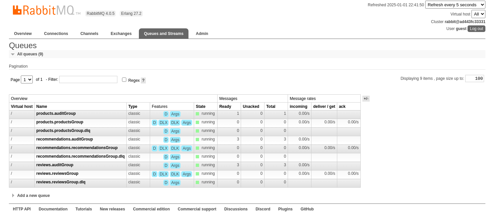
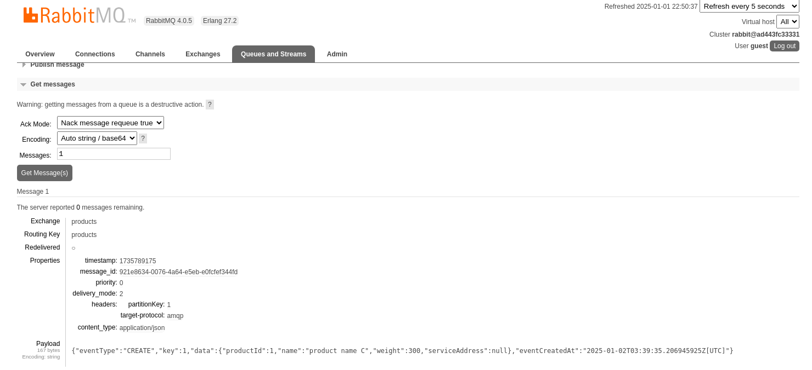
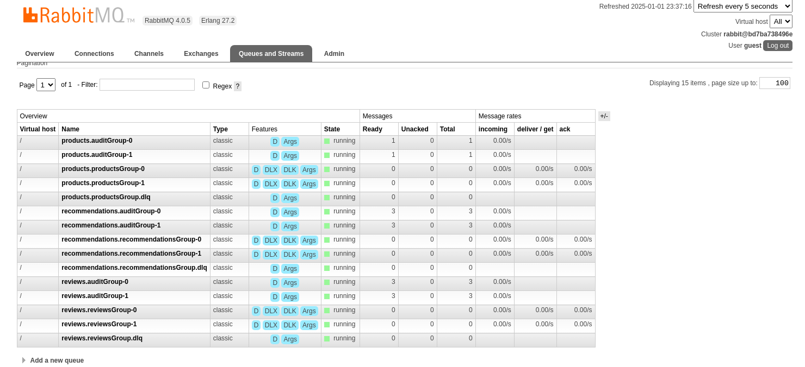

# Testing in the Test Environment Only

These examples do **not** use seeded data. 

## Contents

- [Testing messaging (RabbitMQ)](#testing-messaging-rabbitmq)
- [Testing streamed-partitions (RabbitMQ)](#testing-streamed-partitions-rabbitmq)
- [Testing streamed-partitions (Kafka)](#testing-streamed-partitions-kafka)

---

## Helpers
- [Setting up the environment](#setting-up-the-environment)
- [Shutting down the environment](#shutting-down-the-environment)


---
## Documentation
- [Readme](../README.md)
- [Building](BUILD.md)
- [Release Notes](RELEASE.md)
- [Running Services](RUNNING.md)
- [Testing Services](TESTING.md)
- [Support](SUPPORT.md)

---

## Setting up the environment

- [1. Build microservices](#1-build-microservices)
- [2. Build Containers](#2-build--start-containers)
  - [Default (docker-compose.yml)](#default-docker-composeyml)
  - [Streamed-partitioning (RabbitMQ)](#streamed-partitioning-rabbitmq)
  - [Streamed-partitioning (Kafka)](#streamed-partitioning-kafka)
- [4. Validate Microservices are up](#3-validate-microservices-are-up)

### 1. Build Microservices

```shell
./gradlew build
```

### 2. Build & Start Containers

#### Default (docker-compose.yml)

```shell
docker-compose build
docker-compose up -d
```

#### Streamed-Partitioning (RabbitMQ)

```shell
export COMPOSE_FILE=docker-compose-partitions.yml 
docker-compose build
docker-compose up -d
```
You will note that this uses 2 instances of the product, recommendations, and reviews microservices.
```text
[+] Running 11/11
 ✔ Network servicetransformation_default                Created                                                                                                                                                                                                                                         0.0s 
 ✔ Container servicetransformation-mongodb-1            Healthy                                                                                                                                                                                                                                         6.4s 
 ✔ Container servicetransformation-rabbitmq-1           Healthy                                                                                                                                                                                                                                         6.8s 
 ✔ Container servicetransformation-mysql-1              Healthy                                                                                                                                                                                                                                        31.4s 
 ✔ Container servicetransformation-product-composite-1  Started                                                                                                                                                                                                                                         6.7s 
 ✔ Container servicetransformation-review-1             Started                                                                                                                                                                                                                                        31.2s 
 ✔ Container servicetransformation-review-p2-1          Started                                                                                                                                                                                                                                        31.2s 
 ✔ Container servicetransformation-product-p2-1         Started                                                                                                                                                                                                                                         6.9s 
 ✔ Container servicetransformation-product-1            Started                                                                                                                                                                                                                                         7.0s 
 ✔ Container servicetransformation-recommendation-p2-1  Started                                                                                                                                                                                                                                         6.8s 
 ✔ Container servicetransformation-recommendation-1     Started   
```


#### Streamed Partitioning (Kafka)

```shell
export COMPOSE_FILE=docker-compose-kafka.yml 
docker-compose build
docker-compose up -d
```

NOTE: 
rabbitmq is replaced by kafka and zookeeper. Similar to the streamed partitions, you will see 2 each of the 
product, recommendations and review microservices. 
```text
[+] Running 10/12
 ✔ Network servicetransformation_default                Created                                                                                                                                                                                                                                         0.0s 
 ✔ Container servicetransformation-mongodb-1            Healthy                                                                                                                                                                                                                                         8.2s 
 ✔ Container servicetransformation-zookeeper-1          Started                                                                                                                                                                                                                                         2.6s 
 ✔ Container servicetransformation-mysql-1              Healthy                                                                                                                                                                                                                                        33.2s 
 ✔ Container servicetransformation-kafka-1              Started                                                                                                                                                                                                                                         1.4s 
 ✔ Container servicetransformation-recommendation-p2-1  Started                                                                                                                                                                                                                                         7.1s 
 ⠸ Container servicetransformation-review-1             Starting                                                                                                                                                                                                                                       31.3s 
 ✔ Container servicetransformation-product-composite-1  Started                                                                                                                                                                                                                                         1.6s 
 ⠸ Container servicetransformation-review-p2-1          Starting                                                                                                                                                                                                                                       31.3s 
 ✔ Container servicetransformation-product-p2-1         Started                                                                                                                                                                                                                                         6.8s 
 ✔ Container servicetransformation-recommendation-1     Started                                                                                                                                                                                                                                         6.9s 
 ✔ Container servicetransformation-product-1            Started                                                                                                                                                                                                                                         7.0s 
```


---
### 3. Validate Microservices are up

```shell
curl -s localhost:8080/actuator/health | jq -r .status
```
```text
UP
```
If you've just started up the environment, the result might be `DOWN`. It shouldn't take longer than a minute or so to start up. 

---

## Shutting down the environment

- Sets the docker-compose ENV back to default
- Shuts down landscape and cleans up any orphaned containers. 

```shell
unset COMPOSE_FILE
docker-compose down --remove-orphans
```
---

---
## Testing Messaging (RabbitMQ)

Make sure to [set up your environment](#setting-up-the-environment).

- [1. Create a composite to test reactive streams / event-driven architecture](#1-create-composite)
- [2. Inspect RabbitMQ's administrative page](#2-inspect-rabbit)
- [3. Inspect products.auditGroup](#3-inspect-productsauditgroup)
- [4. Curl GET to validate message](#4-get-the-message-via-curl)
- [5. Delete the record and validate](#5-delete-the-record)
- [6. Inspecting RabbitMQ after deletions](#6-inspecting-rabbit-after-deletions)

### 1. Create Composite

- Creating the composite product w/ Cloud Stream and RabbitMQ will create one RabbitMQ `exchange` per `topic` and a set of queues. (Depends on the config)

```shell
BODY='{"productId":1,"name":"product name C","weight":300,"recommendations":[
{"recommendationId":1,"author":"author 1","rate":1,"content":"content 1"},
{"recommendationId":2,"author":"author 2","rate":2,"content":"content 2"},
{"recommendationId":3,"author":"author 3","rate":3,"content":"content 3"}
], "reviews":[
{"reviewId":1,"author":"author 1","subject":"subject 1","content":"content 1"},
{"reviewId":2,"author":"author 2","subject":"subject 2","content":"content 2"},
{"reviewId":3,"author":"author 3","subject":"subject 3","content":"content 3"}
]}'
curl -X POST localhost:8080/product-composite -H "Content-Type:application/json" --data "$BODY"
```


### 2. Inspect Rabbit

1. Go to the [RabbitMQ Admin Portal](http://localhost:15672/#) (guest/guest).  
2. Navigate to the `Queues and Streams` tab.



```text
What is the auditGroup??
In Rabbit, messages are removed from the actual service queues after consumers have processed them. The auditGroups
serve as a record of the messages that were processed historically. 
```

For each topic there are 3 queues
- `<service>`.auditGroup
- `<service>`.`<service>`Group
- `<service>`.`<service>`Group.dlq (Dead Letter Queue)

You should see that each of the `auditGroup` queues contain messages. 
- `products.auditGroup`: 1
- `recommendations.auditGroup`: 3
- `reviews.auditGroup`: 3
---

### 3. Inspect products.auditGroup

1. click on `products.auditGroup`
2. scroll down to get messages
3. click the `Get Message(s)` button


- note the properties (message_id, priority, delivery_mode)
- note the headers
  - the partitionKey is important when using `partitioning`
- compare the payload to the message we sent (It should be the same)

### 4. Get the message via curl

```shell
curl localhost:8080/product-composite/1 -s | jq
```
```text

{
  "productId": 1,
  "name": "product name C",
  "weight": 300,
  "recommendations": [
    {
      "recommendationId": 1,
      "author": "author 1",
      "rate": 1,
      "content": "content 1"
    },
    {
      "recommendationId": 2,
      "author": "author 2",
      "rate": 2,
      "content": "content 2"
    },
    {
      "recommendationId": 3,
      "author": "author 3",
      "rate": 3,
      "content": "content 3"
    }
  ],
  "reviews": [
    {
      "reviewId": 1,
      "author": "author 1",
      "subject": "subject 1",
      "content": "content 1"
    },
    {
      "reviewId": 2,
      "author": "author 2",
      "subject": "subject 2",
      "content": "content 2"
    },
    {
      "reviewId": 3,
      "author": "author 3",
      "subject": "subject 3",
      "content": "content 3"
    }
  ],
  "serviceAddress": {
    "compositeAddress": "af20d18bf452/192.168.16.5:8080",
    "productAddress": "9d97fd5cf379/192.168.16.7:8080",
    "recommendationAddress": "414094ca1cf4/192.168.16.8:8080",
    "reviewAddress": "c5316c0ed7b6/192.168.16.6:8080"
  }
}
```

From this we can see that Rabbit delivered the records appropriately, and we can query the microservices

### 5. Delete the record

Command
```shell
curl -X DELETE localhost:8080/product-composite/1
```

You won't get a response. Try running the get again to validate the deletion.
```shell
curl localhost:8080/product-composite/1 -s | jq
```

```text
{
  "timestamp": "2025-01-02T04:01:20.496718852Z",
  "path": "/product-composite/1",
  "message": "No product found for productId: 1",
  "status": 404,
  "error": "Not Found"
}
```

### 6. Inspecting Rabbit (After Deletions)

- Log back in to RabbitMQ and inspect the queues to see the delete messages.
  - (When clicking get messages, it defaults to selecting only a single message,you can type any number you want there to see the rest of the messages)
- (play around!)
- Remember to [clean up after you are done](#shutting-down-the-environment).


---

## Testing Streamed Partitions (RabbitMQ)

When [setting up your environment](#setting-up-the-environment), select the [streamed-partitions (RabbitMQ)](#streamed-partitioning-rabbitmq) option for launching the containers. 


- [1. Create 2 composites to test streamed partitions](#1-create-composites-streamed-partitions)
- [2. Inspect Rabbit (Streamed Partitions)](#2-inspect-rabbit-partitions)
- [3. Inspect auditGroups](#3-inspecting-the-auditqueues)

---

### 1. Create Composites (Streamed Partitions)

- Creating the composite product w/ Cloud Stream and RabbitMQ will create one RabbitMQ `exchange` per `topic` and a set of queues. (Depends on the config)

```shell
BODY1='{"productId":1,"name":"product name C","weight":300,"recommendations":[
{"recommendationId":1,"author":"author 1","rate":1,"content":"content 1"},
{"recommendationId":2,"author":"author 2","rate":2,"content":"content 2"},
{"recommendationId":3,"author":"author 3","rate":3,"content":"content 3"}
], "reviews":[
{"reviewId":1,"author":"author 1","subject":"subject 1","content":"content 1"},
{"reviewId":2,"author":"author 2","subject":"subject 2","content":"content 2"},
{"reviewId":3,"author":"author 3","subject":"subject 3","content":"content 3"}
]}'
curl -X POST localhost:8080/product-composite -H "Content-Type:application/json" --data "$BODY1"

BODY2='{"productId":2,"name":"product name D","weight":300,"recommendations":[
{"recommendationId":4,"author":"author 1","rate":1,"content":"content 1"},
{"recommendationId":5,"author":"author 2","rate":2,"content":"content 2"},
{"recommendationId":6,"author":"author 3","rate":3,"content":"content 3"}
], "reviews":[
{"reviewId":4,"author":"author 1","subject":"subject 1","content":"content 1"},
{"reviewId":5,"author":"author 2","subject":"subject 2","content":"content 2"},
{"reviewId":6,"author":"author 3","subject":"subject 3","content":"content 3"}
]}'
curl -X POST localhost:8080/product-composite -H "Content-Type:application/json" --data "$BODY2"
```

---
### 2. Inspect Rabbit (Partitions)

1. Go to the [RabbitMQ Admin Portal](http://localhost:15672/#) (guest/guest).
2. Navigate to the `Queues and Streams` tab.



This should look a bit different
For each topic there are 5 queues
- 2 `<service>`.auditGroups (1 for each partition)
- 2 `<service>`.`<service>`Groups (1 for each partition) 
- 1 `<service>`.`<service>`Group.dlq (Dead Letter Queue)

You should see that each of the `auditGroup` queues contain messages.
- `products.auditGroup`: 1 per partition 
- `recommendations.auditGroup`: 3 per partition
- `reviews.auditGroup`: 3 per partition
---

### 3. Inspecting the auditQueues

If you inspect any of the auditQueues, you'll note that the contents are split. 
- The messages we sent w/ **productId 1** are associated with **partitionKey 1**
  - products.auditGroup-0
  - recommendations.auditGroup-1
  - reviews.auditGroup-1
- The messages we sent w/ **productId 2** are associated with **partitionKey 2**
  - products.auditGroup-1
  - recommendations.auditGroup-0
  - reviews.auditGroup-0


- Feel Free to repeat some of the previous tests.

- Remember to [clean up when you are done](#shutting-down-the-environment).

---


## Testing Streamed Partitions (Kafka)

When [setting up your environment](#setting-up-the-environment), select the [streamed-partitions (Kafka)](#streamed-partitioning-kafka) option for launching the containers.

- [1. Get list of topics](#1-get-list-of-topics)
- [2. Create composites (Kafka)](#2-create-composites-kafka)
- [3. Inspecting topics](#3-inspecting-topics)
- [4. Inspecting messages in a topic](#4-inspecting-messages-in-topics)
- [5. Inspecting messages in a specific partition](#5-inspecting-messages-in-a-specific-partition)


### 1. Get list of topics

```shell
docker-compose exec kafka /opt/bitnami/kafka/bin/kafka-topics.sh --bootstrap-server localhost:9092 --list
```
```text
__consumer_offsets
error.products.productsGroup
error.recommendations.recommendationsGroup
error.reviews.reviewsGroup
products
recommendations
reviews
```

Each microservice only has 2 queues (unlike the 3 we had in RabbitMQ):
- queues prefixed w/ `error.` are dead letter queues
- the event queues are those w/ the names of the microservice: `products, recommendations, reviews`.

Kafka retains events in the topics even after consumers have processed them, so there aren't any auditGroups.

---

## 2. Create Composites (Kafka)


```shell
BODY1='{"productId":1,"name":"product name C","weight":300,"recommendations":[
{"recommendationId":1,"author":"author 1","rate":1,"content":"content 1"},
{"recommendationId":2,"author":"author 2","rate":2,"content":"content 2"},
{"recommendationId":3,"author":"author 3","rate":3,"content":"content 3"}
], "reviews":[
{"reviewId":1,"author":"author 1","subject":"subject 1","content":"content 1"},
{"reviewId":2,"author":"author 2","subject":"subject 2","content":"content 2"},
{"reviewId":3,"author":"author 3","subject":"subject 3","content":"content 3"}
]}'
curl -X POST localhost:8080/product-composite -H "Content-Type:application/json" --data "$BODY1"

BODY2='{"productId":2,"name":"product name D","weight":300,"recommendations":[
{"recommendationId":4,"author":"author 1","rate":1,"content":"content 1"},
{"recommendationId":5,"author":"author 2","rate":2,"content":"content 2"},
{"recommendationId":6,"author":"author 3","rate":3,"content":"content 3"}
], "reviews":[
{"reviewId":4,"author":"author 1","subject":"subject 1","content":"content 1"},
{"reviewId":5,"author":"author 2","subject":"subject 2","content":"content 2"},
{"reviewId":6,"author":"author 3","subject":"subject 3","content":"content 3"}
]}'
curl -X POST localhost:8080/product-composite -H "Content-Type:application/json" --data "$BODY2"
```


### 3. Inspecting topics

```shell
docker-compose exec kafka /opt/bitnami/kafka/bin/kafka-topics.sh --bootstrap-server localhost:9092 --describe --topic products
```
```text
Topic: products TopicId: zb3e0G-2Q06elXMpTQQHkg PartitionCount: 2       ReplicationFactor: 1    Configs: 
        Topic: products Partition: 0    Leader: 1001    Replicas: 1001  Isr: 1001       Elr: N/A        LastKnownElr: N/A
        Topic: products Partition: 1    Leader: 1001    Replicas: 1001  Isr: 1001       Elr: N/A        LastKnownElr: N/A
```


### 4. Inspecting messages in topics

```shell
docker-compose exec kafka /opt/bitnami/kafka/bin/kafka-console-consumer.sh --bootstrap-server localhost:9092 --topic products --from-beginning --timeout-ms 10000
```
```text
{"eventType":"CREATE","key":2,"data":{"productId":2,"name":"product name D","weight":300,"serviceAddress":null},"eventCreatedAt":"2025-01-02T05:29:09.681559746Z[UTC]"}
{"eventType":"CREATE","key":1,"data":{"productId":1,"name":"product name C","weight":300,"serviceAddress":null},"eventCreatedAt":"2025-01-02T05:29:09.140813853Z[UTC]"}
[2025-01-02 05:30:40,895] ERROR Error processing message, terminating consumer process:  (org.apache.kafka.tools.consumer.ConsoleConsumer)
org.apache.kafka.common.errors.TimeoutException
Processed a total of 2 messages
```
Ignore the error, you told it to do that! (That's the timeout.) It should get the messages you sent in at least 10
seconds, if not, try extending the timeout or removing it altogether. (If you remove the timeout, you have to hit CTRL-C to
exit the command)


### 5. Inspecting messages in a specific partition

```shell
docker-compose exec kafka /opt/bitnami/kafka/bin/kafka-console-consumer.sh --bootstrap-server localhost:9092 --topic products --from-beginning --timeout-ms 10000 --partition 1
```
```text
{"eventType":"CREATE","key":1,"data":{"productId":1,"name":"product name C","weight":300,"serviceAddress":null},"eventCreatedAt":"2025-01-02T05:29:09.140813853Z[UTC]"}
[2025-01-02 05:32:54,795] ERROR Error processing message, terminating consumer process:  (org.apache.kafka.tools.consumer.ConsoleConsumer)
org.apache.kafka.common.errors.TimeoutException
Processed a total of 1 messages
```

[Remember to turn everything off when you are done playing around!](#shutting-down-the-environment)

---